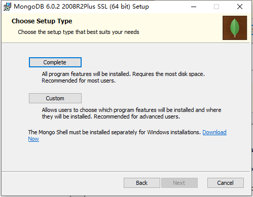
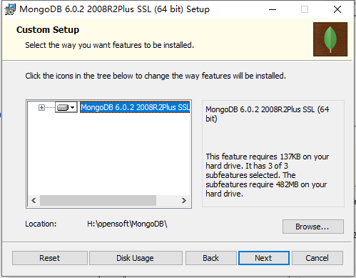

<h1 style="font-size:3.3em;color:skyblue;text-align:center">MongoDB学习笔记</h1>


# MongoDB简介

MongoDB是一个开源、高性能、无模式的文档型数据库，当初的设计就是用于简化开发和方便扩展，是NoSQL数据库产品中的一种。是最 像关系型数据库（MySQL）的非关系型数据库。 

它支持的数据结构非常松散，是一种类似于 JSON 的 格式叫BSON，所以它既可以存储比较复杂的数据类型，又相当的灵活。 MongoDB中的记录是一个文档，它是一个由字段和值对（field:value）组成的数据结构。MongoDB文档类似于JSON对象，即一个文档认 为就是一个对象。字段的数据类型是字符型，它的值除了使用基本的一些类型外，还可以包括其他文档、普通数组和文档数组。


# 业务应用场景

传统的关系型数据库（如MySQL），在数据操作的“三高”需求以及应对Web2.0的网站需求面前，显得力不从心。


“三高”需求：

* High performance - 对数据库高并发读写的需求。 
* Huge Storage - 对海量数据的高效率存储和访问的需求。 
* High Scalability && High Availability- 对数据库的高可扩展性和高可用性的需求。


而MongoDB可应对“三高”需求


具体的应用场景：

* 社交场景，使用 MongoDB 存储存储用户信息，以及用户发表的朋友圈信息，通过地理位置索引实现附近的人、地点等功能
* 游戏场景，使用 MongoDB 存储游戏用户信息，用户的装备、积分等直接以内嵌文档的形式存储，方便查询、高效率存储和访问
* 物流场景，使用 MongoDB 存储订单信息，订单状态在运送过程中会不断更新，以 MongoDB 内嵌数组的形式来存储，一次查询就能将订单所有的变更读取出来
* 物联网场景，使用 MongoDB 存储所有接入的智能设备信息，以及设备汇报的日志信息，并对这些信息进行多维度的分析
* 视频直播，使用 MongoDB 存储用户信息、点赞互动信息等


这些应用场景中，数据操作方面的共同特点是：

* 数据量大
* 写入操作频繁（读写都很频繁）
* 价值较低的数据，对事务性要求不高


对于这样的数据，我们更适合使用MongoDB来实现数据的存储。


什么时候选择MongoDB？

* 应用不需要事务及复杂 join 支持
* 新应用，需求会变，数据模型无法确定，想快速迭代开发
* 应用需要2000-3000以上的读写QPS
* 应用需要TB甚至 PB 级别数据存储
* 应用发展迅速，需要能快速水平扩展
* 应用要求存储的数据不丢失
* 应用需要99.999%高可用
* 应用需要大量的地理位置查询、文本查询


# 体系结构


|SQL术语/概念| MongoDB术语/概念 |解释/说明 |
| :--: | :--: | :--: |
|database| database |数据库|
|table |collection |数据库表/集合|
|row| document |数据记录行/文档|
|column |field| 数据字段/域 |
|index |index |索引|
|table| | joins 表连接,MongoDB不支持 |
| |嵌入文档| MongoDB通过嵌入式文档来替代多表连接|
|primary key| primary key |主键,MongoDB自动将_id字段设置为主键|


# 数据模型

MongoDB的最小存储单位就是文档(document)对象。文档(document)对象对应于关系型数据库的行。数据在MongoDB中以 BSON（Binary-JSON）文档的格式存储在磁盘上

BSON（Binary Serialized Document Format）是一种类json的一种二进制形式的存储格式，简称Binary JSON。BSON和JSON一样，支持 内嵌的文档对象和数组对象，但是BSON有JSON没有的一些数据类型，如Date和BinData类型。

BSON采用了类似于 C 语言结构体的名称、对表示方法，支持内嵌的文档对象和数组对象，具有轻量性、可遍历性、高效性的三个特点，可 以有效描述非结构化数据和结构化数据。这种格式的优点是灵活性高，但它的缺点是空间利用率不是很理想。

Bson中，除了基本的JSON类型：string,integer,boolean,double,null,array和object，mongo还使用了特殊的数据类型。这些类型包括 date,object id,binary data,regular expression 和code。每一个驱动都以特定语言的方式实现了这些类型，查看你的驱动的文档来获取详细信息。


|数据类型 |描述 |举例|
| :--: | :--: | :--: |
|字符串| UTF-8字符串都可表示为字符串类型的数据 |{"x" : "foobar"}|
|对象id| 对象id是文档的12字节的唯一 ID| {"X" :ObjectId() }|
|布尔值| 真或者假：true或者false| {"x":true}+|
|数组| 值的集合或者列表可以表示成数组| {"x" ： ["a", "b", "c"]}|
|32位整数| 类型不可用。JavaScript仅支持64位浮点数，所以32位整数会被自动转换。|shell是不支持该类型的，shell中默认会转换成64位浮点数|
|64位整数| 不支持这个类型。shell会使用一个特殊的内嵌文档来显示64位整数|shell是不支持该类型的，shell中默认会转换成64位浮点数|
|64位浮点数| shell中的数字就是这一种类型| {"x"：3.14159，"y"：3}|
|null |表示空值或者未定义的对象| {"x":null}|
|undefined| 文档中也可以使用未定义类型 |{"x":undefined}|
|符号 |shell不支持，shell会将数据库中的符号类型的数据自动转换成字符串| |
|正则表达式 |文档中可以包含正则表达式，采用JavaScript的正则表达式语法| {"x" ： /foobar/i} |
|代码 |文档中还可以包含JavaScript代码 |{"x" ： function() { /* …… */ }}|
|二进制数据 |二进制数据可以由任意字节的串组成，不过shell中无法使用||
|最大值/最小值|BSON包括一个特殊类型，表示可能的最大值。shell中没有这个类型。||


shell默认使用64位浮点型数值。{“x”：3.14}或{“x”：3}。对于整型值，可以使用NumberInt（4字节符号整数）或NumberLong（8字节符 号整数），{“x”:NumberInt(“3”)}{“x”:NumberLong(“3”)}


# MongoDB的特点

MongoDB主要有如下特点：


## 高性能

MongoDB提供高性能的数据持久性。

特别是, 对嵌入式数据模型的支持减少了数据库系统上的I/O活动。

索引支持更快的查询，并且可以包含来自嵌入式文档和数组的键。（文本索引解决搜索的需求、TTL索引解决历史数据自动过期的需求、地理位置索引可用于构建各种 O2O 应用）

mmapv1、wiredtiger、mongorocks（rocksdb）、in-memory 等多引擎支持满足各种场景需求

Gridfs解决文件存储的需求


## 高可用性

MongoDB的复制工具称为副本集（replica set），它可提供自动故障转移和数据冗余


## 高扩展性

MongoDB提供了水平可扩展性作为其核心功能的一部分。

分片将数据分布在一组集群的机器上。（海量数据存储，服务能力水平扩展）

从3.4开始，MongoDB支持基于片键创建数据区域。在一个平衡的集群中，MongoDB将一个区域所覆盖的读写只定向到该区域内的那些片


## 丰富的查询支持

MongoDB支持丰富的查询语言，支持读和写操作(CRUD)，比如数据聚合、文本搜索和地理空间查询等


# 单机部署

## Windows系统


### 第一步：下载安装包


https://www.mongodb.com/try#community


### 第二步：安装





选择安装位置





### 第三步：启动


手动建立一个目录用于存放数据文件，如 data/db


```sh
PS H:\opensoft\MongoDB> ls


    目录: H:\opensoft\MongoDB


Mode                 LastWriteTime         Length Name
----                 -------------         ------ ----
d-----        2022/11/14     20:18                bin
d-----        2022/11/14     20:19                data
d-----        2022/11/14     20:16                log
-a----         2022/9/29      1:03          30608 LICENSE-Community.txt
-a----         2022/9/29      1:03          16726 MPL-2
-a----         2022/9/29      1:03           1977 README
-a----         2022/9/29      1:03          77913 THIRD-PARTY-NOTICES


PS H:\opensoft\MongoDB> cd data
PS H:\opensoft\MongoDB\data> ls


    目录: H:\opensoft\MongoDB\data


Mode                 LastWriteTime         Length Name
----                 -------------         ------ ----
d-----        2022/11/14     20:20                diagnostic.data
d-----        2022/11/14     20:16                journal
-a----        2022/11/14     20:17          20480 collection-0--8270527627153216986.wt
-a----        2022/11/14     20:17          20480 collection-2--8270527627153216986.wt
-a----        2022/11/14     20:16           4096 collection-4--8270527627153216986.wt
-a----        2022/11/14     20:17          20480 index-1--8270527627153216986.wt
-a----        2022/11/14     20:17          20480 index-3--8270527627153216986.wt
-a----        2022/11/14     20:16           4096 index-5--8270527627153216986.wt
-a----        2022/11/14     20:16           4096 index-6--8270527627153216986.wt
-a----        2022/11/14     20:16              5 mongod.lock
-a----        2022/11/14     20:18          20480 sizeStorer.wt
-a----        2022/11/14     20:16            114 storage.bson
-a----        2022/11/14     20:16             50 WiredTiger
-a----        2022/11/14     20:16             21 WiredTiger.lock
-a----        2022/11/14     20:19           1464 WiredTiger.turtle
-a----        2022/11/14     20:19          69632 WiredTiger.wt
-a----        2022/11/14     20:16           4096 WiredTigerHS.wt
-a----        2022/11/14     20:17          20480 _mdb_catalog.wt


PS H:\opensoft\MongoDB\data> mkdir db


    目录: H:\opensoft\MongoDB\data


Mode                 LastWriteTime         Length Name
----                 -------------         ------ ----
d-----        2022/11/14     20:20                db


PS H:\opensoft\MongoDB\data> ls


    目录: H:\opensoft\MongoDB\data


Mode                 LastWriteTime         Length Name
----                 -------------         ------ ----
d-----        2022/11/14     20:20                db
d-----        2022/11/14     20:20                diagnostic.data
d-----        2022/11/14     20:16                journal
-a----        2022/11/14     20:17          20480 collection-0--8270527627153216986.wt
-a----        2022/11/14     20:17          20480 collection-2--8270527627153216986.wt
-a----        2022/11/14     20:16           4096 collection-4--8270527627153216986.wt
-a----        2022/11/14     20:17          20480 index-1--8270527627153216986.wt
-a----        2022/11/14     20:17          20480 index-3--8270527627153216986.wt
-a----        2022/11/14     20:16           4096 index-5--8270527627153216986.wt
-a----        2022/11/14     20:16           4096 index-6--8270527627153216986.wt
-a----        2022/11/14     20:16              5 mongod.lock
-a----        2022/11/14     20:18          20480 sizeStorer.wt
-a----        2022/11/14     20:16            114 storage.bson
-a----        2022/11/14     20:16             50 WiredTiger
-a----        2022/11/14     20:16             21 WiredTiger.lock
-a----        2022/11/14     20:19           1464 WiredTiger.turtle
-a----        2022/11/14     20:19          69632 WiredTiger.wt
-a----        2022/11/14     20:16           4096 WiredTigerHS.wt
-a----        2022/11/14     20:17          20480 _mdb_catalog.wt


PS H:\opensoft\MongoDB\data>
```


启动有两种方式


#### 第一种：命令行参数方式启动服务


bin目录里输入以下命令：

```sh
mongod --dbpath=..\data\db
```

或者

```sh
.\mongod --dbpath=..\data\db
```


运行结果：

```sh
PS H:\opensoft\MongoDB\data> cd ..
PS H:\opensoft\MongoDB> cd bin
PS H:\opensoft\MongoDB\bin> ls


    目录: H:\opensoft\MongoDB\bin


Mode                 LastWriteTime         Length Name
----                 -------------         ------ ----
-a----         2022/9/29      1:03           1558 InstallCompass.ps1
-a----        2022/11/14     20:16            573 mongod.cfg
-a----         2022/9/29      2:47       56164864 mongod.exe
-a----         2022/9/29      2:47      842002432 mongod.pdb
-a----         2022/9/29      2:01       34776576 mongos.exe
-a----         2022/9/29      2:01      471011328 mongos.pdb


PS H:\opensoft\MongoDB\bin> mongod --dbpath=..\data\db
mongod : 无法将“mongod”项识别为 cmdlet、函数、脚本文件或可运行程序的名称。请检查名称的拼写，如果包括路径，请确保路径正确，然后再试一次。
所在位置 行:1 字符: 1
+ mongod --dbpath=..\data\db
+ ~~~~~~
    + CategoryInfo          : ObjectNotFound: (mongod:String) [], CommandNotFoundException
    + FullyQualifiedErrorId : CommandNotFoundException


Suggestion [3,General]: 找不到命令 mongod，但它确实存在于当前位置。默认情况下，Windows PowerShell 不会从当前位置加载命令。如果信任此命令，请改为键入“.\mongod”。有关详细信息，请参阅 "get-help about_Command_Precedence"。
PS H:\opensoft\MongoDB\bin> .\mongod --dbpath=..\data\db
{"t":{"$date":"2022-11-14T20:23:00.603+08:00"},"s":"I",  "c":"NETWORK",  "id":4915701, "ctx":"thread1","msg":"Initialized wire specification","attr":{"spec":{"incomingExternalClient":{"minWireVersion":0,"maxWireVersion":17},"incomingInternalClient":{"minWireVersion":0,"maxWireVersion":17},"outgoing":{"minWireVersion":6,"maxWireVersion":17},"isInternalClient":true}}}
{"t":{"$date":"2022-11-14T20:23:00.605+08:00"},"s":"I",  "c":"CONTROL",  "id":23285,   "ctx":"thread1","msg":"Automatically disabling TLS 1.0, to force-enable TLS 1.0 specify --sslDisabledProtocols 'none'"}
{"t":{"$date":"2022-11-14T20:23:00.605+08:00"},"s":"I",  "c":"NETWORK",  "id":4648602, "ctx":"thread1","msg":"Implicit TCP FastOpen in use."}
{"t":{"$date":"2022-11-14T20:23:00.607+08:00"},"s":"I",  "c":"REPL",     "id":5123008, "ctx":"thread1","msg":"Successfully registered PrimaryOnlyService","attr":{"service":"TenantMigrationDonorService","namespace":"config.tenantMigrationDonors"}}
{"t":{"$date":"2022-11-14T20:23:00.607+08:00"},"s":"I",  "c":"REPL",     "id":5123008, "ctx":"thread1","msg":"Successfully registered PrimaryOnlyService","attr":{"service":"TenantMigrationRecipientService","namespace":"config.tenantMigrationRecipients"}}
{"t":{"$date":"2022-11-14T20:23:00.608+08:00"},"s":"I",  "c":"REPL",     "id":5123008, "ctx":"thread1","msg":"Successfully registered PrimaryOnlyService","attr":{"service":"ShardSplitDonorService","namespace":"config.tenantSplitDonors"}}
{"t":{"$date":"2022-11-14T20:23:00.608+08:00"},"s":"I",  "c":"CONTROL",  "id":5945603, "ctx":"thread1","msg":"Multi threading initialized"}
{"t":{"$date":"2022-11-14T20:23:00.611+08:00"},"s":"I",  "c":"CONTROL",  "id":4615611, "ctx":"initandlisten","msg":"MongoDB starting","attr":{"pid":2400,"port":27017,"dbPath":"../data/db","architecture":"64-bit","host":"mao"}}
{"t":{"$date":"2022-11-14T20:23:00.611+08:00"},"s":"I",  "c":"CONTROL",  "id":23398,   "ctx":"initandlisten","msg":"Target operating system minimum version","attr":{"targetMinOS":"Windows 7/Windows Server 2008 R2"}}
{"t":{"$date":"2022-11-14T20:23:00.612+08:00"},"s":"I",  "c":"CONTROL",  "id":23403,   "ctx":"initandlisten","msg":"Build Info","attr":{"buildInfo":{"version":"6.0.2","gitVersion":"94fb7dfc8b974f1f5343e7ea394d0d9deedba50e","modules":[],"allocator":"tcmalloc","environment":{"distmod":"windows","distarch":"x86_64","target_arch":"x86_64"}}}}
{"t":{"$date":"2022-11-14T20:23:00.613+08:00"},"s":"I",  "c":"CONTROL",  "id":51765,   "ctx":"initandlisten","msg":"Operating System","attr":{"os":{"name":"Microsoft Windows 10","version":"10.0 (build 19044)"}}}
{"t":{"$date":"2022-11-14T20:23:00.613+08:00"},"s":"I",  "c":"CONTROL",  "id":21951,   "ctx":"initandlisten","msg":"Options set by command line","attr":{"options":{"storage":{"dbPath":"..\\data\\db"}}}}
{"t":{"$date":"2022-11-14T20:23:00.617+08:00"},"s":"I",  "c":"STORAGE",  "id":22315,   "ctx":"initandlisten","msg":"Opening WiredTiger","attr":{"config":"create,cache_size=7636M,session_max=33000,eviction=(threads_min=4,threads_max=4),config_base=false,statistics=(fast),log=(enabled=true,remove=true,path=journal,compressor=snappy),builtin_extension_config=(zstd=(compression_level=6)),file_manager=(close_idle_time=600,close_scan_interval=10,close_handle_minimum=2000),statistics_log=(wait=0),json_output=(error,message),verbose=[recovery_progress:1,checkpoint_progress:1,compact_progress:1,backup:0,checkpoint:0,compact:0,evict:0,history_store:0,recovery:0,rts:0,salvage:0,tiered:0,timestamp:0,transaction:0,verify:0,log:0],"}}
{"t":{"$date":"2022-11-14T20:23:00.949+08:00"},"s":"I",  "c":"STORAGE",  "id":4795906, "ctx":"initandlisten","msg":"WiredTiger opened","attr":{"durationMillis":331}}
{"t":{"$date":"2022-11-14T20:23:00.950+08:00"},"s":"I",  "c":"RECOVERY", "id":23987,   "ctx":"initandlisten","msg":"WiredTiger recoveryTimestamp","attr":{"recoveryTimestamp":{"$timestamp":{"t":0,"i":0}}}}
{"t":{"$date":"2022-11-14T20:23:01.235+08:00"},"s":"W",  "c":"CONTROL",  "id":22120,   "ctx":"initandlisten","msg":"Access control is not enabled for the database. Read and write access to data and configuration is unrestricted","tags":["startupWarnings"]}
{"t":{"$date":"2022-11-14T20:23:01.235+08:00"},"s":"W",  "c":"CONTROL",  "id":22140,   "ctx":"initandlisten","msg":"This server is bound to localhost. Remote systems will be unable to connect to this server. Start the server with --bind_ip <address> to specify which IP addresses it should serve responses from, or with --bind_ip_all to bind to all interfaces. If this behavior is desired, start the server with --bind_ip 127.0.0.1 to disable this warning","tags":["startupWarnings"]}
{"t":{"$date":"2022-11-14T20:23:01.237+08:00"},"s":"I",  "c":"STORAGE",  "id":20320,   "ctx":"initandlisten","msg":"createCollection","attr":{"namespace":"admin.system.version","uuidDisposition":"provided","uuid":{"uuid":{"$uuid":"f9dc9298-7737-4157-942d-69eb2e95c4ca"}},"options":{"uuid":{"$uuid":"f9dc9298-7737-4157-942d-69eb2e95c4ca"}}}}
{"t":{"$date":"2022-11-14T20:23:01.331+08:00"},"s":"I",  "c":"INDEX",    "id":20345,   "ctx":"initandlisten","msg":"Index build: done building","attr":{"buildUUID":null,"collectionUUID":{"uuid":{"$uuid":"f9dc9298-7737-4157-942d-69eb2e95c4ca"}},"namespace":"admin.system.version","index":"_id_","ident":"index-1--8612451295210606605","collectionIdent":"collection-0--8612451295210606605","commitTimestamp":null}}
{"t":{"$date":"2022-11-14T20:23:01.331+08:00"},"s":"I",  "c":"REPL",     "id":20459,   "ctx":"initandlisten","msg":"Setting featureCompatibilityVersion","attr":{"newVersion":"6.0"}}
{"t":{"$date":"2022-11-14T20:23:01.333+08:00"},"s":"I",  "c":"REPL",     "id":5853300, "ctx":"initandlisten","msg":"current featureCompatibilityVersion value","attr":{"featureCompatibilityVersion":"6.0","context":"setFCV"}}
{"t":{"$date":"2022-11-14T20:23:01.333+08:00"},"s":"I",  "c":"NETWORK",  "id":4915702, "ctx":"initandlisten","msg":"Updated wire specification","attr":{"oldSpec":{"incomingExternalClient":{"minWireVersion":0,"maxWireVersion":17},"incomingInternalClient":{"minWireVersion":0,"maxWireVersion":17},"outgoing":{"minWireVersion":6,"maxWireVersion":17},"isInternalClient":true},"newSpec":{"incomingExternalClient":{"minWireVersion":0,"maxWireVersion":17},"incomingInternalClient":{"minWireVersion":17,"maxWireVersion":17},"outgoing":{"minWireVersion":17,"maxWireVersion":17},"isInternalClient":true}}}
{"t":{"$date":"2022-11-14T20:23:01.334+08:00"},"s":"I",  "c":"NETWORK",  "id":4915702, "ctx":"initandlisten","msg":"Updated wire specification","attr":{"oldSpec":{"incomingExternalClient":{"minWireVersion":0,"maxWireVersion":17},"incomingInternalClient":{"minWireVersion":17,"maxWireVersion":17},"outgoing":{"minWireVersion":17,"maxWireVersion":17},"isInternalClient":true},"newSpec":{"incomingExternalClient":{"minWireVersion":0,"maxWireVersion":17},"incomingInternalClient":{"minWireVersion":17,"maxWireVersion":17},"outgoing":{"minWireVersion":17,"maxWireVersion":17},"isInternalClient":true}}}
{"t":{"$date":"2022-11-14T20:23:01.334+08:00"},"s":"I",  "c":"REPL",     "id":5853300, "ctx":"initandlisten","msg":"current featureCompatibilityVersion value","attr":{"featureCompatibilityVersion":"6.0","context":"startup"}}
{"t":{"$date":"2022-11-14T20:23:01.334+08:00"},"s":"I",  "c":"STORAGE",  "id":5071100, "ctx":"initandlisten","msg":"Clearing temp directory"}
{"t":{"$date":"2022-11-14T20:23:01.335+08:00"},"s":"I",  "c":"CONTROL",  "id":20536,   "ctx":"initandlisten","msg":"Flow Control is enabled on this deployment"}
{"t":{"$date":"2022-11-14T20:23:01.812+08:00"},"s":"I",  "c":"FTDC",     "id":20625,   "ctx":"initandlisten","msg":"Initializing full-time diagnostic data capture","attr":{"dataDirectory":"../data/db/diagnostic.data"}}
{"t":{"$date":"2022-11-14T20:23:01.816+08:00"},"s":"I",  "c":"STORAGE",  "id":20320,   "ctx":"initandlisten","msg":"createCollection","attr":{"namespace":"local.startup_log","uuidDisposition":"generated","uuid":{"uuid":{"$uuid":"c6deb412-71a6-4db4-8207-eba2392b5a42"}},"options":{"capped":true,"size":10485760}}}
{"t":{"$date":"2022-11-14T20:23:01.923+08:00"},"s":"I",  "c":"INDEX",    "id":20345,   "ctx":"initandlisten","msg":"Index build: done building","attr":{"buildUUID":null,"collectionUUID":{"uuid":{"$uuid":"c6deb412-71a6-4db4-8207-eba2392b5a42"}},"namespace":"local.startup_log","index":"_id_","ident":"index-3--8612451295210606605","collectionIdent":"collection-2--8612451295210606605","commitTimestamp":null}}
{"t":{"$date":"2022-11-14T20:23:01.923+08:00"},"s":"I",  "c":"REPL",     "id":6015317, "ctx":"initandlisten","msg":"Setting new configuration state","attr":{"newState":"ConfigReplicationDisabled","oldState":"ConfigPreStart"}}
{"t":{"$date":"2022-11-14T20:23:01.925+08:00"},"s":"I",  "c":"STORAGE",  "id":22262,   "ctx":"initandlisten","msg":"Timestamp monitor starting"}
{"t":{"$date":"2022-11-14T20:23:01.929+08:00"},"s":"I",  "c":"CONTROL",  "id":20712,   "ctx":"LogicalSessionCacheReap","msg":"Sessions collection is not set up; waiting until next sessions reap interval","attr":{"error":"NamespaceNotFound: config.system.sessions does not exist"}}
{"t":{"$date":"2022-11-14T20:23:01.929+08:00"},"s":"I",  "c":"NETWORK",  "id":23015,   "ctx":"listener","msg":"Listening on","attr":{"address":"127.0.0.1"}}
{"t":{"$date":"2022-11-14T20:23:01.929+08:00"},"s":"I",  "c":"STORAGE",  "id":20320,   "ctx":"LogicalSessionCacheRefresh","msg":"createCollection","attr":{"namespace":"config.system.sessions","uuidDisposition":"generated","uuid":{"uuid":{"$uuid":"b673fae5-30c1-4303-85d3-d2d8084b9f02"}},"options":{}}}
{"t":{"$date":"2022-11-14T20:23:01.930+08:00"},"s":"I",  "c":"NETWORK",  "id":23016,   "ctx":"listener","msg":"Waiting for connections","attr":{"port":27017,"ssl":"off"}}
{"t":{"$date":"2022-11-14T20:23:02.088+08:00"},"s":"I",  "c":"INDEX",    "id":20345,   "ctx":"LogicalSessionCacheRefresh","msg":"Index build: done building","attr":{"buildUUID":null,"collectionUUID":{"uuid":{"$uuid":"b673fae5-30c1-4303-85d3-d2d8084b9f02"}},"namespace":"config.system.sessions","index":"_id_","ident":"index-5--8612451295210606605","collectionIdent":"collection-4--8612451295210606605","commitTimestamp":null}}
{"t":{"$date":"2022-11-14T20:23:02.089+08:00"},"s":"I",  "c":"INDEX",    "id":20345,   "ctx":"LogicalSessionCacheRefresh","msg":"Index build: done building","attr":{"buildUUID":null,"collectionUUID":{"uuid":{"$uuid":"b673fae5-30c1-4303-85d3-d2d8084b9f02"}},"namespace":"config.system.sessions","index":"lsidTTLIndex","ident":"index-6--8612451295210606605","collectionIdent":"collection-4--8612451295210606605","commitTimestamp":null}}
{"t":{"$date":"2022-11-14T20:23:02.090+08:00"},"s":"I",  "c":"COMMAND",  "id":51803,   "ctx":"LogicalSessionCacheRefresh","msg":"Slow query","attr":{"type":"command","ns":"config.system.sessions","command":{"createIndexes":"system.sessions","v":2,"indexes":[{"key":{"lastUse":1},"name":"lsidTTLIndex","expireAfterSeconds":1800}],"ignoreUnknownIndexOptions":false,"writeConcern":{},"$db":"config"},"numYields":0,"reslen":114,"locks":{"ParallelBatchWriterMode":{"acquireCount":{"r":5}},"FeatureCompatibilityVersion":{"acquireCount":{"r":5,"w":1}},"ReplicationStateTransition":{"acquireCount":{"w":5}},"Global":{"acquireCount":{"r":5,"w":1}},"Database":{"acquireCount":{"r":4,"w":1}},"Collection":{"acquireCount":{"r":5,"w":1}},"Mutex":{"acquireCount":{"r":8}}},"storage":{},"protocol":"op_msg","durationMillis":161}}

```


#### 第二种：配置文件方式启动服务


在解压目录中新建 conf 文件夹，该文件夹中新建配置文件 mongod.conf


配置文件内容：

```
storage:
  dbPath: .\\..\\data\\db
```


```sh
PS H:\opensoft\MongoDB> ls


    目录: H:\opensoft\MongoDB


Mode                 LastWriteTime         Length Name
----                 -------------         ------ ----
d-----        2022/11/14     20:18                bin
d-----        2022/11/14     20:37                conf
d-----        2022/11/14     20:41                data
d-----        2022/11/14     20:16                log
-a----         2022/9/29      1:03          30608 LICENSE-Community.txt
-a----         2022/9/29      1:03          16726 MPL-2
-a----         2022/9/29      1:03           1977 README
-a----         2022/9/29      1:03          77913 THIRD-PARTY-NOTICES


PS H:\opensoft\MongoDB> cd conf
PS H:\opensoft\MongoDB\conf> ls


    目录: H:\opensoft\MongoDB\conf


Mode                 LastWriteTime         Length Name
----                 -------------         ------ ----
-a----        2022/11/14     20:41             33 mongod.conf


PS H:\opensoft\MongoDB\conf> cat .\mongod.conf
storage:
  dbPath: .\\..\\data\\db
PS H:\opensoft\MongoDB\conf>
```


更多参数配置：


启动方式：


```sh
.\mongod -f ../conf/mongod.conf
```

或者

```sh
.\mongod --config ../conf/mongod.conf
```


## Shell连接


### 第一步：下载


https://www.mongodb.com/try/download/shell


### 第二步：解压


解压到MongoDB目录下


```sh
PS H:\opensoft\MongoDB> ls


    目录: H:\opensoft\MongoDB


Mode                 LastWriteTime         Length Name
----                 -------------         ------ ----
d-----        2022/11/14     20:18                bin
d-----        2022/11/14     20:37                conf
d-----        2022/11/14     21:02                data
d-----        2022/11/14     20:16                log
d-----         2022/9/20      4:08                mongosh
-a----         2022/9/29      1:03          30608 LICENSE-Community.txt
-a----         2022/9/29      1:03          16726 MPL-2
-a----         2022/9/29      1:03           1977 README
-a----         2022/9/29      1:03          77913 THIRD-PARTY-NOTICES


PS H:\opensoft\MongoDB> cd .\mongosh\
PS H:\opensoft\MongoDB\mongosh> ls


    目录: H:\opensoft\MongoDB\mongosh


Mode                 LastWriteTime         Length Name
----                 -------------         ------ ----
d-----         2022/9/20      4:08                bin
-a----         2022/9/20      4:01          17524 LICENSE-crypt-library
-a----         2022/9/20      4:01          10759 LICENSE-mongosh
-a----         2022/9/20      4:08           5792 mongosh.1.gz
-a----         2022/9/20      4:01            393 README
-a----         2022/9/20      4:01         918987 THIRD_PARTY_NOTICES


PS H:\opensoft\MongoDB\mongosh> cd bin
PS H:\opensoft\MongoDB\mongosh\bin> ls


    目录: H:\opensoft\MongoDB\mongosh\bin


Mode                 LastWriteTime         Length Name
----                 -------------         ------ ----
-a----         2022/9/20      3:53      146979840 mongosh.exe
-a----         2022/8/16     10:50       17886208 mongosh_crypt_v1.dll


PS H:\opensoft\MongoDB\mongosh\bin>
```


### 第三步：启动


```sh
.\mongosh
```

或者

```sh
.\mongosh --host=127.0.0.1 --port=27017
```


```sh
PS H:\opensoft\MongoDB\mongosh\bin> .\mongosh
Current Mongosh Log ID: 63723d5d79fae2f2ba5e24af
Connecting to:          mongodb://127.0.0.1:27017/?directConnection=true&serverSelectionTimeoutMS=2000&appName=mongosh+1.6.0
Using MongoDB:          6.0.2
Using Mongosh:          1.6.0

For mongosh info see: https://docs.mongodb.com/mongodb-shell/

------
   The server generated these startup warnings when booting
   2022-11-14T20:16:36.251+08:00: Access control is not enabled for the database. Read and write access to data and configuration is unrestricted
------

------
   Enable MongoDB's free cloud-based monitoring service, which will then receive and display
   metrics about your deployment (disk utilization, CPU, operation statistics, etc).

   The monitoring data will be available on a MongoDB website with a unique URL accessible to you
   and anyone you share the URL with. MongoDB may use this information to make product
   improvements and to suggest MongoDB products and deployment options to you.

   To enable free monitoring, run the following command: db.enableFreeMonitoring()
   To permanently disable this reminder, run the following command: db.disableFreeMonitoring()
------

test>
```


```sh
PS H:\opensoft\MongoDB\mongosh\bin> .\mongosh --host=127.0.0.1 --port=27017
Current Mongosh Log ID: 63723d397060718605194f6b
Connecting to:          mongodb://127.0.0.1:27017/?directConnection=true&serverSelectionTimeoutMS=2000&appName=mongosh+1.6.0
Using MongoDB:          6.0.2
Using Mongosh:          1.6.0

For mongosh info see: https://docs.mongodb.com/mongodb-shell/

------
   The server generated these startup warnings when booting
   2022-11-14T20:16:36.251+08:00: Access control is not enabled for the database. Read and write access to data and configuration is unrestricted
------

------
   Enable MongoDB's free cloud-based monitoring service, which will then receive and display
   metrics about your deployment (disk utilization, CPU, operation statistics, etc).

   The monitoring data will be available on a MongoDB website with a unique URL accessible to you
   and anyone you share the URL with. MongoDB may use this information to make product
   improvements and to suggest MongoDB products and deployment options to you.

   To enable free monitoring, run the following command: db.enableFreeMonitoring()
   To permanently disable this reminder, run the following command: db.disableFreeMonitoring()
------

test>
```


查看已经有的数据库

```sh
show databases
```


```sh
test> show databases
admin    40.00 KiB
config  108.00 KiB
local    40.00 KiB
test>
```


退出mongodb

```sh
exit
```


```sh
test> exit
PS H:\opensoft\MongoDB\mongosh\bin>
```


更多参数可以通过帮助查看：

```sh
.\mongosh --help
```


```sh
PS H:\opensoft\MongoDB\mongosh\bin> .\mongosh --help

  $ mongosh [options] [db address] [file names (ending in .js or .mongodb)]

  Options:

    -h, --help                                 Show this usage information
    -f, --file [arg]                           Load the specified mongosh script
        --host [arg]                           Server to connect to
        --port [arg]                           Port to connect to
        --version                              Show version information
        --verbose                              Increase the verbosity of the output of the shell
        --quiet                                Silence output from the shell during the connection process
        --shell                                Run the shell after executing files
        --nodb                                 Don't connect to mongod on startup - no 'db address' [arg] expected
        --norc                                 Will not run the '.mongoshrc.js' file on start up
        --eval [arg]                           Evaluate javascript
        --json[=canonical|relaxed]             Print result of --eval as Extended JSON, including errors
        --retryWrites[=true|false]             Automatically retry write operations upon transient network errors (Default: true)

  Authentication Options:

    -u, --username [arg]                       Username for authentication
    -p, --password [arg]                       Password for authentication
        --authenticationDatabase [arg]         User source (defaults to dbname)
        --authenticationMechanism [arg]        Authentication mechanism
        --awsIamSessionToken [arg]             AWS IAM Temporary Session Token ID
        --gssapiServiceName [arg]              Service name to use when authenticating using GSSAPI/Kerberos
        --sspiHostnameCanonicalization [arg]   Specify the SSPI hostname canonicalization (none or forward, available on Windows)
        --sspiRealmOverride [arg]              Specify the SSPI server realm (available on Windows)

  TLS Options:

        --tls                                  Use TLS for all connections
        --tlsCertificateKeyFile [arg]          PEM certificate/key file for TLS
        --tlsCertificateKeyFilePassword [arg]  Password for key in PEM file for TLS
        --tlsCAFile [arg]                      Certificate Authority file for TLS
        --tlsAllowInvalidHostnames             Allow connections to servers with non-matching hostnames
        --tlsAllowInvalidCertificates          Allow connections to servers with invalid certificates
        --tlsCertificateSelector [arg]         TLS Certificate in system store (Windows and macOS only)
        --tlsCRLFile [arg]                     Specifies the .pem file that contains the Certificate Revocation List
        --tlsDisabledProtocols [arg]           Comma separated list of TLS protocols to disable [TLS1_0,TLS1_1,TLS1_2]
        --tlsUseSystemCA                       Load the operating system trusted certificate list
        --tlsFIPSMode                          Enable the system TLS library's FIPS mode

  API version options:

        --apiVersion [arg]                     Specifies the API version to connect with
        --apiStrict                            Use strict API version mode
        --apiDeprecationErrors                 Fail deprecated commands for the specified API version

  FLE Options:

        --awsAccessKeyId [arg]                 AWS Access Key for FLE Amazon KMS
        --awsSecretAccessKey [arg]             AWS Secret Key for FLE Amazon KMS
        --awsSessionToken [arg]                Optional AWS Session Token ID
        --keyVaultNamespace [arg]              database.collection to store encrypted FLE parameters
        --kmsURL [arg]                         Test parameter to override the URL of the KMS endpoint

  DB Address Examples:

        foo                                    Foo database on local machine
        192.168.0.5/foo                        Foo database on 192.168.0.5 machine
        192.168.0.5:9999/foo                   Foo database on 192.168.0.5 machine on port 9999
        mongodb://192.168.0.5:9999/foo         Connection string URI can also be used

  File Names:

        A list of files to run. Files must end in .js and will exit after unless --shell is specified.

  Examples:

        Start mongosh using 'ships' database on specified connection string:
        $ mongosh mongodb://192.168.0.5:9999/ships

  For more information on usage: https://docs.mongodb.com/mongodb-shell.
PS H:\opensoft\MongoDB\mongosh\bin>
```


### 第四步：配置环境变量


点击高级系统设置


点击环境变量


编辑path


新建一个，保存


随便在一个路径下启动

```sh
PS C:\Users\mao\Desktop> mongosh.exe
Current Mongosh Log ID: 63723f4fea0a3e8c6d08ee92
Connecting to:          mongodb://127.0.0.1:27017/?directConnection=true&serverSelectionTimeoutMS=2000&appName=mongosh+1.6.0
Using MongoDB:          6.0.2
Using Mongosh:          1.6.0

For mongosh info see: https://docs.mongodb.com/mongodb-shell/

------
   The server generated these startup warnings when booting
   2022-11-14T20:16:36.251+08:00: Access control is not enabled for the database. Read and write access to data and configuration is unrestricted
------

------
   Enable MongoDB's free cloud-based monitoring service, which will then receive and display
   metrics about your deployment (disk utilization, CPU, operation statistics, etc).

   The monitoring data will be available on a MongoDB website with a unique URL accessible to you
   and anyone you share the URL with. MongoDB may use this information to make product
   improvements and to suggest MongoDB products and deployment options to you.

   To enable free monitoring, run the following command: db.enableFreeMonitoring()
   To permanently disable this reminder, run the following command: db.disableFreeMonitoring()
------

test>
```


## Compass-图形化界面客户端


### 第一步：下载

https://www.mongodb.com/try/download/compass


### 第二步：运行


```sh
PS H:\opensoft\MongoDB> ls


    目录: H:\opensoft\MongoDB


Mode                 LastWriteTime         Length Name
----                 -------------         ------ ----
d-----        2022/11/14     20:18                bin
d-----        2022/11/14     20:37                conf
d-----        2022/11/14     21:32                data
d-----        2022/11/14     20:16                log
d-----        2022/11/14     21:32                MongoDBCompass
d-----         2022/9/20      4:08                mongosh
-a----         2022/9/29      1:03          30608 LICENSE-Community.txt
-a----         2022/9/29      1:03          16726 MPL-2
-a----         2022/9/29      1:03           1977 README
-a----         2022/9/29      1:03          77913 THIRD-PARTY-NOTICES
-a----        2022/11/14     21:22             50 运行.bat


PS H:\opensoft\MongoDB> cd .\MongoDBCompass\
PS H:\opensoft\MongoDB\MongoDBCompass> ls


    目录: H:\opensoft\MongoDB\MongoDBCompass


Mode                 LastWriteTime         Length Name
----                 -------------         ------ ----
d-----        2022/11/14     21:32                app-1.33.1
d-----        2022/11/14     21:32                packages
-a----        2022/11/14     21:28           6518 app.ico
-a----        2022/11/14     21:28         664472 MongoDBCompass.exe
-a----        2022/11/14     21:28           1309 Squirrel-Shortcut.log
-a----        2022/11/14     21:28        1905560 Update.exe


PS H:\opensoft\MongoDB\MongoDBCompass> cd .\app-1.33.1\
PS H:\opensoft\MongoDB\MongoDBCompass\app-1.33.1> ls


    目录: H:\opensoft\MongoDB\MongoDBCompass\app-1.33.1


Mode                 LastWriteTime         Length Name
----                 -------------         ------ ----
d-----        2022/11/14     21:32                locales
d-----        2022/11/14     21:32                resources
d-----        2022/11/14     21:32                swiftshader
-a----        2022/11/14     21:28         142204 chrome_100_percent.pak
-a----        2022/11/14     21:28         207660 chrome_200_percent.pak
-a----        2022/11/14     21:28        4524696 d3dcompiler_47.dll
-a----        2022/11/14     21:28        1681408 ffmpeg.dll
-a----        2022/11/14     21:28       10215904 icudtl.dat
-a----        2022/11/14     21:28         441856 libEGL.dll
-a----        2022/11/14     21:28        7831552 libGLESv2.dll
-a----        2022/11/14     21:28          36100 LICENSE
-a----        2022/11/14     21:28      140914072 MongoDBCompass.exe
-a----        2022/11/14     21:28        5870149 resources.pak
-a----        2022/11/14     21:28          49266 snapshot_blob.bin
-a----        2022/11/14     21:28            263 Squirrel-UpdateSelf.log
-a----        2022/11/14     21:28        1905560 squirrel.exe
-a----        2022/11/14     21:28         164467 v8_context_snapshot.bin
-a----        2022/11/14     21:28        4467712 vk_swiftshader.dll
-a----        2022/11/14     21:28            106 vk_swiftshader_icd.json
-a----        2022/11/14     21:28         732672 vulkan-1.dll


PS H:\opensoft\MongoDB\MongoDBCompass\app-1.33.1> .\MongoDBCompass.exe
PS H:\opensoft\MongoDB\MongoDBCompass\app-1.33.1>
```


### 第三步：新建一个连接


# 基本常用命令

## 数据库操作

### 选择和创建数据库


```sh
use 数据库名称
```


如果数据库不存在则自动创建


```sh
test> use db1
switched to db db1
db1>
```


查看有权限查看的所有的数据库命令


```sh
show dbs
```

或者

```sh
show databases
```


在 MongoDB 中，集合只有在内容插入后才会创建! 就是说，创建集合(数据表)后要再插入一个文档(记录)，集合才会真正创建


```sh
db1> show dbs
admin    40.00 KiB
config  108.00 KiB
local    40.00 KiB
db1> show databases
admin    40.00 KiB
config  108.00 KiB
local    40.00 KiB
db1>
```


### 查看当前正在使用的数据库


```sh
db
```


```sh
db1> db
db1
db1>
```


MongoDB 中默认的数据库为 test，如果你没有选择数据库，集合将存放在 test 数据库中


数据库名可以是满足以下条件的任意UTF-8字符串：

* 不能是空字符串
* 不得含有' '（空格)、.、$、/、\和\0 (空字符)
* 应全部小写
* 最多64字节


有一些数据库名是保留的，可以直接访问这些有特殊作用的数据库

* **admin**： 从权限的角度来看，这是"root"数据库。要是将一个用户添加到这个数据库，这个用户自动继承所有数据库的权限。一些特定的服务器端命令也只能从这个数据库运行，比如列出所有的数据库或者关闭服务器
* **local**: 这个数据永远不会被复制，可以用来存储限于本地单台服务器的任意集合
* **config**: 当Mongo用于分片设置时，config数据库在内部使用，用于保存分片的相关信息


### 数据库的删除

MongoDB 删除数据库的语法格式如下：

```sh
db.dropDatabase()
```


主要用来删除已经持久化的数据库


```sh
db1> db.dropDatabase()
{ ok: 1, dropped: 'db1' }
db1>
```


## 集合操作

集合，类似关系型数据库中的表

可以显示的创建，也可以隐式的创建


### 集合的显式创建

基本语法格式：

```sh
db.createCollection(name)
```

参数：

* name: 要创建的集合名称


```sh
db1> db.createCollection("c1")
{ ok: 1 }
db1>
```


### 查看当前库中的表

命令：

```sh
show tables
```

或者

```sh
show collections
```


```sh
db1> show collections
c1
db1> show tables
c1
db1>
```


集合的命名规范：

* 集合名不能是空字符串""
* 集合名不能含有\0字符（空字符)，这个字符表示集合名的结尾
* 集合名不能以"system."开头，这是为系统集合保留的前缀
* 用户创建的集合名字不能含有保留字符。有些驱动程序的确支持在集合名里面包含，这是因为某些系统生成的集合中包含该字符。除非你要访问这种系统创建的集合，否则千万不要在名字里出现$


### 集合的隐式创建

当向一个集合中插入一个文档的时候，如果集合不存在，则会自动创建集合


通常我们使用隐式创建文档即可


### 集合的删除

集合删除语法格式如下：

```sh
db.collection.drop()
```

或者

```sh
db.集合名称.drop()
```


如果成功删除选定集合，则 drop() 方法返回 true，否则返回 false


```sh
db1> db.c1.drop()
true
db1> show tables

db1>
```


## 文档的增删改查

文档（document）的数据结构和 JSON 基本一样

所有存储在集合中的数据都是 BSON 格式


### 文档的插入

**单个文档插入**

使用insert() 或 save() 方法向集合中插入文档，语法如下：


```json
db.collection.insert(
	<document or array of documents>,
	{
		writeConcern: <document>,
		ordered: <boolean>
	}
)
```


document：要插入到集合中的文档或文档数组


ordered：可选。如果为真，则按顺序插入数组中的文档，如果其中一个文档出现错误，MongoDB将返回而 不处理数组中的其余文档。如果为假，则执行无序插入，如果其中一个文档出现错误，则继续处理 数组中的主文档。在版本2.6+中默认为true


要向comment的集合(表)中插入一条测试数据：

```sh
db.comment.insert({"articleid":"100000","content":"今天天气真好，阳光明媚","userid":"1001","nickname":"Rose","createdatetime":new Date(),"likenum":NumberInt(10),"state":null})
```


```sh
db1> db.comment.insert({"articleid":"100000","content":"今天天气真好，阳光明媚","userid":"1001","nickname":"Rose","createdatetime":new Date(),"likenum":NumberInt(10),"state":null})
{
  acknowledged: true,
  insertedIds: { '0': ObjectId("6372f74a140d38c7cf862490") }
}
db1>
```


* comment集合如果不存在，则会隐式创建
* mongo中的数字，默认情况下是double类型，如果要存整型，必须使用函数NumberInt(整型数字)，否则取出来就有问题了
* 插入当前日期使用 new Date()
* 插入的数据没有指定 _id ，会自动生成主键值
* 如果某字段没值，可以赋值为null，或不写该字段


注意：

* 文档中的键/值对是有序的
* 文档中的值不仅可以是在双引号里面的字符串，还可以是其他几种数据类型（甚至可以是整个嵌入的文档)
* MongoDB区分类型和大小写
* MongoDB的文档不能有重复的键
* 文档的键是字符串。除了少数例外情况，键可以使用任意UTF-8字符


**批量插入**

```sh
db.collection.insertMany(
	[ <document 1> , <document 2>, ... ],
		{
			writeConcern: <document>,
			ordered: <boolean>
		}
)

```


批量插入多条文章评论：

```sh
db.comment.insertMany([
{"_id":"1","articleid":"100001","content":"我们不应该把清晨浪费在手机上，健康很重要，一杯温水幸福你我他。","userid":"1002","nickname":"相忘于江湖","createdatetime":new Date("2019-08-05T22:08:15.522Z"),"likenum":NumberInt(1000),"state":"1"},
{"_id":"2","articleid":"100001","content":"我夏天空腹喝凉开水，冬天喝温开水","userid":"1005","nickname":"伊人憔悴","createdatetime":new Date("2019-08-05T23:58:51.485Z"),"likenum":NumberInt(888),"state":"1"},
{"_id":"3","articleid":"100001","content":"我一直喝凉开水，冬天夏天都喝。","userid":"1004","nickname":"杰克船长","createdatetime":new Date("2019-08-06T01:05:06.321Z"),"likenum":NumberInt(666),"state":"1"},
{"_id":"4","articleid":"100001","content":"专家说不能空腹吃饭，影响健康。","userid":"1003","nickname":"凯撒","createdatetime":new Date("2019-08-06T08:18:35.288Z"),"likenum":NumberInt(2000),"state":"1"},
{"_id":"5","articleid":"100001","content":"研究表明，刚烧开的水千万不能喝，因为烫嘴。","userid":"1003","nickname":"凯撒","createdatetime":new Date("2019-08-06T11:01:02.521Z"),"likenum":NumberInt(3000),"state":"1"}
]);
```


```sh
db1> db.comment.insertMany([
... {"_id":"1","articleid":"100001","content":"我们不应该把清晨浪费在手机上，健康很重要，一杯温水幸福你我他。","userid":"1002","nickname":"相忘于江湖","createdatetime":new Date("2019-08-05T22:08:15.522Z"),"likenum":NumberInt(1000),"state":"1"},
... {"_id":"2","articleid":"100001","content":"我夏天空腹喝凉开水，冬天喝温开水","userid":"1005","nickname":"伊人憔悴","createdatetime":new Date("2019-08-05T23:58:51.485Z"),"likenum":NumberInt(888),"state":"1"},
... {"_id":"3","articleid":"100001","content":"我一直喝凉开水，冬天夏天都喝。","userid":"1004","nickname":"杰克船长","createdatetime":new Date("2019-08-06T01:05:06.321Z"),"likenum":NumberInt(666),"state":"1"},
... {"_id":"4","articleid":"100001","content":"专家说不能空腹吃饭，影响健康。","userid":"1003","nickname":"凯撒","createdatetime":new Date("2019-08-06T08:18:35.288Z"),"likenum":NumberInt(2000),"state":"1"},
... {"_id":"5","articleid":"100001","content":"研究表明，刚烧开的水千万不能喝，因为烫嘴。","userid":"1003","nickname":"凯撒","createdatetime":new Date("2019-08-06T11:01:02.521Z"),"likenum":NumberInt(3000),"state":"1"}
db1>
{
  acknowledged: true,
  insertedIds: { '0': '1', '1': '2', '2': '3', '3': '4', '4': '5' }
}
```


* 插入时指定了 _id ，则主键就是该值
* 如果某条数据插入失败，将会终止插入，但已经插入成功的数据不会回滚掉
* 因为批量插入由于数据较多容易出现失败，因此，可以使用try catch进行异常捕捉处理，测试的时候可以不处理


```sh
try {
db.comment.insertMany([
{"_id":"1","articleid":"100001","content":"我们不应该把清晨浪费在手机上，健康很重要，一杯温水幸福你我他。","userid":"1002","nickname":"相忘于江湖","createdatetime":new Date("2019-08-05T22:08:15.522Z"),"likenum":NumberInt(1000),"state":"1"},
{"_id":"2","articleid":"100001","content":"我夏天空腹喝凉开水，冬天喝温开水","userid":"1005","nickname":"伊人憔悴","createdatetime":new Date("2019-08-05T23:58:51.485Z"),"likenum":NumberInt(888),"state":"1"},
{"_id":"3","articleid":"100001","content":"我一直喝凉开水，冬天夏天都喝。","userid":"1004","nickname":"杰克船长","createdatetime":new Date("2019-08-06T01:05:06.321Z"),"likenum":NumberInt(666),"state":"1"},
{"_id":"4","articleid":"100001","content":"专家说不能空腹吃饭，影响健康。","userid":"1003","nickname":"凯撒","createdatetime":new Date("2019-08-06T08:18:35.288Z"),"likenum":NumberInt(2000),"state":"1"},
{"_id":"5","articleid":"100001","content":"研究表明，刚烧开的水千万不能喝，因为烫嘴。","userid":"1003","nickname":"凯撒","createdatetime":new Date("2019-08-06T11:01:02.521Z"),"likenum":NumberInt(3000),"state":"1"}
]);
} catch (e) {
	print (e);
}
```


### 文档的查询

查询数据的语法格式如下：

```sh
db.collection.find(<query>, [projection])
```


query：可选。使用查询运算符指定选择筛选器。若要返回集合中的所有文档，请省略此参数或传递空文档 ( {} )

projection：可选。指定要在与查询筛选器匹配的文档中返回的字段（投影）。若要返回匹配文档中的所有字段， 请省略此参数


**查询所有**

```sh
db.comment.find()
```

或者

```sh
db.comment.find({})
```


```sh
db1> db.comment.find();
[
  {
    _id: ObjectId("6372f74a140d38c7cf862490"),
    articleid: '100000',
    content: '今天天气真好，阳光明媚',
    userid: '1001',
    nickname: 'Rose',
    createdatetime: ISODate("2022-11-15T02:19:54.161Z"),
    likenum: 10,
    state: null
  },
  {
    _id: '1',
    articleid: '100001',
    content: '我们不应该把清晨浪费在手机上，健康很重要，一杯温水幸福你我他。',
    userid: '1002',
    nickname: '相忘于江湖',
    createdatetime: ISODate("2019-08-05T22:08:15.522Z"),
    likenum: 1000,
    state: '1'
  },
  {
    _id: '2',
    articleid: '100001',
    content: '我夏天空腹喝凉开水，冬天喝温开水',
    userid: '1005',
    nickname: '伊人憔悴',
    createdatetime: ISODate("2019-08-05T23:58:51.485Z"),
    likenum: 888,
    state: '1'
  },
  {
    _id: '3',
    articleid: '100001',
    content: '我一直喝凉开水，冬天夏天都喝。',
    userid: '1004',
    nickname: '杰克船长',
    createdatetime: ISODate("2019-08-06T01:05:06.321Z"),
    likenum: 666,
    state: '1'
  },
  {
    _id: '4',
    articleid: '100001',
    content: '专家说不能空腹吃饭，影响健康。',
    userid: '1003',
    nickname: '凯撒',
    createdatetime: ISODate("2019-08-06T08:18:35.288Z"),
    likenum: 2000,
    state: '1'
  },
  {
    _id: '5',
    articleid: '100001',
    content: '研究表明，刚烧开的水千万不能喝，因为烫嘴。',
    userid: '1003',
    nickname: '凯撒',
    createdatetime: ISODate("2019-08-06T11:01:02.521Z"),
    likenum: 3000,
    state: '1'
  }
]
db1> db.comment.find({});
[
  {
    _id: ObjectId("6372f74a140d38c7cf862490"),
    articleid: '100000',
    content: '今天天气真好，阳光明媚',
    userid: '1001',
    nickname: 'Rose',
    createdatetime: ISODate("2022-11-15T02:19:54.161Z"),
    likenum: 10,
    state: null
  },
  {
    _id: '1',
    articleid: '100001',
    content: '我们不应该把清晨浪费在手机上，健康很重要，一杯温水幸福你我他。',
    userid: '1002',
    nickname: '相忘于江湖',
    createdatetime: ISODate("2019-08-05T22:08:15.522Z"),
    likenum: 1000,
    state: '1'
  },
  {
    _id: '2',
    articleid: '100001',
    content: '我夏天空腹喝凉开水，冬天喝温开水',
    userid: '1005',
    nickname: '伊人憔悴',
    createdatetime: ISODate("2019-08-05T23:58:51.485Z"),
    likenum: 888,
    state: '1'
  },
  {
    _id: '3',
    articleid: '100001',
    content: '我一直喝凉开水，冬天夏天都喝。',
    userid: '1004',
    nickname: '杰克船长',
    createdatetime: ISODate("2019-08-06T01:05:06.321Z"),
    likenum: 666,
    state: '1'
  },
  {
    _id: '4',
    articleid: '100001',
    content: '专家说不能空腹吃饭，影响健康。',
    userid: '1003',
    nickname: '凯撒',
    createdatetime: ISODate("2019-08-06T08:18:35.288Z"),
    likenum: 2000,
    state: '1'
  },
  {
    _id: '5',
    articleid: '100001',
    content: '研究表明，刚烧开的水千万不能喝，因为烫嘴。',
    userid: '1003',
    nickname: '凯撒',
    createdatetime: ISODate("2019-08-06T11:01:02.521Z"),
    likenum: 3000,
    state: '1'
  }
]
db1>
```


**按一定条件来查询**

比如按userid来查询：

```sh
db.comment.find({userid:'1005'})
```


```sh
db1> db.comment.find({userid:'1005'})
[
  {
    _id: '2',
    articleid: '100001',
    content: '我夏天空腹喝凉开水，冬天喝温开水',
    userid: '1005',
    nickname: '伊人憔悴',
    createdatetime: ISODate("2019-08-05T23:58:51.485Z"),
    likenum: 888,
    state: '1'
  }
db1>
```


如果只需要返回符合条件的第一条数据，我们可以使用findOne命令来实现

```sh
db.comment.findOne({userid:'1004'})
```


```sh
db1> db.comment.findOne({userid:'1004'})
{
  _id: '3',
  articleid: '100001',
  content: '我一直喝凉开水，冬天夏天都喝。',
  userid: '1004',
  nickname: '杰克船长',
  createdatetime: ISODate("2019-08-06T01:05:06.321Z"),
  likenum: 666,
  state: '1'
}
db1>
```


**投影查询**

如果要查询结果返回部分字段，则需要使用投影查询（不显示所有字段，只显示指定的字段）


查询结果只显示 userid：

```sh
db.comment.find({},{userid:1})
```


```sh
db1> db.comment.find({},{userid:1})
[
  { _id: ObjectId("6372f74a140d38c7cf862490"), userid: '1001' },
  { _id: '1', userid: '1002' },
  { _id: '2', userid: '1005' },
  { _id: '3', userid: '1004' },
  { _id: '4', userid: '1003' },
  { _id: '5', userid: '1003' }
]
db1>
```


查询结果只显示 _id：

```sh
db.comment.find({},{_id:1})
```


```sh
db1> db.comment.find({},{_id:1})
[
  { _id: ObjectId("6372f74a140d38c7cf862490") },
  { _id: '1' },
  { _id: '2' },
  { _id: '3' },
  { _id: '4' },
  { _id: '5' }
]
db1>
```


查询结果显示 userid和content：

```sh
db.comment.find({},{userid:1,content:1})
```


```sh
db1> db.comment.find({},{userid:1,content:1})
[
  {
    _id: ObjectId("6372f74a140d38c7cf862490"),
    content: '今天天气真好，阳光明媚',
    userid: '1001'
  },
  {
    _id: '1',
    content: '我们不应该把清晨浪费在手机上，健康很重要，一杯温水幸福你我他。',
    userid: '1002'
  },
  { _id: '2', content: '我夏天空腹喝凉开水，冬天喝温开水', userid: '1005' },
  { _id: '3', content: '我一直喝凉开水，冬天夏天都喝。', userid: '1004' },
  { _id: '4', content: '专家说不能空腹吃饭，影响健康。', userid: '1003' },
  { _id: '5', content: '研究表明，刚烧开的水千万不能喝，因为烫嘴。', userid: '1003' }
]
db1>
```


**默认 _id 会显示**


查询结果只显示 、userid、nickname ，不显示 _id：

```sh
db.comment.find({},{userid:1,nickname:1,_id:0})
```


```sh
db1> db.comment.find({},{userid:1,nickname:1,_id:0})
[
  { userid: '1001', nickname: 'Rose' },
  { userid: '1002', nickname: '相忘于江湖' },
  { userid: '1005', nickname: '伊人憔悴' },
  { userid: '1004', nickname: '杰克船长' },
  { userid: '1003', nickname: '凯撒' },
  { userid: '1003', nickname: '凯撒' }
]
db1>
```


### 文档的更新

更新文档的语法：

```sh
db.collection.update(query, update, options)
```

或者

```sh
db.collection.update(
	<query>,
	<update>,
	{
		upsert: <boolean>,
		multi: <boolean>,
		writeConcern: <document>,
		collation: <document>,
		arrayFilters: [ <filterdocument1>, ... ],
		hint: <document|string> // Available starting in MongoDB 4.2
	}
)

```


* query：更新的选择条件。可以使用与find（）方法中相同的查询选择器，类似sql update查询内where后面的。。在3.0版中进行了更改：当使用upsert:true执行update（）时，如果查询使用点表示法在_id字段上指定条件，则MongoDB将拒绝插入新文档

* update：要应用的修改。该值可以是：包含更新运算符表达式的文档，或仅包含：对的替换文档，或在MongoDB 4.2中启动聚合管道。

* upsert：可选。如果设置为true，则在没有与查询条件匹配的文档时创建新文档。默认值为false，如果找不到匹配项，则不会插入新文档
* multi：可选。如果设置为true，则更新符合查询条件的多个文档。如果设置为false，则更新一个文档。默认值为false
* collation：可选。指定要用于操作的校对规则。校对规则允许用户为字符串比较指定特定于语言的规则，例如字母大小写和重音标记的规则。
* arrayFilters：可选。一个筛选文档数组，用于确定要为数组字段上的更新操作修改哪些数组元素
* hint：可选。指定用于支持查询谓词的索引的文档或字符串。该选项可以采用索引规范文档或索引名称字符串。如果指定的索引不存在，则说明操作错误


修改_id为1的记录，点赞量为2000：

```sh
db.comment.updateOne({_id:"1"},{$set:{likenum:NumberInt(2000)}})
```

或者

```sh
db.comment.updateMany({_id:"1"},{$set:{likenum:NumberInt(2000)}})
```


```sh
db1> db.comment.updateOne({_id:"1"},{$set:{likenum:NumberInt(2000)}})
{
  acknowledged: true,
  insertedId: null,
  matchedCount: 1,
  modifiedCount: 1,
  upsertedCount: 0
}
db1>
```


**列值增长的修改**

如果我们想实现对某列值在原有值的基础上进行增加或减少，可以使用 $inc 运算符来实现

对3号数据的点赞数，每次递增1：

```sh
db.comment.updateOne({_id:"3"},{$inc:{likenum:NumberInt(1)}})
```


```sh
db1> db.comment.updateOne({_id:"3"},{$inc:{likenum:NumberInt(1)}})
{
  acknowledged: true,
  insertedId: null,
  matchedCount: 1,
  modifiedCount: 1,
  upsertedCount: 0
}
db1> db.comment.find({_id:"3"})
[
  {
    _id: '3',
    articleid: '100001',
    content: '我一直喝凉开水，冬天夏天都喝。',
    userid: '1004',
    nickname: '杰克船长',
    createdatetime: ISODate("2019-08-06T01:05:06.321Z"),
    likenum: 667,
    state: '1'
  }
]
db1> db.comment.updateOne({_id:"3"},{$inc:{likenum:NumberInt(1)}})
{
  acknowledged: true,
  insertedId: null,
  matchedCount: 1,
  modifiedCount: 1,
  upsertedCount: 0
}
db1> db.comment.find({_id:"3"})
[
  {
    _id: '3',
    articleid: '100001',
    content: '我一直喝凉开水，冬天夏天都喝。',
    userid: '1004',
    nickname: '杰克船长',
    createdatetime: ISODate("2019-08-06T01:05:06.321Z"),
    likenum: 668,
    state: '1'
  }
]
db1> db.comment.updateOne({_id:"3"},{$inc:{likenum:NumberInt(1)}})
{
  acknowledged: true,
  insertedId: null,
  matchedCount: 1,
  modifiedCount: 1,
  upsertedCount: 0
}
db1> db.comment.find({_id:"3"})
[
  {
    _id: '3',
    articleid: '100001',
    content: '我一直喝凉开水，冬天夏天都喝。',
    userid: '1004',
    nickname: '杰克船长',
    createdatetime: ISODate("2019-08-06T01:05:06.321Z"),
    likenum: 669,
    state: '1'
  }
]
db1>
```


### 文档的删除

删除文档的语法结构：

```sh
db.集合名称.remove(条件)
```


以下语句可以将数据全部删除，请慎用：

```sh
db.comment.remove({})
```


如果删除_id=1的记录，输入以下语句：

```sh
db.comment.remove({_id:"1"})
```


```sh
db1> db.comment.remove({_id:"1"})
DeprecationWarning: Collection.remove() is deprecated. Use deleteOne, deleteMany, findOneAndDelete, or bulkWrite.
{ acknowledged: true, deletedCount: 1 }
db1> db.comment.find({_id:"1"})

db1>
```


## 文档的分页查询

### 统计查询

统计查询使用count()方法，语法如下：

```sh
db.collection.count(query, options)
```


* query：查询选择条件
* options：可选。用于修改计数的额外选项


统计所有记录数：

```sh
db.comment.count()
```


```sh
db1> db.comment.count()
5
db1>
```


统计userid为1003的记录条数：

```sh
db.comment.count({userid:"1003"})
```


```sh
db1> db.comment.count({userid:"1003"})
2
db1>
```


默认情况下 count() 方法返回符合条件的全部记录条数


### 分页列表查询

可以使用limit()方法来读取指定数量的数据，使用skip()方法来跳过指定数量的数据


基本语法如下所示：

```sh
db.COLLECTION_NAME.find().limit(NUMBER).skip(NUMBER)
```


如果你想返回指定条数的记录，可以在find方法后调用limit来返回结果(TopN)，默认值20，例如：

```sh
db.comment.find().limit(3)
```


```sh
db1> db.comment.find().limit(3)
[
  {
    _id: '1',
    articleid: '100001',
    content: '我们不应该把清晨浪费在手机上，健康很重要，一杯温水幸福你我他。',
    userid: '1002',
    nickname: '相忘于江湖',
    createdatetime: ISODate("2019-08-05T22:08:15.522Z"),
    likenum: 1000,
    state: '1'
  },
  {
    _id: '2',
    articleid: '100001',
    content: '我夏天空腹喝凉开水，冬天喝温开水',
    userid: '1005',
    nickname: '伊人憔悴',
    createdatetime: ISODate("2019-08-05T23:58:51.485Z"),
    likenum: 888,
    state: '1'
  },
  {
    _id: '3',
    articleid: '100001',
    content: '我一直喝凉开水，冬天夏天都喝。',
    userid: '1004',
    nickname: '杰克船长',
    createdatetime: ISODate("2019-08-06T01:05:06.321Z"),
    likenum: 666,
    state: '1'
  }
]
db1>
```


```sh
db.comment.find().limit(2)
```


```sh
db1> db.comment.find().limit(2)
[
  {
    _id: '1',
    articleid: '100001',
    content: '我们不应该把清晨浪费在手机上，健康很重要，一杯温水幸福你我他。',
    userid: '1002',
    nickname: '相忘于江湖',
    createdatetime: ISODate("2019-08-05T22:08:15.522Z"),
    likenum: 1000,
    state: '1'
  },
  {
    _id: '2',
    articleid: '100001',
    content: '我夏天空腹喝凉开水，冬天喝温开水',
    userid: '1005',
    nickname: '伊人憔悴',
    createdatetime: ISODate("2019-08-05T23:58:51.485Z"),
    likenum: 888,
    state: '1'
  }
]
db1>
```


skip方法同样接受一个数字参数作为跳过的记录条数。（前N个不要）,默认值是0


```sh
db.comment.find().skip(3)
```


```sh
db1> db.comment.find()
[
  {
    _id: '1',
    articleid: '100001',
    content: '我们不应该把清晨浪费在手机上，健康很重要，一杯温水幸福你我他。',
    userid: '1002',
    nickname: '相忘于江湖',
    createdatetime: ISODate("2019-08-05T22:08:15.522Z"),
    likenum: 1000,
    state: '1'
  },
  {
    _id: '2',
    articleid: '100001',
    content: '我夏天空腹喝凉开水，冬天喝温开水',
    userid: '1005',
    nickname: '伊人憔悴',
    createdatetime: ISODate("2019-08-05T23:58:51.485Z"),
    likenum: 888,
    state: '1'
  },
  {
    _id: '3',
    articleid: '100001',
    content: '我一直喝凉开水，冬天夏天都喝。',
    userid: '1004',
    nickname: '杰克船长',
    createdatetime: ISODate("2019-08-06T01:05:06.321Z"),
    likenum: 666,
    state: '1'
  },
  {
    _id: '4',
    articleid: '100001',
    content: '专家说不能空腹吃饭，影响健康。',
    userid: '1003',
    nickname: '凯撒',
    createdatetime: ISODate("2019-08-06T08:18:35.288Z"),
    likenum: 2000,
    state: '1'
  },
  {
    _id: '5',
    articleid: '100001',
    content: '研究表明，刚烧开的水千万不能喝，因为烫嘴。',
    userid: '1003',
    nickname: '凯撒',
    createdatetime: ISODate("2019-08-06T11:01:02.521Z"),
    likenum: 3000,
    state: '1'
  }
]
db1> db.comment.find().skip(3)
[
  {
    _id: '4',
    articleid: '100001',
    content: '专家说不能空腹吃饭，影响健康。',
    userid: '1003',
    nickname: '凯撒',
    createdatetime: ISODate("2019-08-06T08:18:35.288Z"),
    likenum: 2000,
    state: '1'
  },
  {
    _id: '5',
    articleid: '100001',
    content: '研究表明，刚烧开的水千万不能喝，因为烫嘴。',
    userid: '1003',
    nickname: '凯撒',
    createdatetime: ISODate("2019-08-06T11:01:02.521Z"),
    likenum: 3000,
    state: '1'
  }
]
db1>
```


```sh
db.comment.find().skip(2)
```


```sh
db1> db.comment.find().skip(2)
[
  {
    _id: '3',
    articleid: '100001',
    content: '我一直喝凉开水，冬天夏天都喝。',
    userid: '1004',
    nickname: '杰克船长',
    createdatetime: ISODate("2019-08-06T01:05:06.321Z"),
    likenum: 666,
    state: '1'
  },
  {
    _id: '4',
    articleid: '100001',
    content: '专家说不能空腹吃饭，影响健康。',
    userid: '1003',
    nickname: '凯撒',
    createdatetime: ISODate("2019-08-06T08:18:35.288Z"),
    likenum: 2000,
    state: '1'
  },
  {
    _id: '5',
    articleid: '100001',
    content: '研究表明，刚烧开的水千万不能喝，因为烫嘴。',
    userid: '1003',
    nickname: '凯撒',
    createdatetime: ISODate("2019-08-06T11:01:02.521Z"),
    likenum: 3000,
    state: '1'
  }
]
db1>
```


分页查询：


```sh
db.comment.find().skip(0).limit(2)
```

```sh
db.comment.find().skip(2).limit(2)
```

```sh
db.comment.find().skip(4).limit(2)
```

```sh
db.comment.find().skip(6).limit(2)
```

......


```sh
db1> db.comment.find().skip(0).limit(2)
[
  {
    _id: '1',
    articleid: '100001',
    content: '我们不应该把清晨浪费在手机上，健康很重要，一杯温水幸福你我他。',
    userid: '1002',
    nickname: '相忘于江湖',
    createdatetime: ISODate("2019-08-05T22:08:15.522Z"),
    likenum: 1000,
    state: '1'
  },
  {
    _id: '2',
    articleid: '100001',
    content: '我夏天空腹喝凉开水，冬天喝温开水',
    userid: '1005',
    nickname: '伊人憔悴',
    createdatetime: ISODate("2019-08-05T23:58:51.485Z"),
    likenum: 888,
    state: '1'
  }
]
db1> db.comment.find().skip(2).limit(2)
[
  {
    _id: '3',
    articleid: '100001',
    content: '我一直喝凉开水，冬天夏天都喝。',
    userid: '1004',
    nickname: '杰克船长',
    createdatetime: ISODate("2019-08-06T01:05:06.321Z"),
    likenum: 666,
    state: '1'
  },
  {
    _id: '4',
    articleid: '100001',
    content: '专家说不能空腹吃饭，影响健康。',
    userid: '1003',
    nickname: '凯撒',
    createdatetime: ISODate("2019-08-06T08:18:35.288Z"),
    likenum: 2000,
    state: '1'
  }
]
db1> db.comment.find().skip(4).limit(2)
[
  {
    _id: '5',
    articleid: '100001',
    content: '研究表明，刚烧开的水千万不能喝，因为烫嘴。',
    userid: '1003',
    nickname: '凯撒',
    createdatetime: ISODate("2019-08-06T11:01:02.521Z"),
    likenum: 3000,
    state: '1'
  }
]
db1> db.comment.find().skip(6).limit(2)

db1>
```


### 排序查询

sort() 方法对数据进行排序，sort() 方法可以通过参数指定排序的字段，并使用 1 和 -1 来指定排序的方式，其中 1 为升序排列，而 -1 是用于降序排列


语法如下所示：

```sh
db.COLLECTION_NAME.find().sort({KEY:1})
```

或者

```sh
db.集合名称.find().sort(排序方式)

```


对userid降序排列，并对访问量进行升序排列：

```sh
db.comment.find().sort({userid:-1,likenum:1})
```


```sh
db1> db.comment.find().sort({userid:-1,likenum:1})
[
  {
    _id: '2',
    articleid: '100001',
    content: '我夏天空腹喝凉开水，冬天喝温开水',
    userid: '1005',
    nickname: '伊人憔悴',
    createdatetime: ISODate("2019-08-05T23:58:51.485Z"),
    likenum: 888,
    state: '1'
  },
  {
    _id: '3',
    articleid: '100001',
    content: '我一直喝凉开水，冬天夏天都喝。',
    userid: '1004',
    nickname: '杰克船长',
    createdatetime: ISODate("2019-08-06T01:05:06.321Z"),
    likenum: 666,
    state: '1'
  },
  {
    _id: '4',
    articleid: '100001',
    content: '专家说不能空腹吃饭，影响健康。',
    userid: '1003',
    nickname: '凯撒',
    createdatetime: ISODate("2019-08-06T08:18:35.288Z"),
    likenum: 2000,
    state: '1'
  },
  {
    _id: '5',
    articleid: '100001',
    content: '研究表明，刚烧开的水千万不能喝，因为烫嘴。',
    userid: '1003',
    nickname: '凯撒',
    createdatetime: ISODate("2019-08-06T11:01:02.521Z"),
    likenum: 3000,
    state: '1'
  },
  {
    _id: '1',
    articleid: '100001',
    content: '我们不应该把清晨浪费在手机上，健康很重要，一杯温水幸福你我他。',
    userid: '1002',
    nickname: '相忘于江湖',
    createdatetime: ISODate("2019-08-05T22:08:15.522Z"),
    likenum: 1000,
    state: '1'
  }
]
db1>
```


按点赞数量降序排列：

```sh
db.comment.find().sort({likenum:-1})
```


```sh
db1> db.comment.find().sort({likenum:-1})
[
  {
    _id: '5',
    articleid: '100001',
    content: '研究表明，刚烧开的水千万不能喝，因为烫嘴。',
    userid: '1003',
    nickname: '凯撒',
    createdatetime: ISODate("2019-08-06T11:01:02.521Z"),
    likenum: 3000,
    state: '1'
  },
  {
    _id: '4',
    articleid: '100001',
    content: '专家说不能空腹吃饭，影响健康。',
    userid: '1003',
    nickname: '凯撒',
    createdatetime: ISODate("2019-08-06T08:18:35.288Z"),
    likenum: 2000,
    state: '1'
  },
  {
    _id: '1',
    articleid: '100001',
    content: '我们不应该把清晨浪费在手机上，健康很重要，一杯温水幸福你我他。',
    userid: '1002',
    nickname: '相忘于江湖',
    createdatetime: ISODate("2019-08-05T22:08:15.522Z"),
    likenum: 1000,
    state: '1'
  },
  {
    _id: '2',
    articleid: '100001',
    content: '我夏天空腹喝凉开水，冬天喝温开水',
    userid: '1005',
    nickname: '伊人憔悴',
    createdatetime: ISODate("2019-08-05T23:58:51.485Z"),
    likenum: 888,
    state: '1'
  },
  {
    _id: '3',
    articleid: '100001',
    content: '我一直喝凉开水，冬天夏天都喝。',
    userid: '1004',
    nickname: '杰克船长',
    createdatetime: ISODate("2019-08-06T01:05:06.321Z"),
    likenum: 666,
    state: '1'
  }
]
db1>
```


skip(), limilt(), sort()三个放在一起执行的时候，执行的顺序是先 sort(), 然后是 skip()，最后是显示的 limit()，和命令编写顺序无关


## 文档的其它查询

### 正则表达式条件查询

MongoDB的模糊查询是通过正则表达式的方式实现的


```sh
db.collection.find({field:/正则表达式/})
```

或者

```sh
db.集合.find({字段:/正则表达式/})
```


正则表达式是js的语法


### 比较查询

<, <=, >, >= 这个操作符也是很常用的，格式如下：

```sh
db.集合名称.find({ "field" : { $gt: value }}) // 大于: field > value
db.集合名称.find({ "field" : { $lt: value }}) // 小于: field < value
db.集合名称.find({ "field" : { $gte: value }}) // 大于等于: field >= value
db.集合名称.find({ "field" : { $lte: value }}) // 小于等于: field <= value
db.集合名称.find({ "field" : { $ne: value }}) // 不等于: field != value
```


查询评论点赞数量大于700的记录：

```sh
db.comment.find({likenum:{$gt:NumberInt(700)}})
```


```sh
db1> db.comment.find({likenum:{$gt:NumberInt(700)}})
[
  {
    _id: '1',
    articleid: '100001',
    content: '我们不应该把清晨浪费在手机上，健康很重要，一杯温水幸福你我他。',
    userid: '1002',
    nickname: '相忘于江湖',
    createdatetime: ISODate("2019-08-05T22:08:15.522Z"),
    likenum: 1000,
    state: '1'
  },
  {
    _id: '2',
    articleid: '100001',
    content: '我夏天空腹喝凉开水，冬天喝温开水',
    userid: '1005',
    nickname: '伊人憔悴',
    createdatetime: ISODate("2019-08-05T23:58:51.485Z"),
    likenum: 888,
    state: '1'
  },
  {
    _id: '4',
    articleid: '100001',
    content: '专家说不能空腹吃饭，影响健康。',
    userid: '1003',
    nickname: '凯撒',
    createdatetime: ISODate("2019-08-06T08:18:35.288Z"),
    likenum: 2000,
    state: '1'
  },
  {
    _id: '5',
    articleid: '100001',
    content: '研究表明，刚烧开的水千万不能喝，因为烫嘴。',
    userid: '1003',
    nickname: '凯撒',
    createdatetime: ISODate("2019-08-06T11:01:02.521Z"),
    likenum: 3000,
    state: '1'
  }
]
db1>
```


查询评论点赞数量小于1300的记录：

```sh
db.comment.find({likenum:{$lt:NumberInt(1300)}})
```


```sh
db1> db.comment.find({likenum:{$lt:NumberInt(1300)}})
[
  {
    _id: '1',
    articleid: '100001',
    content: '我们不应该把清晨浪费在手机上，健康很重要，一杯温水幸福你我他。',
    userid: '1002',
    nickname: '相忘于江湖',
    createdatetime: ISODate("2019-08-05T22:08:15.522Z"),
    likenum: 1000,
    state: '1'
  },
  {
    _id: '2',
    articleid: '100001',
    content: '我夏天空腹喝凉开水，冬天喝温开水',
    userid: '1005',
    nickname: '伊人憔悴',
    createdatetime: ISODate("2019-08-05T23:58:51.485Z"),
    likenum: 888,
    state: '1'
  },
  {
    _id: '3',
    articleid: '100001',
    content: '我一直喝凉开水，冬天夏天都喝。',
    userid: '1004',
    nickname: '杰克船长',
    createdatetime: ISODate("2019-08-06T01:05:06.321Z"),
    likenum: 666,
    state: '1'
  }
]
db1>
```


### 包含查询

包含使用$in操作符


查询评论的集合中userid字段包含1003或1004的文档：

```sh
db.comment.find({userid:{$in:["1003","1004"]}})
```


```sh
db1> db.comment.find({userid:{$in:["1003","1004"]}})
[
  {
    _id: '3',
    articleid: '100001',
    content: '我一直喝凉开水，冬天夏天都喝。',
    userid: '1004',
    nickname: '杰克船长',
    createdatetime: ISODate("2019-08-06T01:05:06.321Z"),
    likenum: 666,
    state: '1'
  },
  {
    _id: '4',
    articleid: '100001',
    content: '专家说不能空腹吃饭，影响健康。',
    userid: '1003',
    nickname: '凯撒',
    createdatetime: ISODate("2019-08-06T08:18:35.288Z"),
    likenum: 2000,
    state: '1'
  },
  {
    _id: '5',
    articleid: '100001',
    content: '研究表明，刚烧开的水千万不能喝，因为烫嘴。',
    userid: '1003',
    nickname: '凯撒',
    createdatetime: ISODate("2019-08-06T11:01:02.521Z"),
    likenum: 3000,
    state: '1'
  }
]
db1>
```


不包含使用$nin操作符


查询评论集合中userid字段不包含1003和1004的文档


```sh
db.comment.find({userid:{$nin:["1003","1004"]}})
```


```sh
db1> db.comment.find({userid:{$nin:["1003","1004"]}})
[
  {
    _id: '1',
    articleid: '100001',
    content: '我们不应该把清晨浪费在手机上，健康很重要，一杯温水幸福你我他。',
    userid: '1002',
    nickname: '相忘于江湖',
    createdatetime: ISODate("2019-08-05T22:08:15.522Z"),
    likenum: 1000,
    state: '1'
  },
  {
    _id: '2',
    articleid: '100001',
    content: '我夏天空腹喝凉开水，冬天喝温开水',
    userid: '1005',
    nickname: '伊人憔悴',
    createdatetime: ISODate("2019-08-05T23:58:51.485Z"),
    likenum: 888,
    state: '1'
  }
]
db1>
```


### 条件连接查询

我们如果需要查询同时满足两个以上条件，需要使用$and操作符将条件进行关联。（相当于SQL的and） 格式为：

```sh
$and:[ { },{ },{ } ]
```


查询评论集合中likenum大于等于700 并且小于1300的文档：

```sh
db.comment.find({$and:[{likenum:{$gte:NumberInt(700)}},{likenum:{$lt:NumberInt(1300)}}]})
```


```sh
db1> db.comment.find({$and:[{likenum:{$gte:NumberInt(700)}},{likenum:{$lt:NumberInt(1300)}}]})
[
  {
    _id: '1',
    articleid: '100001',
    content: '我们不应该把清晨浪费在手机上，健康很重要，一杯温水幸福你我他。',
    userid: '1002',
    nickname: '相忘于江湖',
    createdatetime: ISODate("2019-08-05T22:08:15.522Z"),
    likenum: 1000,
    state: '1'
  },
  {
    _id: '2',
    articleid: '100001',
    content: '我夏天空腹喝凉开水，冬天喝温开水',
    userid: '1005',
    nickname: '伊人憔悴',
    createdatetime: ISODate("2019-08-05T23:58:51.485Z"),
    likenum: 888,
    state: '1'
  }
]
db1>
```


如果两个以上条件之间是或者的关系，我们使用操作符进行关联，与前面 and的使用方式相同 ，格式为：

```sh
$or:[ { },{ },{ } ]
```


查询userid大于等于1005或者点赞数大于1500的文档：

```sh
db.comment.find({$or:[{userid:{$gte:"1005"}},{likenum:{$gt:NumberInt(1500)}}]})
```


```sh
db1> db.comment.find({$or:[{userid:{$gte:"1005"}},{likenum:{$gt:NumberInt(1500)}}]})
[
  {
    _id: '2',
    articleid: '100001',
    content: '我夏天空腹喝凉开水，冬天喝温开水',
    userid: '1005',
    nickname: '伊人憔悴',
    createdatetime: ISODate("2019-08-05T23:58:51.485Z"),
    likenum: 888,
    state: '1'
  },
  {
    _id: '4',
    articleid: '100001',
    content: '专家说不能空腹吃饭，影响健康。',
    userid: '1003',
    nickname: '凯撒',
    createdatetime: ISODate("2019-08-06T08:18:35.288Z"),
    likenum: 2000,
    state: '1'
  },
  {
    _id: '5',
    articleid: '100001',
    content: '研究表明，刚烧开的水千万不能喝，因为烫嘴。',
    userid: '1003',
    nickname: '凯撒',
    createdatetime: ISODate("2019-08-06T11:01:02.521Z"),
    likenum: 3000,
    state: '1'
  }
]
db1>
```


# 索引

## 概述

索引支持在MongoDB中高效地执行查询。如果没有索引，MongoDB必须执行全集合扫描，即扫描集合中的每个文档，以选择与查询语句 匹配的文档。这种扫描全集合的查询效率是非常低的，特别在处理大量的数据时，查询可以要花费几十秒甚至几分钟，这对网站的性能是非 常致命的


如果查询存在适当的索引，MongoDB可以使用该索引限制必须检查的文档数


索引是特殊的数据结构，它以易于遍历的形式存储集合数据集的一小部分。索引存储特定字段或一组字段的值，按字段值排序。索引项的排 序支持有效的相等匹配和基于范围的查询操作。此外，MongoDB还可以使用索引中的排序返回排序结果


MongoDB索引使用B树数据结构（确切的说是B-Tree，MySQL是B+Tree）


## 索引的类型

### 单字段索引

MongoDB支持在文档的单个字段上创建用户定义的升序/降序索引，称为单字段索引（Single Field Index）

对于单个字段索引和排序操作，索引键的排序顺序（即升序或降序）并不重要，因为MongoDB可以在任何方向上遍历索引


### 复合索引

MongoDB还支持多个字段的用户定义索引，即复合索引（Compound Index）

复合索引中列出的字段顺序具有重要意义。例如，如果复合索引由 { userid: 1, score: -1 } 组成，则索引首先按userid正序排序，然后 在每个userid的值内，再在按score倒序排序


### 其他索引

地理空间索引（Geospatial Index）、文本索引（Text Indexes）、哈希索引（Hashed Indexes）


地理空间索引：

为了支持对地理空间坐标数据的有效查询，MongoDB提供了两种特殊的索引：返回结果时使用平面几何的二维索引和返回结果时使用球面几何的二维球面索引


文本索引：

MongoDB提供了一种文本索引类型，支持在集合中搜索字符串内容。这些文本索引不存储特定于语言的停止词（例如“the”、“a”、“or”），而将集合中的词作为词干，只存储根词


哈希索引：

为了支持基于散列的分片，MongoDB提供了散列索引类型，它对字段值的散列进行索引。这些索引在其范围内的值分布更加随机，但只支持相等匹配，不支持基于范围的查询


## 索引的管理

### 索引的查看

返回一个集合中的所有索引的数组


语法：

```sh
db.collection.getIndexes()
```


```sh
db1> db.comment.getIndexes()
[ { v: 2, key: { _id: 1 }, name: '_id_' } ]
db1>
```


默认_id索引


MongoDB在创建集合的过程中，在 _id 字段上创建一个唯一的索引，默认名字为 _id_ ，该索引可防止客户端插入两个具有相同值的文 档，您不能在_id字段上删除此索引


### 索引的创建

在集合上创建索引


语法：

```sh
db.collection.createIndex(keys, options)
```


* keys：包含字段和值对的文档，其中字段是索引键，值描述该字段的索引类型。对于字段上的升序索引，请指定值1；对于降序索引，请指定值-1。比如： {字段:1或-1} ，其中1 为指定按升序创建索引，如果你想按降序来创建索引指定为 -1 即可。另外，MongoDB支持几种不同的索引类型，包括文本、地理空间和哈希索引
* options：可选。包含一组控制索引创建的选项的文档


options：

* background：建索引过程会阻塞其它数据库操作，background可指定以后台方式创建索引，即增加 "background" 可选参数。 "background" 默认值为false
* unique：建立的索引是否唯一。指定为true创建唯一索引。默认值为false.
* name：索引的名称。如果未指定，MongoDB的通过连接索引的字段名和排序顺序生成一个索引名称
* dropDups：3.0+版本已废弃。在建立唯一索引时是否删除重复记录,指定 true 创建唯一索引。默认值为 false.
* sparse：对文档中不存在的字段数据不启用索引；这个参数需要特别注意，如果设置为true的话，在索引字段中不会查询出不包含对应字段的文档.。默认值为 false
* expireAfterSeconds：指定一个以秒为单位的数值，完成 TTL设定，设定集合的生存时间
* v：索引的版本号。默认的索引版本取决于mongod创建索引时运行的版本
* weights：索引权重值，数值在 1 到 99,999 之间，表示该索引相对于其他索引字段的得分权重
* default_language：对于文本索引，该参数决定了停用词及词干和词器的规则的列表。 默认为英语
* language_override：对于文本索引，该参数指定了包含在文档中的字段名，语言覆盖默认的language，默认值为 language


对 userid 字段建立索引：

```sh
db.comment.createIndex({userid:1})
```


```sh
db1> db.comment.createIndex({userid:1})
userid_1
db1> db.comment.getIndexes()
[
  { v: 2, key: { _id: 1 }, name: '_id_' },
  { v: 2, key: { userid: 1 }, name: 'userid_1' }
]
db1>
```


按点赞数的降序建立索引：

```sh
db.comment.createIndex({likenum:-1})
```


```sh
db1> db.comment.createIndex({likenum:-1})
likenum_-1
db1> db.comment.getIndexes()
[
  { v: 2, key: { _id: 1 }, name: '_id_' },
  { v: 2, key: { userid: 1 }, name: 'userid_1' },
  { v: 2, key: { likenum: -1 }, name: 'likenum_-1' }
]
db1>
```


对 userid 和 nickname 同时建立复合（Compound）索引：

```sh
 db.comment.createIndex({userid:1,nickname:-1})
```


```sh
db1>  db.comment.createIndex({userid:1,nickname:-1})
userid_1_nickname_-1
db1> db.comment.getIndexes()
[
  { v: 2, key: { _id: 1 }, name: '_id_' },
  { v: 2, key: { userid: 1 }, name: 'userid_1' },
  { v: 2, key: { likenum: -1 }, name: 'likenum_-1' },
  {
    v: 2,
    key: { userid: 1, nickname: -1 },
    name: 'userid_1_nickname_-1'
  }
]
db1>
```


### 索引的移除

可以移除指定的索引，或移除所有索引


指定索引的移除：

```sh
db.collection.dropIndex(index)
```


index：指定要删除的索引。可以通过索引名称或索引规范文档指定索引。若要删除文本索引，请指定 索引名称


删除 comment 集合中 userid 字段上的升序索引：

```sh
db.comment.dropIndex({userid:1})
```


```sh
db1> db.comment.dropIndex({userid:1})
{ nIndexesWas: 4, ok: 1 }
db1> db.comment.getIndexes()
[
  { v: 2, key: { _id: 1 }, name: '_id_' },
  { v: 2, key: { likenum: -1 }, name: 'likenum_-1' },
  {
    v: 2,
    key: { userid: 1, nickname: -1 },
    name: 'userid_1_nickname_-1'
  }
]
db1>
```


所有索引的移除：

```sh
db.collection.dropIndexes()
```


删除comment集合中的所有索引：

```sh
 db.comment.dropIndexes()
```


```sh
db1> db.comment.getIndexes()
[
  { v: 2, key: { _id: 1 }, name: '_id_' },
  { v: 2, key: { likenum: -1 }, name: 'likenum_-1' },
  {
    v: 2,
    key: { userid: 1, nickname: -1 },
    name: 'userid_1_nickname_-1'
  }
]
db1>  db.comment.dropIndexes()
{
  nIndexesWas: 3,
  msg: 'non-_id indexes dropped for collection',
  ok: 1
}
db1>  db.comment.dropIndexes()
{
  nIndexesWas: 1,
  msg: 'non-_id indexes dropped for collection',
  ok: 1
}
db1> db.comment.getIndexes()
[ { v: 2, key: { _id: 1 }, name: '_id_' } ]
db1>
```


_id 的字段的索引是无法删除的，只能删除非 _id 字段的索引


## 索引的使用

### 执行计划

分析查询性能（Analyze Query Performance）通常使用执行计划（解释计划、Explain Plan）来查看查询的情况，如查询耗费的时间、是否基于索引查询等

那么，通常，我们想知道，建立的索引是否有效，效果如何，都需要通过执行计划查看


语法：

```sh
db.collection.find(query,options).explain(options)
```


```sh
db1> db.comment.find().explain()
{
  explainVersion: '1',
  queryPlanner: {
    namespace: 'db1.comment',
    indexFilterSet: false,
    parsedQuery: {},
    queryHash: '17830885',
    planCacheKey: '17830885',
    maxIndexedOrSolutionsReached: false,
    maxIndexedAndSolutionsReached: false,
    maxScansToExplodeReached: false,
    winningPlan: { stage: 'COLLSCAN', direction: 'forward' },
    rejectedPlans: []
  },
  command: { find: 'comment', filter: {}, '$db': 'db1' },
  serverInfo: {
    host: 'mao',
    port: 27017,
    version: '6.0.2',
    gitVersion: '94fb7dfc8b974f1f5343e7ea394d0d9deedba50e'
  },
  serverParameters: {
    internalQueryFacetBufferSizeBytes: 104857600,
    internalQueryFacetMaxOutputDocSizeBytes: 104857600,
    internalLookupStageIntermediateDocumentMaxSizeBytes: 104857600,
    internalDocumentSourceGroupMaxMemoryBytes: 104857600,
    internalQueryMaxBlockingSortMemoryUsageBytes: 104857600,
    internalQueryProhibitBlockingMergeOnMongoS: 0,
    internalQueryMaxAddToSetBytes: 104857600,
    internalDocumentSourceSetWindowFieldsMaxMemoryBytes: 104857600
  },
  ok: 1
}
db1>
```


```sh
db1> db.comment.find({userid:1003}).explain()
{
  explainVersion: '1',
  queryPlanner: {
    namespace: 'db1.comment',
    indexFilterSet: false,
    parsedQuery: { userid: { '$eq': 1003 } },
    queryHash: '82257C83',
    planCacheKey: '82257C83',
    maxIndexedOrSolutionsReached: false,
    maxIndexedAndSolutionsReached: false,
    maxScansToExplodeReached: false,
    winningPlan: {
      stage: 'COLLSCAN',
      filter: { userid: { '$eq': 1003 } },
      direction: 'forward'
    },
    rejectedPlans: []
  },
  command: { find: 'comment', filter: { userid: 1003 }, '$db': 'db1' },
  serverInfo: {
    host: 'mao',
    port: 27017,
    version: '6.0.2',
    gitVersion: '94fb7dfc8b974f1f5343e7ea394d0d9deedba50e'
  },
  serverParameters: {
    internalQueryFacetBufferSizeBytes: 104857600,
    internalQueryFacetMaxOutputDocSizeBytes: 104857600,
    internalLookupStageIntermediateDocumentMaxSizeBytes: 104857600,
    internalDocumentSourceGroupMaxMemoryBytes: 104857600,
    internalQueryMaxBlockingSortMemoryUsageBytes: 104857600,
    internalQueryProhibitBlockingMergeOnMongoS: 0,
    internalQueryMaxAddToSetBytes: 104857600,
    internalDocumentSourceSetWindowFieldsMaxMemoryBytes: 104857600
  },
  ok: 1
}
db1>
```


关键点看： "stage" : "COLLSCAN", 表示全集合扫描


面对userid建立索引：

```sh
db.comment.createIndex({userid:1})
```


```sh
db1> db.comment.createIndex({userid:1})
userid_1
db1>

db1> db.comment.find({userid:1003}).explain()
{
  explainVersion: '1',
  queryPlanner: {
    namespace: 'db1.comment',
    indexFilterSet: false,
    parsedQuery: { userid: { '$eq': 1003 } },
    queryHash: '82257C83',
    planCacheKey: '75A2858A',
    maxIndexedOrSolutionsReached: false,
    maxIndexedAndSolutionsReached: false,
    maxScansToExplodeReached: false,
    winningPlan: {
      stage: 'FETCH',
      inputStage: {
        stage: 'IXSCAN',
        keyPattern: { userid: 1 },
        indexName: 'userid_1',
        isMultiKey: false,
        multiKeyPaths: { userid: [] },
        isUnique: false,
        isSparse: false,
        isPartial: false,
        indexVersion: 2,
        direction: 'forward',
        indexBounds: { userid: [ '[1003, 1003]' ] }
      }
    },
    rejectedPlans: []
  },
  command: { find: 'comment', filter: { userid: 1003 }, '$db': 'db1' },
  serverInfo: {
    host: 'mao',
    port: 27017,
    version: '6.0.2',
    gitVersion: '94fb7dfc8b974f1f5343e7ea394d0d9deedba50e'
  },
  serverParameters: {
    internalQueryFacetBufferSizeBytes: 104857600,
    internalQueryFacetMaxOutputDocSizeBytes: 104857600,
    internalLookupStageIntermediateDocumentMaxSizeBytes: 104857600,
    internalDocumentSourceGroupMaxMemoryBytes: 104857600,
    internalQueryMaxBlockingSortMemoryUsageBytes: 104857600,
    internalQueryProhibitBlockingMergeOnMongoS: 0,
    internalQueryMaxAddToSetBytes: 104857600,
    internalDocumentSourceSetWindowFieldsMaxMemoryBytes: 104857600
  },
  ok: 1
}
db1>
```


关键点看： "stage" : "IXSCAN" ,基于索引的扫描


### 涵盖的查询

当查询条件和查询的投影仅包含索引字段时，MongoDB直接从索引返回结果，而不扫描任何文档或将文档带入内存。 这些覆盖的查询可以 非常有效


```sh
 db.comment.find({userid:"1003"},{userid:1,_id:0}).explain()
```


```sh
db1>  db.comment.find({userid:"1003"},{userid:1,_id:0}).explain()
{
  explainVersion: '1',
  queryPlanner: {
    namespace: 'db1.comment',
    indexFilterSet: false,
    parsedQuery: { userid: { '$eq': '1003' } },
    queryHash: '0DE8F223',
    planCacheKey: 'DC1F18A2',
    maxIndexedOrSolutionsReached: false,
    maxIndexedAndSolutionsReached: false,
    maxScansToExplodeReached: false,
    winningPlan: {
      stage: 'PROJECTION_COVERED',
      transformBy: { userid: 1, _id: 0 },
      inputStage: {
        stage: 'IXSCAN',
        keyPattern: { userid: 1 },
        indexName: 'userid_1',
        isMultiKey: false,
        multiKeyPaths: { userid: [] },
        isUnique: false,
        isSparse: false,
        isPartial: false,
        indexVersion: 2,
        direction: 'forward',
        indexBounds: { userid: [ '["1003", "1003"]' ] }
      }
    },
    rejectedPlans: []
  },
  command: {
    find: 'comment',
    filter: { userid: '1003' },
    projection: { userid: 1, _id: 0 },
    '$db': 'db1'
  },
  serverInfo: {
    host: 'mao',
    port: 27017,
    version: '6.0.2',
    gitVersion: '94fb7dfc8b974f1f5343e7ea394d0d9deedba50e'
  },
  serverParameters: {
    internalQueryFacetBufferSizeBytes: 104857600,
    internalQueryFacetMaxOutputDocSizeBytes: 104857600,
    internalLookupStageIntermediateDocumentMaxSizeBytes: 104857600,
    internalDocumentSourceGroupMaxMemoryBytes: 104857600,
    internalQueryMaxBlockingSortMemoryUsageBytes: 104857600,
    internalQueryProhibitBlockingMergeOnMongoS: 0,
    internalQueryMaxAddToSetBytes: 104857600,
    internalDocumentSourceSetWindowFieldsMaxMemoryBytes: 104857600
  },
  ok: 1
}
db1>
```


# 文章评论

## 表结构分析

数据库：articledb

表：comment


|字段名称| 字段含义 |字段类型| 备注|
| :--: | :--: | :--: | :--: |
|_id |ID |ObjectId或String| Mongo的主键的字段|
|articleid |文章ID |String| |
|content| 评论内容| String| |
|userid | 评论人ID | String ||
|nickname | 评论人昵称| String| |
|createdatetime  |评论的日期时间 | Date| |
|likenum | 点赞数| Int32| |
|replynum| 回复数| Int32| |
|state | 状态| String| 0：不可见；1：可见；|
|parentid| 上级ID| String| 如果为0表示文章的顶级评论|


## 技术选型

### mongodb-driver

mongodb-driver是mongo官方推出的java连接mongoDB的驱动包，相当于JDBC驱动


官方驱动说明和下载：http://mongodb.github.io/mongo-java-driver/

官方驱动示例文档：http://mongodb.github.io/mongo-java-driver/3.8/driver/getting-started/quick-start/


### SpringDataMongoDB

SpringData家族成员之一，用于操作MongoDB的持久层框架，封装了底层的mongodb-driver

官网主页：https://projects.spring.io/spring-data-mongodb/


## 文章服务模块搭建

### 第一步：创建spring boot 项目 MongoDB_article


### 第二步：修改pom文件


```xml
<?xml version="1.0" encoding="UTF-8"?>
<project xmlns="http://maven.apache.org/POM/4.0.0" xmlns:xsi="http://www.w3.org/2001/XMLSchema-instance"
         xsi:schemaLocation="http://maven.apache.org/POM/4.0.0 https://maven.apache.org/xsd/maven-4.0.0.xsd">
    <modelVersion>4.0.0</modelVersion>
    <parent>
        <groupId>org.springframework.boot</groupId>
        <artifactId>spring-boot-starter-parent</artifactId>
        <version>2.7.1</version>
        <relativePath/> <!-- lookup parent from repository -->
    </parent>
    <groupId>mao</groupId>
    <artifactId>MongoDB_article</artifactId>
    <version>0.0.1-SNAPSHOT</version>
    <name>MongoDB_article</name>
    <description>MongoDB_article</description>

    <properties>
        <java.version>11</java.version>
    </properties>

    <dependencies>

        <dependency>
            <groupId>org.springframework.boot</groupId>
            <artifactId>spring-boot-starter-web</artifactId>
        </dependency>

        <dependency>
            <groupId>org.springframework.boot</groupId>
            <artifactId>spring-boot-starter-test</artifactId>
            <scope>test</scope>
        </dependency>

        <!--MongoDB spring-boot-starter-->
        <dependency>
            <groupId>org.springframework.boot</groupId>
            <artifactId>spring-boot-starter-data-mongodb</artifactId>
        </dependency>


    </dependencies>

    <build>
        <plugins>
            <plugin>
                <groupId>org.springframework.boot</groupId>
                <artifactId>spring-boot-maven-plugin</artifactId>
            </plugin>
        </plugins>
    </build>

</project>

```


### 第三步：修改创建application.yml文件


```yaml
spring:
  data:
    mongodb:
      # 库名称
      database: articledb
      # mongodb服务地址
      host: 127.0.0.1
      # 端口号
      port: 27017
      # 可以使用uri连接
      # uri: mongodb://localhost/test
```


### 第四步：启动程序

启动程序的目的是看程序是否能正常启动，是否有异常


```sh

  .   ____          _            __ _ _
 /\\ / ___'_ __ _ _(_)_ __  __ _ \ \ \ \
( ( )\___ | '_ | '_| | '_ \/ _` | \ \ \ \
 \\/  ___)| |_)| | | | | || (_| |  ) ) ) )
  '  |____| .__|_| |_|_| |_\__, | / / / /
 =========|_|==============|___/=/_/_/_/
 :: Spring Boot ::                (v2.7.1)

2022-11-16 15:09:51.763  INFO 16908 --- [           main] m.m.MongoDbArticleApplication            : Starting MongoDbArticleApplication using Java 16.0.2 on mao with PID 16908 (H:\程序\大四上期\MongoDB_article\target\classes started by mao in H:\程序\大四上期\MongoDB_article)
2022-11-16 15:09:51.766  INFO 16908 --- [           main] m.m.MongoDbArticleApplication            : No active profile set, falling back to 1 default profile: "default"
2022-11-16 15:09:52.150  INFO 16908 --- [           main] .s.d.r.c.RepositoryConfigurationDelegate : Bootstrapping Spring Data MongoDB repositories in DEFAULT mode.
2022-11-16 15:09:52.158  INFO 16908 --- [           main] .s.d.r.c.RepositoryConfigurationDelegate : Finished Spring Data repository scanning in 4 ms. Found 0 MongoDB repository interfaces.
2022-11-16 15:09:52.482  INFO 16908 --- [           main] o.s.b.w.embedded.tomcat.TomcatWebServer  : Tomcat initialized with port(s): 8080 (http)
2022-11-16 15:09:52.489  INFO 16908 --- [           main] o.apache.catalina.core.StandardService   : Starting service [Tomcat]
2022-11-16 15:09:52.490  INFO 16908 --- [           main] org.apache.catalina.core.StandardEngine  : Starting Servlet engine: [Apache Tomcat/9.0.64]
2022-11-16 15:09:52.567  INFO 16908 --- [           main] o.a.c.c.C.[Tomcat].[localhost].[/]       : Initializing Spring embedded WebApplicationContext
2022-11-16 15:09:52.567  INFO 16908 --- [           main] w.s.c.ServletWebServerApplicationContext : Root WebApplicationContext: initialization completed in 763 ms
2022-11-16 15:09:52.870  INFO 16908 --- [           main] org.mongodb.driver.client                : MongoClient with metadata {"driver": {"name": "mongo-java-driver|sync|spring-boot", "version": "4.6.1"}, "os": {"type": "Windows", "name": "Windows 10", "architecture": "amd64", "version": "10.0"}, "platform": "Java/Oracle Corporation/16.0.2+7-67"} created with settings MongoClientSettings{readPreference=primary, writeConcern=WriteConcern{w=null, wTimeout=null ms, journal=null}, retryWrites=true, retryReads=true, readConcern=ReadConcern{level=null}, credential=null, streamFactoryFactory=null, commandListeners=[], codecRegistry=ProvidersCodecRegistry{codecProviders=[ValueCodecProvider{}, BsonValueCodecProvider{}, DBRefCodecProvider{}, DBObjectCodecProvider{}, DocumentCodecProvider{}, IterableCodecProvider{}, MapCodecProvider{}, GeoJsonCodecProvider{}, GridFSFileCodecProvider{}, Jsr310CodecProvider{}, JsonObjectCodecProvider{}, BsonCodecProvider{}, EnumCodecProvider{}, com.mongodb.Jep395RecordCodecProvider@68f6e55d]}, clusterSettings={hosts=[127.0.0.1:27017], srvServiceName=mongodb, mode=SINGLE, requiredClusterType=UNKNOWN, requiredReplicaSetName='null', serverSelector='null', clusterListeners='[]', serverSelectionTimeout='30000 ms', localThreshold='30000 ms'}, socketSettings=SocketSettings{connectTimeoutMS=10000, readTimeoutMS=0, receiveBufferSize=0, sendBufferSize=0}, heartbeatSocketSettings=SocketSettings{connectTimeoutMS=10000, readTimeoutMS=10000, receiveBufferSize=0, sendBufferSize=0}, connectionPoolSettings=ConnectionPoolSettings{maxSize=100, minSize=0, maxWaitTimeMS=120000, maxConnectionLifeTimeMS=0, maxConnectionIdleTimeMS=0, maintenanceInitialDelayMS=0, maintenanceFrequencyMS=60000, connectionPoolListeners=[], maxConnecting=2}, serverSettings=ServerSettings{heartbeatFrequencyMS=10000, minHeartbeatFrequencyMS=500, serverListeners='[]', serverMonitorListeners='[]'}, sslSettings=SslSettings{enabled=false, invalidHostNameAllowed=false, context=null}, applicationName='null', compressorList=[], uuidRepresentation=JAVA_LEGACY, serverApi=null, autoEncryptionSettings=null, contextProvider=null}
2022-11-16 15:09:52.895  INFO 16908 --- [127.0.0.1:27017] org.mongodb.driver.connection            : Opened connection [connectionId{localValue:2, serverValue:9}] to 127.0.0.1:27017
2022-11-16 15:09:52.895  INFO 16908 --- [127.0.0.1:27017] org.mongodb.driver.connection            : Opened connection [connectionId{localValue:1, serverValue:8}] to 127.0.0.1:27017
2022-11-16 15:09:52.895  INFO 16908 --- [127.0.0.1:27017] org.mongodb.driver.cluster               : Monitor thread successfully connected to server with description ServerDescription{address=127.0.0.1:27017, type=STANDALONE, state=CONNECTED, ok=true, minWireVersion=0, maxWireVersion=17, maxDocumentSize=16777216, logicalSessionTimeoutMinutes=30, roundTripTimeNanos=30787200}
2022-11-16 15:09:53.041  INFO 16908 --- [           main] o.s.b.w.embedded.tomcat.TomcatWebServer  : Tomcat started on port(s): 8080 (http) with context path ''
2022-11-16 15:09:53.051  INFO 16908 --- [           main] m.m.MongoDbArticleApplication            : Started MongoDbArticleApplication in 1.605 seconds (JVM running for 2.267)
```


## 文章评论实体类的编写


```java
package mao.mongodb_article.entity;

import org.springframework.data.annotation.Id;
import org.springframework.data.mongodb.core.index.CompoundIndex;
import org.springframework.data.mongodb.core.index.Indexed;
import org.springframework.data.mongodb.core.mapping.Document;
import org.springframework.data.mongodb.core.mapping.Field;

import java.time.LocalDateTime;
import java.util.Date;

/**
 * Project name(项目名称)：MongoDB_article
 * Package(包名): mao.mongodb_article.entity
 * Class(类名): Comment
 * Author(作者）: mao
 * Author QQ：1296193245
 * GitHub：https://github.com/maomao124/
 * Date(创建日期)： 2022/11/16
 * Time(创建时间)： 19:35
 * Version(版本): 1.0
 * Description(描述)： 评论表
 */


@Document(collection="comment")//可以省略，如果省略，则默认使用类名小写映射集合
//复合索引
@CompoundIndex( def = "{'userid': 1, 'nickname': -1}")
public class Comment
{

    /**
     * id
     */
    @Id
    private String id;
    /**
     * 内容
     */
    //该属性对应mongodb的字段的名字，如果一致，则无需该注解
    @Field("content")
    private String content;

    /**
     * 发布时间
     */
    private Date publishTime;
    /**
     * 用户标识
     */
    private String userid;
    /**
     * 昵称
     */
    private String nickname;
    /**
     * 创建日期时间
     */
    private LocalDateTime createDateTime;
    /**
     * 点赞数
     */
    //单字段的索引
    @Indexed
    private Integer likeNum;
    /**
     * 回复数
     */
    private Integer replyNum;
    /**
     * 状态
     */
    private String state;
    /**
     * 上级ID
     */
    private String parentId;
    /**
     * 文章id
     */
    private String articleId;

    /**
     * Instantiates a new Comment.
     */
    public Comment()
    {

    }

    /**
     * Instantiates a new Comment.
     *
     * @param id             the id
     * @param content        the content
     * @param publishTime    the publish time
     * @param userid         the userid
     * @param nickname       the nickname
     * @param createDateTime the create date time
     * @param likeNum        the like num
     * @param replyNum       the reply num
     * @param state          the state
     * @param parentId       the parent id
     * @param articleId      the article id
     */
    public Comment(String id, String content, Date publishTime, String userid, String nickname,
                   LocalDateTime createDateTime, Integer likeNum, Integer replyNum,
                   String state, String parentId, String articleId)
    {
        this.id = id;
        this.content = content;
        this.publishTime = publishTime;
        this.userid = userid;
        this.nickname = nickname;
        this.createDateTime = createDateTime;
        this.likeNum = likeNum;
        this.replyNum = replyNum;
        this.state = state;
        this.parentId = parentId;
        this.articleId = articleId;
    }

    /**
     * Gets id.
     *
     * @return the id
     */
    public String getId()
    {
        return id;
    }

    /**
     * Sets id.
     *
     * @param id the id
     */
    public void setId(String id)
    {
        this.id = id;
    }

    /**
     * Gets content.
     *
     * @return the content
     */
    public String getContent()
    {
        return content;
    }

    /**
     * Sets content.
     *
     * @param content the content
     */
    public void setContent(String content)
    {
        this.content = content;
    }

    /**
     * Gets publish time.
     *
     * @return the publish time
     */
    public Date getPublishTime()
    {
        return publishTime;
    }

    /**
     * Sets publish time.
     *
     * @param publishTime the publish time
     */
    public void setPublishTime(Date publishTime)
    {
        this.publishTime = publishTime;
    }

    /**
     * Gets userid.
     *
     * @return the userid
     */
    public String getUserid()
    {
        return userid;
    }

    /**
     * Sets userid.
     *
     * @param userid the userid
     */
    public void setUserid(String userid)
    {
        this.userid = userid;
    }

    /**
     * Gets nickname.
     *
     * @return the nickname
     */
    public String getNickname()
    {
        return nickname;
    }

    /**
     * Sets nickname.
     *
     * @param nickname the nickname
     */
    public void setNickname(String nickname)
    {
        this.nickname = nickname;
    }

    /**
     * Gets create date time.
     *
     * @return the create date time
     */
    public LocalDateTime getCreateDateTime()
    {
        return createDateTime;
    }

    /**
     * Sets create date time.
     *
     * @param createDateTime the create date time
     */
    public void setCreateDateTime(LocalDateTime createDateTime)
    {
        this.createDateTime = createDateTime;
    }

    /**
     * Gets like num.
     *
     * @return the like num
     */
    public Integer getLikeNum()
    {
        return likeNum;
    }

    /**
     * Sets like num.
     *
     * @param likeNum the like num
     */
    public void setLikeNum(Integer likeNum)
    {
        this.likeNum = likeNum;
    }

    /**
     * Gets reply num.
     *
     * @return the reply num
     */
    public Integer getReplyNum()
    {
        return replyNum;
    }

    /**
     * Sets reply num.
     *
     * @param replyNum the reply num
     */
    public void setReplyNum(Integer replyNum)
    {
        this.replyNum = replyNum;
    }

    /**
     * Gets state.
     *
     * @return the state
     */
    public String getState()
    {
        return state;
    }

    /**
     * Sets state.
     *
     * @param state the state
     */
    public void setState(String state)
    {
        this.state = state;
    }

    /**
     * Gets parent id.
     *
     * @return the parent id
     */
    public String getParentId()
    {
        return parentId;
    }

    /**
     * Sets parent id.
     *
     * @param parentId the parent id
     */
    public void setParentId(String parentId)
    {
        this.parentId = parentId;
    }

    /**
     * Gets article id.
     *
     * @return the article id
     */
    public String getArticleId()
    {
        return articleId;
    }

    /**
     * Sets article id.
     *
     * @param articleId the article id
     */
    public void setArticleId(String articleId)
    {
        this.articleId = articleId;
    }

    @Override
    @SuppressWarnings("all")
    public String toString()
    {
        final StringBuilder stringbuilder = new StringBuilder();
        stringbuilder.append("id：").append(id).append('\n');
        stringbuilder.append("content：").append(content).append('\n');
        stringbuilder.append("publishTime：").append(publishTime).append('\n');
        stringbuilder.append("userid：").append(userid).append('\n');
        stringbuilder.append("nickname：").append(nickname).append('\n');
        stringbuilder.append("createDateTime：").append(createDateTime).append('\n');
        stringbuilder.append("likeNum：").append(likeNum).append('\n');
        stringbuilder.append("replyNum：").append(replyNum).append('\n');
        stringbuilder.append("state：").append(state).append('\n');
        stringbuilder.append("parentId：").append(parentId).append('\n');
        stringbuilder.append("articleId：").append(articleId).append('\n');
        return stringbuilder.toString();
    }
}

```


索引可以大大提升查询效率，一般在查询字段上添加索引，索引的添加可以通过Mongo的命令来添加，也可以在Java的实体类中通过注解添加

* 单字段索引注解@Indexed

* 复合索引注解@CompoundIndex


## 文章评论的增删改查


### 第一步：创建CommentDao接口


```java
package mao.mongodb_article.dao;

import mao.mongodb_article.entity.Comment;
import org.springframework.data.mongodb.repository.MongoRepository;

/**
 * Project name(项目名称)：MongoDB_article
 * Package(包名): mao.mongodb_article.dao
 * Interface(接口名): CommentDao
 * Author(作者）: mao
 * Author QQ：1296193245
 * GitHub：https://github.com/maomao124/
 * Date(创建日期)： 2022/11/16
 * Time(创建时间)： 19:49
 * Version(版本): 1.0
 * Description(描述)： 无
 */

public interface CommentDao extends MongoRepository<Comment, String>
{

}

```


### 第二步：创建CommentService接口


```java
package mao.mongodb_article.service;

import mao.mongodb_article.entity.Comment;

import java.util.List;

/**
 * Project name(项目名称)：MongoDB_article
 * Package(包名): mao.mongodb_article.service
 * Interface(接口名): CommentService
 * Author(作者）: mao
 * Author QQ：1296193245
 * GitHub：https://github.com/maomao124/
 * Date(创建日期)： 2022/11/16
 * Time(创建时间)： 19:50
 * Version(版本): 1.0
 * Description(描述)： 无
 */

public interface CommentService
{
    /**
     * 保存评论
     *
     * @param comment 评论
     */
    void saveComment(Comment comment);

    /**
     * 更新评论
     *
     * @param comment 评论
     */
    void updateComment(Comment comment);

    /**
     * 通过id删除评论
     *
     * @param id id
     */
    void deleteCommentById(String id);

    /**
     * 查询所有评论
     *
     * @return {@link List}<{@link Comment}>
     */
    List<Comment> findCommentList();

    /**
     * 根据id查询评论
     *
     * @param id id
     * @return {@link Comment}
     */
    Comment findCommentById(String id);


}
```


### 第三步：创建CommentServiceImpl实现类


```java
package mao.mongodb_article.service.impl;

import mao.mongodb_article.dao.CommentDao;
import mao.mongodb_article.entity.Comment;
import mao.mongodb_article.service.CommentService;

import org.springframework.stereotype.Service;

import javax.annotation.Resource;
import java.util.List;
import java.util.Optional;

/**
 * Project name(项目名称)：MongoDB_article
 * Package(包名): mao.mongodb_article.service.impl
 * Class(类名): CommentServiceImpl
 * Author(作者）: mao
 * Author QQ：1296193245
 * GitHub：https://github.com/maomao124/
 * Date(创建日期)： 2022/11/16
 * Time(创建时间)： 19:52
 * Version(版本): 1.0
 * Description(描述)： 无
 */

@Service
public class CommentServiceImpl implements CommentService
{

    @Resource
    private CommentDao commentDao;

    @Override
    public void saveComment(Comment comment)
    {
        commentDao.save(comment);
    }

    @Override
    public void updateComment(Comment comment)
    {
        commentDao.save(comment);
    }

    @Override
    public void deleteCommentById(String id)
    {
        commentDao.deleteById(id);
    }

    @Override
    public List<Comment> findCommentList()
    {
        return commentDao.findAll();
    }

    @Override
    public Comment findCommentById(String id)
    {
        Optional<Comment> commentOptional = commentDao.findById(id);
        return commentOptional.orElse(null);
    }
}

```


### 第四步：创建CommentController类


```java
package mao.mongodb_article.controller;

import mao.mongodb_article.entity.Comment;
import mao.mongodb_article.service.CommentService;
import org.springframework.web.bind.annotation.*;

import javax.annotation.Resource;
import java.util.List;

/**
 * Project name(项目名称)：MongoDB_article
 * Package(包名): mao.mongodb_article.controller
 * Class(类名): CommentController
 * Author(作者）: mao
 * Author QQ：1296193245
 * GitHub：https://github.com/maomao124/
 * Date(创建日期)： 2022/11/16
 * Time(创建时间)： 19:58
 * Version(版本): 1.0
 * Description(描述)： 无
 */

@RestController
@RequestMapping("/comment")
public class CommentController
{

    @Resource
    private CommentService commentService;

    /**
     * 查询所有
     *
     * @return {@link List}<{@link Comment}>
     */
    @GetMapping
    public List<Comment> findAll()
    {
        return commentService.findCommentList();
    }

    /**
     * 通过id查询
     *
     * @param id id
     * @return {@link Comment}
     */
    @GetMapping("/{id}")
    public Comment findById(@PathVariable String id)
    {
        return commentService.findCommentById(id);
    }

    /**
     * 保存
     *
     * @param comment 评论
     */
    @PostMapping
    public void save(@RequestBody Comment comment)
    {
        commentService.saveComment(comment);
    }

    /**
     * 更新
     *
     * @param comment 评论
     */
    @PutMapping
    public void update(@RequestBody Comment comment)
    {
        commentService.updateComment(comment);
    }

    /**
     * 通过id删除
     *
     * @param id id
     */
    @DeleteMapping("/{id}")
    public void deleteById(@PathVariable String id)
    {
        commentService.deleteCommentById(id);
    }
}
```


### 第五步：编写测试类


```java
package mao.mongodb_article.service;

import mao.mongodb_article.entity.Comment;
import org.junit.jupiter.api.Test;
import org.springframework.boot.test.context.SpringBootTest;

import javax.annotation.Resource;

import java.time.LocalDateTime;
import java.util.Date;
import java.util.List;

import static org.junit.jupiter.api.Assertions.*;

/**
 * Project name(项目名称)：MongoDB_article
 * Package(包名): mao.mongodb_article.service
 * Class(测试类名): CommentServiceTest
 * Author(作者）: mao
 * Author QQ：1296193245
 * GitHub：https://github.com/maomao124/
 * Date(创建日期)： 2022/11/16
 * Time(创建时间)： 20:04
 * Version(版本): 1.0
 * Description(描述)： 测试类
 */

@SpringBootTest
class CommentServiceTest
{

    @Resource
    private CommentService commentService;

    @Test
    void init()
    {
        Comment comment1 = new Comment("1", "专家说不能空腹吃饭，影响健康", new Date(), "10001",
                "u1", LocalDateTime.now(), 254, 2, "1", null, "15");
        Comment comment2 = new Comment("2", "专家说不能空腹吃饭，影响健康", new Date(), "10002",
                "u2", LocalDateTime.now(), 125, 2, "1", null, "15");
        Comment comment3 = new Comment("3", "专家说不能空腹吃饭，影响健康", new Date(), "10001",
                "u1", LocalDateTime.now(), 13, 2, "1", null, "15");
        Comment comment4 = new Comment("4", "专家说不能空腹吃饭，影响健康", new Date(), "10003",
                "u3", LocalDateTime.now(), 1056, 9, "1", null, "15");
        Comment comment5 = new Comment("5", "专家说不能空腹吃饭，影响健康", new Date(), "10004",
                "u4", LocalDateTime.now(), 4211, 38, "1", null, "15");

        commentService.saveComment(comment1);
        commentService.saveComment(comment2);
        commentService.saveComment(comment3);
        commentService.saveComment(comment4);
        commentService.saveComment(comment5);


    }

    @Test
    void saveComment()
    {
        Comment comment = new Comment("6", "专家说不能空腹吃饭，影响健康", new Date(), "10001",
                "u1", LocalDateTime.now(), 254, 2, "1", null, "15");
        commentService.saveComment(comment);
    }

    @Test
    void updateComment()
    {
        Comment comment = new Comment("6", "专家说不能空腹吃饭，影响健康", new Date(), "10001",
                "u1", LocalDateTime.now(), 9822, 9, "1", null, "15");
        commentService.updateComment(comment);
    }

    @Test
    void deleteCommentById()
    {
        commentService.deleteCommentById("6");
    }

    @Test
    void findCommentList()
    {
        List<Comment> commentList = commentService.findCommentList();
        for (Comment comment : commentList)
        {
            System.out.println(comment);
            System.out.println();
        }
    }

    @Test
    void findCommentById()
    {
        Comment comment = commentService.findCommentById("2");
        System.out.println(comment);
    }
}
```


```sh
test> show databases
admin      40.00 KiB
articledb   8.00 KiB
config     84.00 KiB
db1        60.00 KiB
local      72.00 KiB
test> use articledb
switched to db articledb
articledb> show tables
comment
articledb> db.comment.find()
[
  {
    _id: '1',
    content: '专家说不能空腹吃饭，影响健康',
    publishTime: ISODate("2022-11-16T12:11:05.758Z"),
    userid: '10001',
    nickname: 'u1',
    createDateTime: ISODate("2022-11-16T12:11:05.761Z"),
    likeNum: 254,
    replyNum: 2,
    state: '1',
    articleId: '15',
    _class: 'mao.mongodb_article.entity.Comment'
  },
  {
    _id: '2',
    content: '专家说不能空腹吃饭，影响健康',
    publishTime: ISODate("2022-11-16T12:11:05.761Z"),
    userid: '10002',
    nickname: 'u2',
    createDateTime: ISODate("2022-11-16T12:11:05.761Z"),
    likeNum: 125,
    replyNum: 2,
    state: '1',
    articleId: '15',
    _class: 'mao.mongodb_article.entity.Comment'
  },
  {
    _id: '3',
    content: '专家说不能空腹吃饭，影响健康',
    publishTime: ISODate("2022-11-16T12:11:05.761Z"),
    userid: '10001',
    nickname: 'u1',
    createDateTime: ISODate("2022-11-16T12:11:05.761Z"),
    likeNum: 13,
    replyNum: 2,
    state: '1',
    articleId: '15',
    _class: 'mao.mongodb_article.entity.Comment'
  },
  {
    _id: '4',
    content: '专家说不能空腹吃饭，影响健康',
    publishTime: ISODate("2022-11-16T12:11:05.761Z"),
    userid: '10003',
    nickname: 'u3',
    createDateTime: ISODate("2022-11-16T12:11:05.761Z"),
    likeNum: 1056,
    replyNum: 9,
    state: '1',
    articleId: '15',
    _class: 'mao.mongodb_article.entity.Comment'
  },
  {
    _id: '5',
    content: '专家说不能空腹吃饭，影响健康',
    publishTime: ISODate("2022-11-16T12:11:05.761Z"),
    userid: '10004',
    nickname: 'u4',
    createDateTime: ISODate("2022-11-16T12:11:05.761Z"),
    likeNum: 4211,
    replyNum: 38,
    state: '1',
    articleId: '15',
    _class: 'mao.mongodb_article.entity.Comment'
  }
]
articledb>
```


### 第六步：启动程序


```sh

  .   ____          _            __ _ _
 /\\ / ___'_ __ _ _(_)_ __  __ _ \ \ \ \
( ( )\___ | '_ | '_| | '_ \/ _` | \ \ \ \
 \\/  ___)| |_)| | | | | || (_| |  ) ) ) )
  '  |____| .__|_| |_|_| |_\__, | / / / /
 =========|_|==============|___/=/_/_/_/
 :: Spring Boot ::                (v2.7.1)

2022-11-16 20:21:26.752  INFO 21652 --- [           main] m.m.MongoDbArticleApplication            : Starting MongoDbArticleApplication using Java 16.0.2 on mao with PID 21652 (H:\程序\大四上期\MongoDB_article\target\classes started by mao in H:\程序\大四上期\MongoDB_article)
2022-11-16 20:21:26.754  INFO 21652 --- [           main] m.m.MongoDbArticleApplication            : No active profile set, falling back to 1 default profile: "default"
2022-11-16 20:21:27.134  INFO 21652 --- [           main] .s.d.r.c.RepositoryConfigurationDelegate : Bootstrapping Spring Data MongoDB repositories in DEFAULT mode.
2022-11-16 20:21:27.165  INFO 21652 --- [           main] .s.d.r.c.RepositoryConfigurationDelegate : Finished Spring Data repository scanning in 28 ms. Found 1 MongoDB repository interfaces.
2022-11-16 20:21:27.460  INFO 21652 --- [           main] o.s.b.w.embedded.tomcat.TomcatWebServer  : Tomcat initialized with port(s): 8080 (http)
2022-11-16 20:21:27.467  INFO 21652 --- [           main] o.apache.catalina.core.StandardService   : Starting service [Tomcat]
2022-11-16 20:21:27.467  INFO 21652 --- [           main] org.apache.catalina.core.StandardEngine  : Starting Servlet engine: [Apache Tomcat/9.0.64]
2022-11-16 20:21:27.543  INFO 21652 --- [           main] o.a.c.c.C.[Tomcat].[localhost].[/]       : Initializing Spring embedded WebApplicationContext
2022-11-16 20:21:27.543  INFO 21652 --- [           main] w.s.c.ServletWebServerApplicationContext : Root WebApplicationContext: initialization completed in 750 ms
2022-11-16 20:21:27.664  INFO 21652 --- [           main] org.mongodb.driver.client                : MongoClient with metadata {"driver": {"name": "mongo-java-driver|sync|spring-boot", "version": "4.6.1"}, "os": {"type": "Windows", "name": "Windows 10", "architecture": "amd64", "version": "10.0"}, "platform": "Java/Oracle Corporation/16.0.2+7-67"} created with settings MongoClientSettings{readPreference=primary, writeConcern=WriteConcern{w=null, wTimeout=null ms, journal=null}, retryWrites=true, retryReads=true, readConcern=ReadConcern{level=null}, credential=null, streamFactoryFactory=null, commandListeners=[], codecRegistry=ProvidersCodecRegistry{codecProviders=[ValueCodecProvider{}, BsonValueCodecProvider{}, DBRefCodecProvider{}, DBObjectCodecProvider{}, DocumentCodecProvider{}, IterableCodecProvider{}, MapCodecProvider{}, GeoJsonCodecProvider{}, GridFSFileCodecProvider{}, Jsr310CodecProvider{}, JsonObjectCodecProvider{}, BsonCodecProvider{}, EnumCodecProvider{}, com.mongodb.Jep395RecordCodecProvider@4bd5849e]}, clusterSettings={hosts=[127.0.0.1:27017], srvServiceName=mongodb, mode=SINGLE, requiredClusterType=UNKNOWN, requiredReplicaSetName='null', serverSelector='null', clusterListeners='[]', serverSelectionTimeout='30000 ms', localThreshold='30000 ms'}, socketSettings=SocketSettings{connectTimeoutMS=10000, readTimeoutMS=0, receiveBufferSize=0, sendBufferSize=0}, heartbeatSocketSettings=SocketSettings{connectTimeoutMS=10000, readTimeoutMS=10000, receiveBufferSize=0, sendBufferSize=0}, connectionPoolSettings=ConnectionPoolSettings{maxSize=100, minSize=0, maxWaitTimeMS=120000, maxConnectionLifeTimeMS=0, maxConnectionIdleTimeMS=0, maintenanceInitialDelayMS=0, maintenanceFrequencyMS=60000, connectionPoolListeners=[], maxConnecting=2}, serverSettings=ServerSettings{heartbeatFrequencyMS=10000, minHeartbeatFrequencyMS=500, serverListeners='[]', serverMonitorListeners='[]'}, sslSettings=SslSettings{enabled=false, invalidHostNameAllowed=false, context=null}, applicationName='null', compressorList=[], uuidRepresentation=JAVA_LEGACY, serverApi=null, autoEncryptionSettings=null, contextProvider=null}
2022-11-16 20:21:27.677  INFO 21652 --- [127.0.0.1:27017] org.mongodb.driver.connection            : Opened connection [connectionId{localValue:2, serverValue:40}] to 127.0.0.1:27017
2022-11-16 20:21:27.677  INFO 21652 --- [127.0.0.1:27017] org.mongodb.driver.connection            : Opened connection [connectionId{localValue:1, serverValue:41}] to 127.0.0.1:27017
2022-11-16 20:21:27.677  INFO 21652 --- [127.0.0.1:27017] org.mongodb.driver.cluster               : Monitor thread successfully connected to server with description ServerDescription{address=127.0.0.1:27017, type=STANDALONE, state=CONNECTED, ok=true, minWireVersion=0, maxWireVersion=17, maxDocumentSize=16777216, logicalSessionTimeoutMinutes=30, roundTripTimeNanos=18599000}
2022-11-16 20:21:28.063  INFO 21652 --- [           main] o.s.b.w.embedded.tomcat.TomcatWebServer  : Tomcat started on port(s): 8080 (http) with context path ''
2022-11-16 20:21:28.072  INFO 21652 --- [           main] m.m.MongoDbArticleApplication            : Started MongoDbArticleApplication in 1.608 seconds (JVM running for 2.087)

```


### 第七步：访问


GET http://localhost:8080/comment


```json
[
    {
        "id": "1",
        "content": "专家说不能空腹吃饭，影响健康",
        "publishTime": "2022-11-16T12:11:05.758+00:00",
        "userid": "10001",
        "nickname": "u1",
        "createDateTime": "2022-11-16T20:11:05.761",
        "likeNum": 254,
        "replyNum": 2,
        "state": "1",
        "parentId": null,
        "articleId": "15"
    },
    {
        "id": "2",
        "content": "专家说不能空腹吃饭，影响健康",
        "publishTime": "2022-11-16T12:11:05.761+00:00",
        "userid": "10002",
        "nickname": "u2",
        "createDateTime": "2022-11-16T20:11:05.761",
        "likeNum": 125,
        "replyNum": 2,
        "state": "1",
        "parentId": null,
        "articleId": "15"
    },
    {
        "id": "3",
        "content": "专家说不能空腹吃饭，影响健康",
        "publishTime": "2022-11-16T12:11:05.761+00:00",
        "userid": "10001",
        "nickname": "u1",
        "createDateTime": "2022-11-16T20:11:05.761",
        "likeNum": 13,
        "replyNum": 2,
        "state": "1",
        "parentId": null,
        "articleId": "15"
    },
    {
        "id": "4",
        "content": "专家说不能空腹吃饭，影响健康",
        "publishTime": "2022-11-16T12:11:05.761+00:00",
        "userid": "10003",
        "nickname": "u3",
        "createDateTime": "2022-11-16T20:11:05.761",
        "likeNum": 1056,
        "replyNum": 9,
        "state": "1",
        "parentId": null,
        "articleId": "15"
    },
    {
        "id": "5",
        "content": "专家说不能空腹吃饭，影响健康",
        "publishTime": "2022-11-16T12:11:05.761+00:00",
        "userid": "10004",
        "nickname": "u4",
        "createDateTime": "2022-11-16T20:11:05.761",
        "likeNum": 4211,
        "replyNum": 38,
        "state": "1",
        "parentId": null,
        "articleId": "15"
    }
]
```


GET http://localhost:8080/comment/3


```sh
{
    "id": "3",
    "content": "专家说不能空腹吃饭，影响健康",
    "publishTime": "2022-11-16T12:11:05.761+00:00",
    "userid": "10001",
    "nickname": "u1",
    "createDateTime": "2022-11-16T20:11:05.761",
    "likeNum": 13,
    "replyNum": 2,
    "state": "1",
    "parentId": null,
    "articleId": "15"
}
```


POST  http://localhost:8080/comment


请求体：

```json
{
    "id": "7",
    "content": "专家说不能空腹吃饭，影响健康",
    "publishTime": "2022-11-16T12:11:05.761+00:00",
    "userid": "10009",
    "nickname": "u9",
    "createDateTime": "2022-11-16T20:11:05.761",
    "likeNum": 987,
    "replyNum": 45,
    "state": "1",
    "parentId": null,
    "articleId": "15"
}
```


再次查询


```json
[
    {
        "id": "1",
        "content": "专家说不能空腹吃饭，影响健康",
        "publishTime": "2022-11-16T12:11:05.758+00:00",
        "userid": "10001",
        "nickname": "u1",
        "createDateTime": "2022-11-16T20:11:05.761",
        "likeNum": 254,
        "replyNum": 2,
        "state": "1",
        "parentId": null,
        "articleId": "15"
    },
    {
        "id": "2",
        "content": "专家说不能空腹吃饭，影响健康",
        "publishTime": "2022-11-16T12:11:05.761+00:00",
        "userid": "10002",
        "nickname": "u2",
        "createDateTime": "2022-11-16T20:11:05.761",
        "likeNum": 125,
        "replyNum": 2,
        "state": "1",
        "parentId": null,
        "articleId": "15"
    },
    {
        "id": "3",
        "content": "专家说不能空腹吃饭，影响健康",
        "publishTime": "2022-11-16T12:11:05.761+00:00",
        "userid": "10001",
        "nickname": "u1",
        "createDateTime": "2022-11-16T20:11:05.761",
        "likeNum": 13,
        "replyNum": 2,
        "state": "1",
        "parentId": null,
        "articleId": "15"
    },
    {
        "id": "4",
        "content": "专家说不能空腹吃饭，影响健康",
        "publishTime": "2022-11-16T12:11:05.761+00:00",
        "userid": "10003",
        "nickname": "u3",
        "createDateTime": "2022-11-16T20:11:05.761",
        "likeNum": 1056,
        "replyNum": 9,
        "state": "1",
        "parentId": null,
        "articleId": "15"
    },
    {
        "id": "5",
        "content": "专家说不能空腹吃饭，影响健康",
        "publishTime": "2022-11-16T12:11:05.761+00:00",
        "userid": "10004",
        "nickname": "u4",
        "createDateTime": "2022-11-16T20:11:05.761",
        "likeNum": 4211,
        "replyNum": 38,
        "state": "1",
        "parentId": null,
        "articleId": "15"
    },
    {
        "id": "7",
        "content": "专家说不能空腹吃饭，影响健康",
        "publishTime": "2022-11-16T12:11:05.761+00:00",
        "userid": "10009",
        "nickname": "u9",
        "createDateTime": "2022-11-16T20:11:05.761",
        "likeNum": 987,
        "replyNum": 45,
        "state": "1",
        "parentId": null,
        "articleId": "15"
    }
]
```


PUT http://localhost:8080/comment


请求体：

```json
{
    "id": "7",
    "content": "专家说不能空腹吃饭，影响健康",
    "publishTime": "2022-11-16T12:11:05.761+00:00",
    "userid": "10009",
    "nickname": "u9",
    "createDateTime": "2022-11-16T20:11:05.761",
    "likeNum": 989,
    "replyNum": 58,
    "state": "1",
    "parentId": null,
    "articleId": "15"
}
```


查询


```json
[
    {
        "id": "1",
        "content": "专家说不能空腹吃饭，影响健康",
        "publishTime": "2022-11-16T12:11:05.758+00:00",
        "userid": "10001",
        "nickname": "u1",
        "createDateTime": "2022-11-16T20:11:05.761",
        "likeNum": 254,
        "replyNum": 2,
        "state": "1",
        "parentId": null,
        "articleId": "15"
    },
    {
        "id": "2",
        "content": "专家说不能空腹吃饭，影响健康",
        "publishTime": "2022-11-16T12:11:05.761+00:00",
        "userid": "10002",
        "nickname": "u2",
        "createDateTime": "2022-11-16T20:11:05.761",
        "likeNum": 125,
        "replyNum": 2,
        "state": "1",
        "parentId": null,
        "articleId": "15"
    },
    {
        "id": "3",
        "content": "专家说不能空腹吃饭，影响健康",
        "publishTime": "2022-11-16T12:11:05.761+00:00",
        "userid": "10001",
        "nickname": "u1",
        "createDateTime": "2022-11-16T20:11:05.761",
        "likeNum": 13,
        "replyNum": 2,
        "state": "1",
        "parentId": null,
        "articleId": "15"
    },
    {
        "id": "4",
        "content": "专家说不能空腹吃饭，影响健康",
        "publishTime": "2022-11-16T12:11:05.761+00:00",
        "userid": "10003",
        "nickname": "u3",
        "createDateTime": "2022-11-16T20:11:05.761",
        "likeNum": 1056,
        "replyNum": 9,
        "state": "1",
        "parentId": null,
        "articleId": "15"
    },
    {
        "id": "5",
        "content": "专家说不能空腹吃饭，影响健康",
        "publishTime": "2022-11-16T12:11:05.761+00:00",
        "userid": "10004",
        "nickname": "u4",
        "createDateTime": "2022-11-16T20:11:05.761",
        "likeNum": 4211,
        "replyNum": 38,
        "state": "1",
        "parentId": null,
        "articleId": "15"
    },
    {
        "id": "7",
        "content": "专家说不能空腹吃饭，影响健康",
        "publishTime": "2022-11-16T12:11:05.761+00:00",
        "userid": "10009",
        "nickname": "u9",
        "createDateTime": "2022-11-16T20:11:05.761",
        "likeNum": 989,
        "replyNum": 58,
        "state": "1",
        "parentId": null,
        "articleId": "15"
    }
]
```


删除


DELETE http://localhost:8080/comment/7


查询


```json
[
    {
        "id": "1",
        "content": "专家说不能空腹吃饭，影响健康",
        "publishTime": "2022-11-16T12:11:05.758+00:00",
        "userid": "10001",
        "nickname": "u1",
        "createDateTime": "2022-11-16T20:11:05.761",
        "likeNum": 254,
        "replyNum": 2,
        "state": "1",
        "parentId": null,
        "articleId": "15"
    },
    {
        "id": "2",
        "content": "专家说不能空腹吃饭，影响健康",
        "publishTime": "2022-11-16T12:11:05.761+00:00",
        "userid": "10002",
        "nickname": "u2",
        "createDateTime": "2022-11-16T20:11:05.761",
        "likeNum": 125,
        "replyNum": 2,
        "state": "1",
        "parentId": null,
        "articleId": "15"
    },
    {
        "id": "3",
        "content": "专家说不能空腹吃饭，影响健康",
        "publishTime": "2022-11-16T12:11:05.761+00:00",
        "userid": "10001",
        "nickname": "u1",
        "createDateTime": "2022-11-16T20:11:05.761",
        "likeNum": 13,
        "replyNum": 2,
        "state": "1",
        "parentId": null,
        "articleId": "15"
    },
    {
        "id": "4",
        "content": "专家说不能空腹吃饭，影响健康",
        "publishTime": "2022-11-16T12:11:05.761+00:00",
        "userid": "10003",
        "nickname": "u3",
        "createDateTime": "2022-11-16T20:11:05.761",
        "likeNum": 1056,
        "replyNum": 9,
        "state": "1",
        "parentId": null,
        "articleId": "15"
    },
    {
        "id": "5",
        "content": "专家说不能空腹吃饭，影响健康",
        "publishTime": "2022-11-16T12:11:05.761+00:00",
        "userid": "10004",
        "nickname": "u4",
        "createDateTime": "2022-11-16T20:11:05.761",
        "likeNum": 4211,
        "replyNum": 38,
        "state": "1",
        "parentId": null,
        "articleId": "15"
    }
]
```


## 根据上级ID查询文章评论的分页列表


### 第一步：CommentDao接口里新增方法


```java
package mao.mongodb_article.dao;

import mao.mongodb_article.entity.Comment;
import org.springframework.data.domain.Page;
import org.springframework.data.domain.Pageable;
import org.springframework.data.mongodb.repository.MongoRepository;

/**
 * Project name(项目名称)：MongoDB_article
 * Package(包名): mao.mongodb_article.dao
 * Interface(接口名): CommentDao
 * Author(作者）: mao
 * Author QQ：1296193245
 * GitHub：https://github.com/maomao124/
 * Date(创建日期)： 2022/11/16
 * Time(创建时间)： 19:49
 * Version(版本): 1.0
 * Description(描述)： 无
 */

public interface CommentDao extends MongoRepository<Comment, String>
{
    /**
     * 根据上级ID查询文章评论的分页列表
     *
     * @param parentId 父id
     * @param pageable Pageable
     * @return {@link Page}<{@link Comment}>
     */
    Page<Comment> findByParentId(String parentId, Pageable pageable);
}
```


**注意！！！方法名称不能乱写**


### 第二步：CommentService接口里新增方法


```java
package mao.mongodb_article.service;

import mao.mongodb_article.entity.Comment;
import org.springframework.data.domain.Page;

import java.util.List;

/**
 * Project name(项目名称)：MongoDB_article
 * Package(包名): mao.mongodb_article.service
 * Interface(接口名): CommentService
 * Author(作者）: mao
 * Author QQ：1296193245
 * GitHub：https://github.com/maomao124/
 * Date(创建日期)： 2022/11/16
 * Time(创建时间)： 19:50
 * Version(版本): 1.0
 * Description(描述)： 无
 */

public interface CommentService
{
    /**
     * 保存评论
     *
     * @param comment 评论
     */
    void saveComment(Comment comment);

    /**
     * 更新评论
     *
     * @param comment 评论
     */
    void updateComment(Comment comment);

    /**
     * 通过id删除评论
     *
     * @param id id
     */
    void deleteCommentById(String id);

    /**
     * 查询所有评论
     *
     * @return {@link List}<{@link Comment}>
     */
    List<Comment> findCommentList();

    /**
     * 根据id查询评论
     *
     * @param id id
     * @return {@link Comment}
     */
    Comment findCommentById(String id);


    /**
     * 通过父id找到评论，分页
     *
     * @param parentId 父id
     * @param page     页面号码
     * @param size     页大小
     * @return {@link Page}<{@link Comment}>
     */
    Page<Comment> findCommentPageByParentId(String parentId, int page, int size);

}
```


### 第三步：在CommentServiceImpl实现类里新增方法


```java
package mao.mongodb_article.service.impl;

import mao.mongodb_article.dao.CommentDao;
import mao.mongodb_article.entity.Comment;
import mao.mongodb_article.service.CommentService;

import org.springframework.data.domain.Page;
import org.springframework.data.domain.PageRequest;
import org.springframework.stereotype.Service;

import javax.annotation.Resource;
import java.util.List;
import java.util.Optional;

/**
 * Project name(项目名称)：MongoDB_article
 * Package(包名): mao.mongodb_article.service.impl
 * Class(类名): CommentServiceImpl
 * Author(作者）: mao
 * Author QQ：1296193245
 * GitHub：https://github.com/maomao124/
 * Date(创建日期)： 2022/11/16
 * Time(创建时间)： 19:52
 * Version(版本): 1.0
 * Description(描述)： 无
 */

@Service
public class CommentServiceImpl implements CommentService
{

    @Resource
    private CommentDao commentDao;

    @Override
    public void saveComment(Comment comment)
    {
        commentDao.save(comment);
    }

    @Override
    public void updateComment(Comment comment)
    {
        commentDao.save(comment);
    }

    @Override
    public void deleteCommentById(String id)
    {
        commentDao.deleteById(id);
    }

    @Override
    public List<Comment> findCommentList()
    {
        return commentDao.findAll();
    }

    @Override
    public Comment findCommentById(String id)
    {
        Optional<Comment> commentOptional = commentDao.findById(id);
        return commentOptional.orElse(null);
    }

    @Override
    public Page<Comment> findCommentPageByParentId(String parentId, int page, int size)
    {
        return commentDao.findByParentId(parentId, PageRequest.of(page, size));
    }
}
```


## MongoTemplate实现评论点赞


```java
package mao.mongodb_article.service;

import mao.mongodb_article.entity.Comment;
import org.springframework.data.domain.Page;

import java.util.List;

/**
 * Project name(项目名称)：MongoDB_article
 * Package(包名): mao.mongodb_article.service
 * Interface(接口名): CommentService
 * Author(作者）: mao
 * Author QQ：1296193245
 * GitHub：https://github.com/maomao124/
 * Date(创建日期)： 2022/11/16
 * Time(创建时间)： 19:50
 * Version(版本): 1.0
 * Description(描述)： 无
 */

public interface CommentService
{
    /**
     * 保存评论
     *
     * @param comment 评论
     */
    void saveComment(Comment comment);

    /**
     * 更新评论
     *
     * @param comment 评论
     */
    void updateComment(Comment comment);

    /**
     * 通过id删除评论
     *
     * @param id id
     */
    void deleteCommentById(String id);

    /**
     * 查询所有评论
     *
     * @return {@link List}<{@link Comment}>
     */
    List<Comment> findCommentList();

    /**
     * 根据id查询评论
     *
     * @param id id
     * @return {@link Comment}
     */
    Comment findCommentById(String id);


    /**
     * 通过父id找到评论，分页
     *
     * @param parentId 父id
     * @param page     页面号码
     * @param size     页大小
     * @return {@link Page}<{@link Comment}>
     */
    Page<Comment> findCommentPageByParentId(String parentId, int page, int size);

    /**
     * 点赞数量+1
     *
     * @param id id
     */
    void updateCommentLikeNum(String id);

}
```


```java
package mao.mongodb_article.service.impl;

import mao.mongodb_article.dao.CommentDao;
import mao.mongodb_article.entity.Comment;
import mao.mongodb_article.service.CommentService;

import org.springframework.data.domain.Page;
import org.springframework.data.domain.PageRequest;
import org.springframework.data.mongodb.core.MongoTemplate;
import org.springframework.data.mongodb.core.query.Criteria;
import org.springframework.data.mongodb.core.query.Query;
import org.springframework.data.mongodb.core.query.Update;
import org.springframework.stereotype.Service;

import javax.annotation.Resource;
import java.util.List;
import java.util.Optional;

/**
 * Project name(项目名称)：MongoDB_article
 * Package(包名): mao.mongodb_article.service.impl
 * Class(类名): CommentServiceImpl
 * Author(作者）: mao
 * Author QQ：1296193245
 * GitHub：https://github.com/maomao124/
 * Date(创建日期)： 2022/11/16
 * Time(创建时间)： 19:52
 * Version(版本): 1.0
 * Description(描述)： 无
 */

@Service
public class CommentServiceImpl implements CommentService
{

    @Resource
    private MongoTemplate mongoTemplate;

    @Resource
    private CommentDao commentDao;

    @Override
    public void saveComment(Comment comment)
    {
        commentDao.save(comment);
    }

    @Override
    public void updateComment(Comment comment)
    {
        commentDao.save(comment);
    }

    @Override
    public void deleteCommentById(String id)
    {
        commentDao.deleteById(id);
    }

    @Override
    public List<Comment> findCommentList()
    {
        return commentDao.findAll();
    }

    @Override
    public Comment findCommentById(String id)
    {
        Optional<Comment> commentOptional = commentDao.findById(id);
        return commentOptional.orElse(null);
    }

    @Override
    public Page<Comment> findCommentPageByParentId(String parentId, int page, int size)
    {
        return commentDao.findByParentId(parentId, PageRequest.of(page, size));
    }

    @Override
    public void updateCommentLikeNum(String id)
    {
        //此方法不能先查询再更新，这样做就对MongoDB服务发起了两次请求，正常的一次网络io的时间大概在1-5毫秒左右，
        //MongoDB服务对请求的处理时间可能远远小于此值
        Update update = new Update();
        update.inc("likeNum", 1);
        mongoTemplate.updateFirst(Query.query(Criteria.where("_id").is(id)), update, Comment.class);
    }
}
```


测试类


```java
package mao.mongodb_article.service.impl;

import mao.mongodb_article.service.CommentService;
import org.junit.jupiter.api.Test;
import org.springframework.boot.test.context.SpringBootTest;

import javax.annotation.Resource;

import static org.junit.jupiter.api.Assertions.*;

/**
 * Project name(项目名称)：MongoDB_article
 * Package(包名): mao.mongodb_article.service.impl
 * Class(测试类名): CommentServiceImplTest
 * Author(作者）: mao
 * Author QQ：1296193245
 * GitHub：https://github.com/maomao124/
 * Date(创建日期)： 2022/11/16
 * Time(创建时间)： 21:13
 * Version(版本): 1.0
 * Description(描述)： 测试类
 */

@SpringBootTest
class CommentServiceImplTest
{

    @Resource
    private CommentService commentService;

    @Test
    void updateCommentLikeNum()
    {
        commentService.updateCommentLikeNum("1");
    }
}
```


```sh
articledb> db.comment.find()
[
  {
    _id: '1',
    content: '专家说不能空腹吃饭，影响健康',
    publishTime: ISODate("2022-11-16T12:11:05.758Z"),
    userid: '10001',
    nickname: 'u1',
    createDateTime: ISODate("2022-11-16T12:11:05.761Z"),
    likeNum: 255,
    replyNum: 2,
    state: '1',
    articleId: '15',
    _class: 'mao.mongodb_article.entity.Comment'
  },
  {
    _id: '2',
    content: '专家说不能空腹吃饭，影响健康',
    publishTime: ISODate("2022-11-16T12:11:05.761Z"),
    userid: '10002',
    nickname: 'u2',
    createDateTime: ISODate("2022-11-16T12:11:05.761Z"),
    likeNum: 125,
    replyNum: 2,
    state: '1',
    articleId: '15',
    _class: 'mao.mongodb_article.entity.Comment'
  },
  {
    _id: '3',
    content: '专家说不能空腹吃饭，影响健康',
    publishTime: ISODate("2022-11-16T12:11:05.761Z"),
    userid: '10001',
    nickname: 'u1',
    createDateTime: ISODate("2022-11-16T12:11:05.761Z"),
    likeNum: 13,
    replyNum: 2,
    state: '1',
    articleId: '15',
    _class: 'mao.mongodb_article.entity.Comment'
  },
  {
    _id: '4',
    content: '专家说不能空腹吃饭，影响健康',
    publishTime: ISODate("2022-11-16T12:11:05.761Z"),
    userid: '10003',
    nickname: 'u3',
    createDateTime: ISODate("2022-11-16T12:11:05.761Z"),
    likeNum: 1056,
    replyNum: 9,
    state: '1',
    articleId: '15',
    _class: 'mao.mongodb_article.entity.Comment'
  },
  {
    _id: '5',
    content: '专家说不能空腹吃饭，影响健康',
    publishTime: ISODate("2022-11-16T12:11:05.761Z"),
    userid: '10004',
    nickname: 'u4',
    createDateTime: ISODate("2022-11-16T12:11:05.761Z"),
    likeNum: 4211,
    replyNum: 38,
    state: '1',
    articleId: '15',
    _class: 'mao.mongodb_article.entity.Comment'
  }
]
articledb>
```


```sh
articledb> db.comment.find()
[
  {
    _id: '1',
    content: '专家说不能空腹吃饭，影响健康',
    publishTime: ISODate("2022-11-16T12:11:05.758Z"),
    userid: '10001',
    nickname: 'u1',
    createDateTime: ISODate("2022-11-16T12:11:05.761Z"),
    likeNum: 256,
    replyNum: 2,
    state: '1',
    articleId: '15',
    _class: 'mao.mongodb_article.entity.Comment'
  },
  {
    _id: '2',
    content: '专家说不能空腹吃饭，影响健康',
    publishTime: ISODate("2022-11-16T12:11:05.761Z"),
    userid: '10002',
    nickname: 'u2',
    createDateTime: ISODate("2022-11-16T12:11:05.761Z"),
    likeNum: 125,
    replyNum: 2,
    state: '1',
    articleId: '15',
    _class: 'mao.mongodb_article.entity.Comment'
  },
  {
    _id: '3',
    content: '专家说不能空腹吃饭，影响健康',
    publishTime: ISODate("2022-11-16T12:11:05.761Z"),
    userid: '10001',
    nickname: 'u1',
    createDateTime: ISODate("2022-11-16T12:11:05.761Z"),
    likeNum: 13,
    replyNum: 2,
    state: '1',
    articleId: '15',
    _class: 'mao.mongodb_article.entity.Comment'
  },
  {
    _id: '4',
    content: '专家说不能空腹吃饭，影响健康',
    publishTime: ISODate("2022-11-16T12:11:05.761Z"),
    userid: '10003',
    nickname: 'u3',
    createDateTime: ISODate("2022-11-16T12:11:05.761Z"),
    likeNum: 1056,
    replyNum: 9,
    state: '1',
    articleId: '15',
    _class: 'mao.mongodb_article.entity.Comment'
  },
  {
    _id: '5',
    content: '专家说不能空腹吃饭，影响健康',
    publishTime: ISODate("2022-11-16T12:11:05.761Z"),
    userid: '10004',
    nickname: 'u4',
    createDateTime: ISODate("2022-11-16T12:11:05.761Z"),
    likeNum: 4211,
    replyNum: 38,
    state: '1',
    articleId: '15',
    _class: 'mao.mongodb_article.entity.Comment'
  }
]
articledb>
```


```java
package mao.mongodb_article.controller;

import mao.mongodb_article.entity.Comment;
import mao.mongodb_article.service.CommentService;
import org.springframework.web.bind.annotation.*;

import javax.annotation.Resource;
import java.util.List;

/**
 * Project name(项目名称)：MongoDB_article
 * Package(包名): mao.mongodb_article.controller
 * Class(类名): CommentController
 * Author(作者）: mao
 * Author QQ：1296193245
 * GitHub：https://github.com/maomao124/
 * Date(创建日期)： 2022/11/16
 * Time(创建时间)： 19:58
 * Version(版本): 1.0
 * Description(描述)： 无
 */

@RestController
@RequestMapping("/comment")
public class CommentController
{

    @Resource
    private CommentService commentService;

    /**
     * 查询所有
     *
     * @return {@link List}<{@link Comment}>
     */
    @GetMapping
    public List<Comment> findAll()
    {
        return commentService.findCommentList();
    }

    /**
     * 通过id查询
     *
     * @param id id
     * @return {@link Comment}
     */
    @GetMapping("/{id}")
    public Comment findById(@PathVariable String id)
    {
        return commentService.findCommentById(id);
    }

    /**
     * 保存
     *
     * @param comment 评论
     */
    @PostMapping
    public void save(@RequestBody Comment comment)
    {
        commentService.saveComment(comment);
    }

    /**
     * 更新
     *
     * @param comment 评论
     */
    @PutMapping
    public void update(@RequestBody Comment comment)
    {
        commentService.updateComment(comment);
    }

    /**
     * 通过id删除
     *
     * @param id id
     */
    @DeleteMapping("/{id}")
    public void deleteById(@PathVariable String id)
    {
        commentService.deleteCommentById(id);
    }


    @PutMapping("/likeNum/{id}")
    public void updateCommentLikeNum(@PathVariable String id)
    {
        commentService.updateCommentLikeNum(id);
    }
}
```


# MongoDB-driver快速入门

##### 注意

以下代码片段来自[`快速浏览.java`](https://github.com/mongodb/mongo-java-driver/blob/master/driver-sync/src/examples/tour/QuickTour.java)示例代码 这可以通过GitHub上的驱动程序源找到。

## 先决条件

- 在本地主机上运行 MongoDB 使用 MongoDB 的默认端口`27017`
- MongoDB 驱动程序。有关如何安装 MongoDB 驱动程序的说明，请参阅[安装](http://mongodb.github.io/mongo-java-driver/3.8/driver/getting-started/installation/)。
- 以下导入语句：

新的MongoClient API（从3.7开始）：

```java
import com.mongodb.ConnectionString;
import com.mongodb.client.MongoClients;
import com.mongodb.client.MongoClient;
```

遗留的MongoClient API：

```java
import com.mongodb.MongoClient;
import com.mongodb.MongoClientURI;
```

以及旧版和新版 API 之间的共同元素：

```java
import com.mongodb.ServerAddress;

import com.mongodb.client.MongoDatabase;
import com.mongodb.client.MongoCollection;

import org.bson.Document;
import java.util.Arrays;
import com.mongodb.Block;

import com.mongodb.client.MongoCursor;
import static com.mongodb.client.model.Filters.*;
import com.mongodb.client.result.DeleteResult;
import static com.mongodb.client.model.Updates.*;
import com.mongodb.client.result.UpdateResult;
import java.util.ArrayList;
import java.util.List;
```

## 建立连接

使用[`MongoClients.create（）`](http://mongodb.github.io/mongo-java-driver/3.8/javadoc?com/mongodb/client/MongoClients.html)， 或[`MongoClient（）`](http://mongodb.github.io/mongo-java-driver/3.8/javadoc?com/mongodb/MongoClient.html)用于遗留的 MongoClient API， 以连接到正在运行的 MongoDB 实例。

实例表示与数据库的连接池;你只需要一个类实例，即使有多个线程。`MongoClient``MongoClient`

##### 重要

通常，您只为给定的MongoDB部署（例如独立，副本集或分片集群）创建一个实例，并在应用程序中使用它。但是，如果您确实创建了多个实例：`MongoClient`

- 所有资源使用限制（例如.max连接等）都适用于每个实例。`MongoClient`
- 要释放实例，请调用以清理资源。`MongoClient.close()`

### 连接到单个MongoDB实例

以下示例显示了连接到单个MongoDB服务器的几种方法。

##### 新的MongoClient API（自3.7起）

要连接到单个 MongoDB 实例，请执行以下操作：

- 您可以实例化没有任何参数的MongoClient对象，以连接到端口上本地主机上运行的MongoDB实例：`27017`

```java
MongoClient mongoClient = MongoClients.create();
```

- 您可以显式指定主机名以连接到端口上指定主机上运行的 MongoDB 实例：`27017`

```java
MongoClient mongoClient = MongoClients.create(
        MongoClientSettings.builder()
                .applyToClusterSettings(builder ->
                        builder.hosts(Arrays.asList(new ServerAddress("hostOne"))))
                .build());
```

- 您可以显式指定主机名和端口：

```java
MongoClient mongoClient = MongoClients.create(
        MongoClientSettings.builder()
                .applyToClusterSettings(builder ->
                        builder.hosts(Arrays.asList(new ServerAddress("hostOne", 27018))))
                .build());
```

- 您可以指定[`连接字符串`](http://mongodb.github.io/mongo-java-driver/3.8/javadoc?/com/mongodb/ConnectionString.html)：

```java
MongoClient mongoClient = MongoClients.create("mongodb://hostOne:27017,hostTwo:27018");
```

##### 遗留的蒙戈客户端 API

要连接到单个 MongoDB 实例，请执行以下操作：

- 您可以实例化没有任何参数的MongoClient对象，以连接到端口上本地主机上运行的MongoDB实例：`27017`

```java
MongoClient mongoClient = new MongoClient();
```

- 您可以显式指定主机名以连接到端口上指定主机上运行的 MongoDB 实例：`27017`

```java
MongoClient mongoClient = new MongoClient( "hostOne" );
```

- 您可以显式指定主机名和端口：

```java
MongoClient mongoClient = new MongoClient( "hostOne" , 27018 );
```

- 您可以指定[`MongoClientURI`](http://mongodb.github.io/mongo-java-driver/3.8/javadoc?/com/mongodb/MongoClientURI.html)连接字符串：

```java
 MongoClientURI connectionString = new MongoClientURI("mongodb://hostOne:27017,hostTwo:27017");
 MongoClient mongoClient = new MongoClient(connectionString);
```

连接字符串主要遵循[RFC 3986](http://tools.ietf.org/html/rfc3986)，但域名除外。对于MongoDB， 可以列出多个用逗号分隔的域名。有关连接字符串的详细信息，请参阅[连接字符串](http://docs.mongodb.org/manual/reference/connection-string)。

## 访问数据库

一旦实例连接到MongoDB部署，请使用[`MongoClient.getDatabase（）`](http://mongodb.github.io/mongo-java-driver/3.8/javadoc?com/mongodb/MongoClient.html#getDatabase-java.lang.String-)方法访问数据库。`MongoClient`

为方法指定数据库的名称。如果数据库不存在，MongoDB会在您首次存储该数据库的数据时创建该数据库。`getDatabase()`

以下示例访问数据库：`mydb`

```java
 MongoDatabase database = mongoClient.getDatabase("mydb");
```

`MongoDatabase`实例是不可变的。

## 访问收藏集

一旦你有一个实例，使用它的[`getCollection（）`](http://mongodb.github.io/mongo-java-driver/3.8/javadoc?com/mongodb/client/MongoDatabase.html#getCollection-java.lang.String-)方法来访问一个集合。`MongoDatabase`

为方法指定集合的名称。如果集合不存在，MongoDB会在您首次存储该集合的数据时创建该集合。`getCollection()`

例如，使用实例，以下语句访问数据库中名为的集合：`database``test``mydb`

```java
MongoCollection<Document> collection = database.getCollection("test");
```

`MongoCollection`实例是不可变的。

## 创建文档

要使用 Java 驱动程序创建文档，请使用[`Document`](http://mongodb.github.io/mongo-java-driver/3.8/javadoc?org/bson/Document.html)类。

例如，请考虑以下 JSON 文档：

```javascript
  {
   "name" : "MongoDB",
   "type" : "database",
   "count" : 1,
   "versions": [ "v3.2", "v3.0", "v2.6" ],
   "info" : { x : 203, y : 102 }
  }
```

要使用 Java 驱动程序创建文档，请使用字段和值实例化对象，并使用其[`append（）`](http://mongodb.github.io/mongo-java-driver/3.8/javadoc?org/bson/Document.html#append) 方法将其他字段和值包含在文档对象中。该值可以是另一个对象，用于指定嵌入的文档：`Document``Document`

```java
 Document doc = new Document("name", "MongoDB")
                .append("type", "database")
                .append("count", 1)
                .append("versions", Arrays.asList("v3.2", "v3.0", "v2.6"))
                .append("info", new Document("x", 203).append("y", 102));
```

##### 注意

数组的BSON类型对应于Java类型。有关 BSON 类型和 Java 中相应类型的列表，请参见。`java.util.List`

## 插入文档

获得对象后，您可以将文档插入到 收集。`MongoCollection`

### 插入一个文档

若要将单个文档插入集合，可以使用集合的[`insertOne（）`](http://mongodb.github.io/mongo-java-driver/3.8/javadoc?com/mongodb/client/MongoCollection.html#insertOne-TDocument-) 方法。

```java
collection.insertOne(doc);
```

##### 注意

如果文档中没有指定顶级字段，MongoDB会自动将该字段添加到插入的文档中。`_id``_id`

### 插入多个文档

若要添加多个文档，可以使用集合的[`insertMany（）`](http://mongodb.github.io/mongo-java-driver/3.8/javadoc?com/mongodb/client/MongoCollection.html#insertMany-java.util.List-) 方法，该方法获取要插入的文档列表。

以下示例将添加表单的多个文档：

```javascript
{ "i" : value }
```

循环创建文档并添加到列表中：`documents`

```java
List<Document> documents = new ArrayList<Document>();
for (int i = 0; i < 100; i++) {
    documents.add(new Document("i", i));
}
```

若要将这些文档插入到集合中，请将文档列表传递给[`insertMany（）`](http://mongodb.github.io/mongo-java-driver/3.8/javadoc?com/mongodb/client/MongoCollection.html#insertMany-java.util.List-) 方法。

```java
collection.insertMany(documents);
```

##### 注意

如果文档中没有指定顶级字段，MongoDB会自动将该字段添加到插入的文档中。`_id``_id`

## 对集合中的文档进行计数

要计算集合中的文档数，可以使用集合的[`countDocuments（）`](http://mongodb.github.io/mongo-java-driver/3.8/javadoc?com/mongodb/client/MongoCollection#countDocuments--.html) 方法。以下代码应打印（插入的 100 个通过加上通过插入的 1）。`101``insertMany``insertOne`

```java
System.out.println(collection.countDocuments());
```

## 查询集合

若要查询集合，可以使用集合的[`find（）`](http://mongodb.github.io/mongo-java-driver/3.8/javadoc?com/mongodb/client/MongoCollection.html#find--) 方法。可以在不带任何参数的情况下调用该方法来查询集合中的所有文档，或者传递筛选器以查询与筛选条件匹配的文档。

[`find（`](http://mongodb.github.io/mongo-java-driver/3.8/javadoc?com/mongodb/client/MongoCollection.html#find--)） 方法返回一个[`FindIterable（）`](http://mongodb.github.io/mongo-java-driver/3.8/javadoc?com/mongodb/client/FindIterable.html)实例，该实例提供了一个用于链接其他方法的流畅接口。

### 查找集合中的第一个文档

若要返回集合中的第一个文档，请使用不带任何参数的[`find（`](http://mongodb.github.io/mongo-java-driver/3.8/javadoc?com/mongodb/client/MongoCollection.html#find--)） 方法，并链接到方法的第一个[`（）`](http://mongodb.github.io/mongo-java-driver/3.8/javadoc?com/mongodb/client/MongoIterable.html#first--)方法。`find()`

如果集合为空，则操作返回 null。

##### 提示

构造对于仅应与单个文档匹配的查询非常有用，或者如果您仅对第一个文档感兴趣。`find().first()`

下面的示例打印在集合中找到的第一个文档。

```java
Document myDoc = collection.find().first();
System.out.println(myDoc.toJson());
```

该示例应打印以下文档：

```json
{ "_id" : { "$oid" : "551582c558c7b4fbacf16735" },
  "name" : "MongoDB",
  "type" : "database",
  "count" : 1,
  "info" : { "x" : 203, "y" : 102 } }
```

##### 注意

该元素已由MongoDB自动添加到您的 文档和您的值将与显示的值不同。MongoDB储备字段 以 和 开头供内部使用的名称。`_id``"_"``"$"`

### 查找集合中的所有文档

为了检索集合中的所有文档，我们将使用没有任何参数的方法。`find()`

要循环访问结果，请将[`iterator（）`](http://mongodb.github.io/mongo-java-driver/3.8/javadoc?com/mongodb/client/MongoIterable.html#iterator--) 方法链接到。`find()`

下面的示例检索集合中的所有文档 并打印返回的文档（101 个文档）：

```java
MongoCursor<Document> cursor = collection.find().iterator();
try {
    while (cursor.hasNext()) {
        System.out.println(cursor.next().toJson());
    }
} finally {
    cursor.close();
}
```

尽管允许使用以下迭代习惯用法，但请避免使用它，因为如果循环提前终止，应用程序可能会泄漏游标：

```java
for (Document cur : collection.find()) {
    System.out.println(cur.toJson());
}
```

## 指定查询筛选器

若要查询与特定条件匹配的文档，请将筛选器对象传递给[`find（）`](http://mongodb.github.io/mongo-java-driver/3.8/javadoc?com/mongodb/client/MongoCollection.html#find--) 方法。为了便于创建过滤器对象，Java 驱动程序提供了[`过滤器`](http://mongodb.github.io/mongo-java-driver/3.8/javadoc?com/mongodb/client/model/Filters.html)帮助程序。

### 获取与筛选器匹配的单个文档

例如，要查找字段具有值的第一个文档，请传递[`eq`](http://mongodb.github.io/mongo-java-driver/3.8/javadoc?com/mongodb/client/model/Filters.html#eq-java.lang.String-TItem-)filter 对象以指定相等条件：`i``71`

```java
myDoc = collection.find(eq("i", 71)).first();
System.out.println(myDoc.toJson());
```

该示例打印一个文档：

```json
{ "_id" : { "$oid" : "5515836e58c7b4fbc756320b" }, "i" : 71 }
```

### 获取与筛选器匹配的所有文档

下面的示例返回并打印所有文档，其中：`"i" > 50`

```java
Block<Document> printBlock = new Block<Document>() {
     @Override
     public void apply(final Document document) {
         System.out.println(document.toJson());
     }
};

collection.find(gt("i", 50)).forEach(printBlock);
```

该示例在对象上使用[`forEach`](http://mongodb.github.io/mongo-java-driver/3.8/driver/getting-started/quick-start/{{ }})方法将块应用于每个文档。`FindIterable`

若要为范围指定筛选器，例如，可以使用[`and`](http://mongodb.github.io/mongo-java-driver/3.8/javadoc?com/mongodb/client/model/Filters.html#and-org.bson.conversions.Bson...-)帮助程序：`50 < i <= 100`

```java
collection.find(and(gt("i", 50), lte("i", 100))).forEach(printBlock);
```

## 更新文档

若要更新集合中的文档，可以使用集合的[`updateOne`](http://mongodb.github.io/mongo-java-driver/3.8/javadoc?com/mongodb/client/MongoCollection.html#updateOne-org.bson.conversions.Bson-org.bson.conversions.Bson-)和[`updateMany`](http://mongodb.github.io/mongo-java-driver/3.8/javadoc?com/mongodb/async/client/MongoCollection.html#updateMany-org.bson.conversions.Bson-org.bson.conversions.Bson-)方法。

传递给方法：

- 用于确定要更新的一个或多个文档的筛选器对象。为了便于创建过滤器对象，Java 驱动程序提供了[`过滤器`](http://mongodb.github.io/mongo-java-driver/3.8/javadoc?com/mongodb/client/model/Filters.html)帮助程序。要指定空筛选器（即匹配集合中的所有文档），请使用空[`的 Document`](http://mongodb.github.io/mongo-java-driver/3.8/javadoc?org/bson/Document.html)对象。
- 指定修改的更新文档。有关可用运算符的列表，请参阅[更新运算符](http://docs.mongodb.org/manual/reference/operator/update-field)。

update 方法返回一个[`UpdateResult`](http://mongodb.github.io/mongo-java-driver/3.8/javadoc?com/mongodb/client/result/UpdateResult.html)，该结果提供有关操作的信息，包括更新修改的文档数。

### 更新单个文档

要最多更新单个文档，请使用[`updateOne`](http://mongodb.github.io/mongo-java-driver/3.8/javadoc?com/mongodb/client/MongoCollection.html#updateOne-org.bson.conversions.Bson-org.bson.conversions.Bson-)

下面的示例更新满足 filterequalsand 并将值设置为 of 的第一个文档：`i``10``i``110`

```java
collection.updateOne(eq("i", 10), new Document("$set", new Document("i", 110)));
```

### 更新多个文档

若要更新与筛选器匹配的所有文档，请使用[`updateMany`](http://mongodb.github.io/mongo-java-driver/3.8/javadoc?com/mongodb/async/client/MongoCollection.html#updateMany-org.bson.conversions.Bson-org.bson.conversions.Bson-)方法。

以下示例递增 ofbyfor 所有文档的值，其中 = 小于：`i``100``i``100`

```java
UpdateResult updateResult = collection.updateMany(lt("i", 100), inc("i", 100));
System.out.println(updateResult.getModifiedCount());
```

## 删除文档

若要从集合中删除文档，可以使用集合的[`deleteOne`](http://mongodb.github.io/mongo-java-driver/3.8/javadoc?com/mongodb/client/MongoCollection.html#deleteOne-org.bson.conversions.Bson-)和[`deleteMany`](http://mongodb.github.io/mongo-java-driver/3.8/javadoc?com/mongodb/client/MongoCollection.html#deleteMany-org.bson.conversions.Bson-)方法。

将筛选器对象传递给方法，以确定要删除的一个或多个文档。为了便于创建过滤器对象，Java 驱动程序提供了[`过滤器`](http://mongodb.github.io/mongo-java-driver/3.8/javadoc?com/mongodb/client/model/Filters.html)帮助程序。要指定空筛选器（即匹配集合中的所有文档），请使用空[`的 Document`](http://mongodb.github.io/mongo-java-driver/3.8/javadoc?org/bson/Document.html)对象。

删除方法返回一个[`DeleteResult`](http://mongodb.github.io/mongo-java-driver/3.8/javadoc?com/mongodb/client/result/DeleteResult.html)，该结果提供有关操作的信息，包括删除的文档数。

### 删除与筛选器匹配的单个文档

若要最多删除与筛选器匹配的单个文档，请使用[`deleteOne`](http://mongodb.github.io/mongo-java-driver/3.8/javadoc?com/mongodb/client/MongoCollection.html#deleteOne-org.bson.conversions.Bson-)方法：

下面的示例最多删除一个满足筛选器等于的文档：`i``110`

```java
collection.deleteOne(eq("i", 110));
```

### 删除与筛选器匹配的所有文档

若要删除与筛选器匹配的所有文档，请使用[`deleteMany`](http://mongodb.github.io/mongo-java-driver/3.8/javadoc?com/mongodb/client/MongoCollection.html#deleteMany-org.bson.conversions.Bson-)方法。

下面的示例删除大于或等于的所有文档：`i``100`

```java
DeleteResult deleteResult = collection.deleteMany(gte("i", 100));
System.out.println(deleteResult.getDeletedCount());
```

## 创建索引

若要在一个或多个字段上创建索引，请将索引规范文档传递给[`createIndex（）`](http://mongodb.github.io/mongo-java-driver/3.8/javadoc?com/mongodb/client/MongoCollection.html#createIndex-org.bson.conversions.Bson-) 方法。索引键规范文档包含要索引的字段以及每个字段的索引类型：

```java
 new Document(<field1>, <type1>).append(<field2>, <type2>) ...
```

- 对于升序索引类型，请指定。`1``<type>`
- 对于降序索引类型，请指定。`-1``<type>`

下面的示例在字段上创建一个升序索引：`i`

```java
 collection.createIndex(new Document("i", 1));
```

有关其他索引类型的列表，请参阅[创建索引](http://mongodb.github.io/mongo-java-driver/3.8/driver/tutorials/indexes/)

### 附加信息

有关将 MongoDB 与 Pojos 配合使用的其他教程，请参阅[Pojos 快速入门](http://mongodb.github.io/mongo-java-driver/3.8/driver/getting-started/quick-start-pojo/)。

有关其他教程（例如使用聚合框架、指定写入关注点等），请参阅[Java 驱动程序教程](http://mongodb.github.io/mongo-java-driver/3.8/driver/tutorials/)


# 副本集

## 简介

MongoDB中的副本集（Replica Set）是一组维护相同数据集的mongod服务。 副本集可提供冗余和高可用性，是所有生产部署的基础。

也可以说，副本集类似于有自动故障恢复功能的主从集群。通俗的讲就是用多台机器进行同一数据的异步同步，从而使多台机器拥有同一数据的多个副本，并且当主库当掉时在不需要用户干预的情况下自动切换其他备份服务器做主库。而且还可以利用副本服务器做只读服务器，实现读写分离，提高负载。


**冗余和数据可用性**

复制提供冗余并提高数据可用性。 通过在不同数据库服务器上提供多个数据副本，复制可提供一定级别的容错功能，以防止丢失单个数据库服务器。

在某些情况下，复制可以提供增加的读取性能，因为客户端可以将读取操作发送到不同的服务上， 在不同数据中心维护数据副本可以增加分布式应用程序的数据位置和可用性。 您还可以为专用目的维护其他副本，例如灾难恢复，报告或备份。


**MongoDB中的复制**

副本集是一组维护相同数据集的mongod实例。 副本集包含多个数据承载节点和可选的一个仲裁节点。 在承载数据的节点中，一个且仅一个成员被视为主节点，而其他节点被视为次要（从）节点。

主节点接收所有写操作。 副本集只能有一个主要能够确认具有{w：“most”}写入关注的写入; 虽然在某些情况下，另一个mongod实例可能暂时认为自己也是主要的。主要记录其操作日志中的数据集的所有更改，即oplog


**主从复制和副本集区别**

主从集群和副本集最大的区别就是副本集没有固定的“主节点”；整个集群会选出一个“主节点”，当其挂掉后，又在剩下的从节点中选中其他节点为“主节点”，副本集总有一个活跃点(主、primary)和一个或多个备份节点(从、secondary)。


## 副本集的三个角色

副本集有两种类型三种角色


两种类型：

* 主节点（Primary）类型：数据操作的主要连接点，可读写
* 次要（辅助、从）节点（Secondaries）类型：数据冗余备份节点，可以读或选举


三种角色：

* 主要成员（Primary）：主要接收所有写操作。就是主节点。
* 副本成员（Replicate）：从主节点通过复制操作以维护相同的数据集，即备份数据，不可写操作，但可以读操作（但需要配置）。是默认的一种从节点类型
* 仲裁者（Arbiter）：不保留任何数据的副本，只具有投票选举作用。当然也可以将仲裁服务器维护为副 本集的一部分，即副本成员同时也可以是仲裁者。也是一种从节点类型


仲裁者不维护数据集。 仲裁者的目的是通过 响应其他副本集成员的心跳和选举请求来维护副本集中的仲裁。 因为它们不存储数据集，所以仲裁器可以是提供副本集仲裁功能的好方法，其资源成本比具有数据集的全功能副本集成员更便宜。

如果您的副本集具有偶数个成员，请添加仲裁者以获得主要选举中的“大多数”投票。 仲裁者不需要专用硬件。

仲裁者将永远是仲裁者，而主要人员可能会退出并成为次要人员，而次要人员可能成为选举期间的主要人员。

如果你的副本+主节点的个数是偶数，建议加一个仲裁者，形成奇数，容易满足大多数的投票。

如果你的副本+主节点的个数是奇数，可以不加仲裁者。


## 副本集的创建

一主一副本一仲裁


### 第一步：创建主节点的文件夹


在软件目录下创建master文件夹

master文件夹里有log和data两个文件夹

data文件夹里有db文件夹


```sh
PS H:\opensoft\MongoDB> ls


    目录: H:\opensoft\MongoDB


Mode                 LastWriteTime         Length Name
----                 -------------         ------ ----
d-----        2022/11/14     20:18                bin
d-----        2022/11/14     20:37                conf
d-----        2022/11/15     12:49                data
d-----        2022/11/14     20:16                log
d-----        2022/11/15     21:53                MongoDBCompass
d-----         2022/9/20      4:08                mongosh
-a----         2022/9/29      1:03          30608 LICENSE-Community.txt
-a----         2022/9/29      1:03          16726 MPL-2
-a----         2022/9/29      1:03           1977 README
-a----         2022/9/29      1:03          77913 THIRD-PARTY-NOTICES
-a----        2022/11/14     21:22             50 运行.bat


PS H:\opensoft\MongoDB> mkdir master


    目录: H:\opensoft\MongoDB


Mode                 LastWriteTime         Length Name
----                 -------------         ------ ----
d-----        2022/11/17     13:46                master


PS H:\opensoft\MongoDB> ls


    目录: H:\opensoft\MongoDB


Mode                 LastWriteTime         Length Name
----                 -------------         ------ ----
d-----        2022/11/14     20:18                bin
d-----        2022/11/14     20:37                conf
d-----        2022/11/15     12:49                data
d-----        2022/11/14     20:16                log
d-----        2022/11/17     13:46                master
d-----        2022/11/15     21:53                MongoDBCompass
d-----         2022/9/20      4:08                mongosh
-a----         2022/9/29      1:03          30608 LICENSE-Community.txt
-a----         2022/9/29      1:03          16726 MPL-2
-a----         2022/9/29      1:03           1977 README
-a----         2022/9/29      1:03          77913 THIRD-PARTY-NOTICES
-a----        2022/11/14     21:22             50 运行.bat


PS H:\opensoft\MongoDB> cd .\master\
PS H:\opensoft\MongoDB\master> ls
PS H:\opensoft\MongoDB\master> mkdir log


    目录: H:\opensoft\MongoDB\master


Mode                 LastWriteTime         Length Name
----                 -------------         ------ ----
d-----        2022/11/17     13:47                log


PS H:\opensoft\MongoDB\master> mkdir data


    目录: H:\opensoft\MongoDB\master


Mode                 LastWriteTime         Length Name
----                 -------------         ------ ----
d-----        2022/11/17     13:47                data


PS H:\opensoft\MongoDB\master> ls


    目录: H:\opensoft\MongoDB\master


Mode                 LastWriteTime         Length Name
----                 -------------         ------ ----
d-----        2022/11/17     13:47                data
d-----        2022/11/17     13:47                log


PS H:\opensoft\MongoDB\master> cd .\data\
PS H:\opensoft\MongoDB\master\data> ls
PS H:\opensoft\MongoDB\master\data> mkdir db


    目录: H:\opensoft\MongoDB\master\data


Mode                 LastWriteTime         Length Name
----                 -------------         ------ ----
d-----        2022/11/17     13:47                db


PS H:\opensoft\MongoDB\master\data> ls


    目录: H:\opensoft\MongoDB\master\data


Mode                 LastWriteTime         Length Name
----                 -------------         ------ ----
d-----        2022/11/17     13:47                db


PS H:\opensoft\MongoDB\master\data>
```


### 第二步：在conf目录下创建配置文件master.conf


填入以下内容：

```sh
systemLog:
  #MongoDB发送所有日志输出的目标指定为文件
  destination: file
  #mongod或mongos应向其发送所有诊断日志记录信息的日志文件的路径
  path: "./../master/log/mongod.log"
  #当mongos或mongod实例重新启动时，mongos或mongod会将新条目附加到现有日志文件的末尾。
  logAppend: true
storage:
  #mongod实例存储其数据的目录。storage.dbPath设置仅适用于mongod
  dbPath: "./../master/data/db"
  journal:
  #启用或禁用持久性日志以确保数据文件保持有效和可恢复。
    enabled: true
processManagement:
  #启用在后台运行mongos或mongod进程的守护进程模式
  #fork: true
  #指定用于保存mongos或mongod进程的进程ID的文件位置，其中mongos或mongod将写入其PID
  pidFilePath: "./../master/log/mongod.pid"
net:
  #服务实例绑定所有IP，有副作用，副本集初始化的时候，节点名字会自动设置为本地域名，而不是ip
  #bindIpAll: true
  #服务实例绑定的IP
  bindIp: 127.0.0.1
  #绑定的端口
  port: 27017
replication:
  #副本集的名称
  replSetName: mongodb
```


```sh
PS H:\opensoft\MongoDB> cd .\conf\
PS H:\opensoft\MongoDB\conf> ls


    目录: H:\opensoft\MongoDB\conf


Mode                 LastWriteTime         Length Name
----                 -------------         ------ ----
-a----        2022/11/17     13:56           1008 master.conf
-a----        2022/11/14     20:50            318 mongod.conf


PS H:\opensoft\MongoDB\conf>
```


### 第三步：创建从节点的文件夹


在软件目录下创建slave文件夹

slave文件夹里有log和data两个文件夹

data文件夹里有db文件夹


```sh
PS H:\opensoft\MongoDB> ls


    目录: H:\opensoft\MongoDB


Mode                 LastWriteTime         Length Name
----                 -------------         ------ ----
d-----        2022/11/14     20:18                bin
d-----        2022/11/17     13:56                conf
d-----        2022/11/15     12:49                data
d-----        2022/11/14     20:16                log
d-----        2022/11/17     13:47                master
d-----        2022/11/15     21:53                MongoDBCompass
d-----         2022/9/20      4:08                mongosh
-a----         2022/9/29      1:03          30608 LICENSE-Community.txt
-a----         2022/9/29      1:03          16726 MPL-2
-a----         2022/9/29      1:03           1977 README
-a----         2022/9/29      1:03          77913 THIRD-PARTY-NOTICES
-a----        2022/11/14     21:22             50 运行.bat


PS H:\opensoft\MongoDB> mkdir slave


    目录: H:\opensoft\MongoDB


Mode                 LastWriteTime         Length Name
----                 -------------         ------ ----
d-----        2022/11/17     13:58                slave


PS H:\opensoft\MongoDB> ls


    目录: H:\opensoft\MongoDB


Mode                 LastWriteTime         Length Name
----                 -------------         ------ ----
d-----        2022/11/14     20:18                bin
d-----        2022/11/17     13:56                conf
d-----        2022/11/15     12:49                data
d-----        2022/11/14     20:16                log
d-----        2022/11/17     13:47                master
d-----        2022/11/15     21:53                MongoDBCompass
d-----         2022/9/20      4:08                mongosh
d-----        2022/11/17     13:58                slave
-a----         2022/9/29      1:03          30608 LICENSE-Community.txt
-a----         2022/9/29      1:03          16726 MPL-2
-a----         2022/9/29      1:03           1977 README
-a----         2022/9/29      1:03          77913 THIRD-PARTY-NOTICES
-a----        2022/11/14     21:22             50 运行.bat


PS H:\opensoft\MongoDB> cd .\slave\
PS H:\opensoft\MongoDB\slave> ls
PS H:\opensoft\MongoDB\slave> mkdir log


    目录: H:\opensoft\MongoDB\slave


Mode                 LastWriteTime         Length Name
----                 -------------         ------ ----
d-----        2022/11/17     13:58                log


PS H:\opensoft\MongoDB\slave> mkdir data


    目录: H:\opensoft\MongoDB\slave


Mode                 LastWriteTime         Length Name
----                 -------------         ------ ----
d-----        2022/11/17     13:58                data


PS H:\opensoft\MongoDB\slave> ls


    目录: H:\opensoft\MongoDB\slave


Mode                 LastWriteTime         Length Name
----                 -------------         ------ ----
d-----        2022/11/17     13:58                data
d-----        2022/11/17     13:58                log


PS H:\opensoft\MongoDB\slave> cd .\data\
PS H:\opensoft\MongoDB\slave\data> mkdir db


    目录: H:\opensoft\MongoDB\slave\data


Mode                 LastWriteTime         Length Name
----                 -------------         ------ ----
d-----        2022/11/17     13:59                db


PS H:\opensoft\MongoDB\slave\data> ls


    目录: H:\opensoft\MongoDB\slave\data


Mode                 LastWriteTime         Length Name
----                 -------------         ------ ----
d-----        2022/11/17     13:59                db


PS H:\opensoft\MongoDB\slave\data>
```


### 第四步：在conf目录下创建配置文件slave.conf


```sh
systemLog:
  #MongoDB发送所有日志输出的目标指定为文件
  destination: file
  #mongod或mongos应向其发送所有诊断日志记录信息的日志文件的路径
  path: "./../slave/log/mongod.log"
  #当mongos或mongod实例重新启动时，mongos或mongod会将新条目附加到现有日志文件的末尾。
  logAppend: true
storage:
  #mongod实例存储其数据的目录。storage.dbPath设置仅适用于mongod
  dbPath: "./../slave/data/db"
  journal:
  #启用或禁用持久性日志以确保数据文件保持有效和可恢复。
    enabled: true
processManagement:
  #启用在后台运行mongos或mongod进程的守护进程模式
  #fork: true
  #指定用于保存mongos或mongod进程的进程ID的文件位置，其中mongos或mongod将写入其PID
  pidFilePath: "./../slave/log/mongod.pid"
net:
  #服务实例绑定所有IP，有副作用，副本集初始化的时候，节点名字会自动设置为本地域名，而不是ip
  #bindIpAll: true
  #服务实例绑定的IP
  bindIp: 127.0.0.1
  #绑定的端口
  port: 27018
replication:
  #副本集的名称
  replSetName: mongodb
```


### 第五步：创建仲裁节点的文件夹


在软件目录下创建arbiter文件夹

arbiter文件夹里有log和data两个文件夹

data文件夹里有db文件夹


```sh
PS H:\opensoft\MongoDB> ls


    目录: H:\opensoft\MongoDB


Mode                 LastWriteTime         Length Name
----                 -------------         ------ ----
d-----        2022/11/14     20:18                bin
d-----        2022/11/17     14:01                conf
d-----        2022/11/15     12:49                data
d-----        2022/11/14     20:16                log
d-----        2022/11/17     13:47                master
d-----        2022/11/15     21:53                MongoDBCompass
d-----         2022/9/20      4:08                mongosh
d-----        2022/11/17     13:58                slave
-a----         2022/9/29      1:03          30608 LICENSE-Community.txt
-a----         2022/9/29      1:03          16726 MPL-2
-a----         2022/9/29      1:03           1977 README
-a----         2022/9/29      1:03          77913 THIRD-PARTY-NOTICES
-a----        2022/11/14     21:22             50 运行.bat


PS H:\opensoft\MongoDB> mkdir arbiter


    目录: H:\opensoft\MongoDB


Mode                 LastWriteTime         Length Name
----                 -------------         ------ ----
d-----        2022/11/17     14:03                arbiter


PS H:\opensoft\MongoDB> ls


    目录: H:\opensoft\MongoDB


Mode                 LastWriteTime         Length Name
----                 -------------         ------ ----
d-----        2022/11/17     14:03                arbiter
d-----        2022/11/14     20:18                bin
d-----        2022/11/17     14:01                conf
d-----        2022/11/15     12:49                data
d-----        2022/11/14     20:16                log
d-----        2022/11/17     13:47                master
d-----        2022/11/15     21:53                MongoDBCompass
d-----         2022/9/20      4:08                mongosh
d-----        2022/11/17     13:58                slave
-a----         2022/9/29      1:03          30608 LICENSE-Community.txt
-a----         2022/9/29      1:03          16726 MPL-2
-a----         2022/9/29      1:03           1977 README
-a----         2022/9/29      1:03          77913 THIRD-PARTY-NOTICES
-a----        2022/11/14     21:22             50 运行.bat


PS H:\opensoft\MongoDB> cd .\arbiter\
PS H:\opensoft\MongoDB\arbiter> ls
PS H:\opensoft\MongoDB\arbiter> mkdir log


    目录: H:\opensoft\MongoDB\arbiter


Mode                 LastWriteTime         Length Name
----                 -------------         ------ ----
d-----        2022/11/17     14:04                log


PS H:\opensoft\MongoDB\arbiter> mkdir data


    目录: H:\opensoft\MongoDB\arbiter


Mode                 LastWriteTime         Length Name
----                 -------------         ------ ----
d-----        2022/11/17     14:04                data


PS H:\opensoft\MongoDB\arbiter> ls


    目录: H:\opensoft\MongoDB\arbiter


Mode                 LastWriteTime         Length Name
----                 -------------         ------ ----
d-----        2022/11/17     14:04                data
d-----        2022/11/17     14:04                log


PS H:\opensoft\MongoDB\arbiter> cd .\data\
PS H:\opensoft\MongoDB\arbiter\data> mkdir db


    目录: H:\opensoft\MongoDB\arbiter\data


Mode                 LastWriteTime         Length Name
----                 -------------         ------ ----
d-----        2022/11/17     14:04                db


PS H:\opensoft\MongoDB\arbiter\data> ls


    目录: H:\opensoft\MongoDB\arbiter\data


Mode                 LastWriteTime         Length Name
----                 -------------         ------ ----
d-----        2022/11/17     14:04                db


PS H:\opensoft\MongoDB\arbiter\data>
```


### 第六步：在conf目录下创建配置文件arbiter.conf


```sh
systemLog:
  #MongoDB发送所有日志输出的目标指定为文件
  destination: file
  #mongod或mongos应向其发送所有诊断日志记录信息的日志文件的路径
  path: "./../arbiter/log/mongod.log"
  #当mongos或mongod实例重新启动时，mongos或mongod会将新条目附加到现有日志文件的末尾。
  logAppend: true
storage:
  #mongod实例存储其数据的目录。storage.dbPath设置仅适用于mongod
  dbPath: "./../arbiter/data/db"
  journal:
  #启用或禁用持久性日志以确保数据文件保持有效和可恢复。
    enabled: true
processManagement:
  #启用在后台运行mongos或mongod进程的守护进程模式
  #fork: true
  #指定用于保存mongos或mongod进程的进程ID的文件位置，其中mongos或mongod将写入其PID
  pidFilePath: "./../arbiter/log/mongod.pid"
net:
  #服务实例绑定所有IP，有副作用，副本集初始化的时候，节点名字会自动设置为本地域名，而不是ip
  #bindIpAll: true
  #服务实例绑定的IP
  bindIp: 127.0.0.1
  #绑定的端口
  port: 27019
replication:
  #副本集的名称
  replSetName: mongodb
```


### 第七步：编写启动脚本


```sh
cd bin
start "mongod-27017" mongod --config ../conf/master.conf
start "mongod-27018" mongod --config ../conf/slave.conf
start "mongod-27019" mongod --config ../conf/arbiter.conf
```

或者

```sh
cd bin
start /b "mongod-27017" mongod --config ../conf/master.conf
start /b "mongod-27018" mongod --config ../conf/slave.conf
start /b "mongod-27019" mongod --config ../conf/arbiter.conf
```


```sh
PS H:\opensoft\MongoDB> ls


    目录: H:\opensoft\MongoDB


Mode                 LastWriteTime         Length Name
----                 -------------         ------ ----
d-----        2022/11/17     14:04                arbiter
d-----        2022/11/14     20:18                bin
d-----        2022/11/17     14:09                conf
d-----        2022/11/15     12:49                data
d-----        2022/11/14     20:16                log
d-----        2022/11/17     13:47                master
d-----        2022/11/15     21:53                MongoDBCompass
d-----         2022/9/20      4:08                mongosh
d-----        2022/11/17     13:58                slave
-a----         2022/9/29      1:03          30608 LICENSE-Community.txt
-a----         2022/9/29      1:03          16726 MPL-2
-a----         2022/9/29      1:03           1977 README
-a----         2022/9/29      1:03          77913 THIRD-PARTY-NOTICES
-a----        2022/11/14     21:22             50 运行.bat
-a----        2022/11/17     14:32            193 集群启动-单窗口.bat
-a----        2022/11/17     14:26            184 集群启动.bat


PS H:\opensoft\MongoDB> cat .\集群启动.bat
cd bin
start "mongod-27017" mongod --config ../conf/master.conf
start "mongod-27018" mongod --config ../conf/slave.conf
start "mongod-27019" mongod --config ../conf/arbiter.conf

PS H:\opensoft\MongoDB> cat .\集群启动-单窗口.bat
cd bin
start /b "mongod-27017" mongod --config ../conf/master.conf
start /b "mongod-27018" mongod --config ../conf/slave.conf
start /b "mongod-27019" mongod --config ../conf/arbiter.conf

PS H:\opensoft\MongoDB>
```


### 第八步：使用mongosh连接27017节点


```sh
mongosh --host=127.0.0.1 --port=27017
```


```sh
PS H:\opensoft\MongoDB> mongosh --host=127.0.0.1 --port=27017
Current Mongosh Log ID: 6375d76778549f08d37aed14
Connecting to:          mongodb://127.0.0.1:27017/?directConnection=true&serverSelectionTimeoutMS=2000&appName=mongosh+1.6.0
Using MongoDB:          6.0.2
Using Mongosh:          1.6.0

For mongosh info see: https://docs.mongodb.com/mongodb-shell/

------
   The server generated these startup warnings when booting
   2022-11-17T14:40:26.684+08:00: Access control is not enabled for the database. Read and write access to data and configuration is unrestricted
------

------
   Enable MongoDB's free cloud-based monitoring service, which will then receive and display
   metrics about your deployment (disk utilization, CPU, operation statistics, etc).

   The monitoring data will be available on a MongoDB website with a unique URL accessible to you
   and anyone you share the URL with. MongoDB may use this information to make product
   improvements and to suggest MongoDB products and deployment options to you.

   To enable free monitoring, run the following command: db.enableFreeMonitoring()
   To permanently disable this reminder, run the following command: db.disableFreeMonitoring()
------

test>
```


连接上之后，很多命令无法使用，比如 show dbs 等，必须初始化副本集才行

```sh
test> show databases
MongoServerError: node is not in primary or recovering state
test>
```


### 第九步：初始化副本集


语法：

```sh
rs.initiate(configuration)
```


configuration：可选择的指定新副本集。如果未指定配置，MongoDB使用默认副本集配置。


使用默认的配置来初始化副本集：

```sh
rs.initiate()
```


```sh
test> rs.initiate()
{
  info2: 'no configuration specified. Using a default configuration for the set',
  me: '127.0.0.1:27017',
  ok: 1
}
mongodb [direct: primary] test>

mongodb [direct: primary] test>

mongodb [direct: primary] test>

mongodb [direct: primary] test>
```


“ok”的值为1，说明创建成功


### 第十步：查看副本集的配置内容


```sh
rs.conf(configuration)
```


rs.config() 是该方法的别名

configuration：可选，如果没有配置，则使用默认主节点配置


```sh
mongodb [direct: primary] test> rs.conf()
{
  _id: 'mongodb',
  version: 1,
  term: 1,
  members: [
    {
      _id: 0,
      host: '127.0.0.1:27017',
      arbiterOnly: false,
      buildIndexes: true,
      hidden: false,
      priority: 1,
      tags: {},
      secondaryDelaySecs: Long("0"),
      votes: 1
    }
  ],
  protocolVersion: Long("1"),
  writeConcernMajorityJournalDefault: true,
  settings: {
    chainingAllowed: true,
    heartbeatIntervalMillis: 2000,
    heartbeatTimeoutSecs: 10,
    electionTimeoutMillis: 10000,
    catchUpTimeoutMillis: -1,
    catchUpTakeoverDelayMillis: 30000,
    getLastErrorModes: {},
    getLastErrorDefaults: { w: 1, wtimeout: 0 },
    replicaSetId: ObjectId("6375d897cd9cfebc5f787bc2")
  }
}
mongodb [direct: primary] test>
```


* _id: 'mongodb'：副本集的配置数据存储的主键值，默认就是副本集的名字
* "members"：副本集成员数组，此时只有一个
* "arbiterOnly" : false：该成员不是仲裁节点
* "priority" : 1：优先级（权重值）
* "settings" ：副本集的参数配置


副本集配置的查看命令，本质是查询的是 system.replset 的表中的数据


### 第十一步：查看副本集状态


返回包含状态信息的文档。此输出使用从副本集的其他成员发送的心跳包中获得的数据反映副本集的当前状态

```sh
rs.status()
```


```sh
mongodb [direct: primary] test> rs.status()
{
  set: 'mongodb',
  date: ISODate("2022-11-17T06:53:40.740Z"),
  myState: 1,
  term: Long("1"),
  syncSourceHost: '',
  syncSourceId: -1,
  heartbeatIntervalMillis: Long("2000"),
  majorityVoteCount: 1,
  writeMajorityCount: 1,
  votingMembersCount: 1,
  writableVotingMembersCount: 1,
  optimes: {
    lastCommittedOpTime: { ts: Timestamp({ t: 1668668015, i: 1 }), t: Long("1") },
    lastCommittedWallTime: ISODate("2022-11-17T06:53:35.011Z"),
    readConcernMajorityOpTime: { ts: Timestamp({ t: 1668668015, i: 1 }), t: Long("1") },
    appliedOpTime: { ts: Timestamp({ t: 1668668015, i: 1 }), t: Long("1") },
    durableOpTime: { ts: Timestamp({ t: 1668668015, i: 1 }), t: Long("1") },
    lastAppliedWallTime: ISODate("2022-11-17T06:53:35.011Z"),
    lastDurableWallTime: ISODate("2022-11-17T06:53:35.011Z")
  },
  lastStableRecoveryTimestamp: Timestamp({ t: 1668667965, i: 1 }),
  electionCandidateMetrics: {
    lastElectionReason: 'electionTimeout',
    lastElectionDate: ISODate("2022-11-17T06:45:44.608Z"),
    electionTerm: Long("1"),
    lastCommittedOpTimeAtElection: { ts: Timestamp({ t: 1668667544, i: 1 }), t: Long("-1") },
    lastSeenOpTimeAtElection: { ts: Timestamp({ t: 1668667544, i: 1 }), t: Long("-1") },
    numVotesNeeded: 1,
    priorityAtElection: 1,
    electionTimeoutMillis: Long("10000"),
    newTermStartDate: ISODate("2022-11-17T06:45:44.849Z"),
    wMajorityWriteAvailabilityDate: ISODate("2022-11-17T06:45:44.997Z")
  },
  members: [
    {
      _id: 0,
      name: '127.0.0.1:27017',
      health: 1,
      state: 1,
      stateStr: 'PRIMARY',
      uptime: 511,
      optime: { ts: Timestamp({ t: 1668668015, i: 1 }), t: Long("1") },
      optimeDate: ISODate("2022-11-17T06:53:35.000Z"),
      lastAppliedWallTime: ISODate("2022-11-17T06:53:35.011Z"),
      lastDurableWallTime: ISODate("2022-11-17T06:53:35.011Z"),
      syncSourceHost: '',
      syncSourceId: -1,
      infoMessage: '',
      electionTime: Timestamp({ t: 1668667544, i: 2 }),
      electionDate: ISODate("2022-11-17T06:45:44.000Z"),
      configVersion: 1,
      configTerm: 1,
      self: true,
      lastHeartbeatMessage: ''
    }
  ],
  ok: 1,
  '$clusterTime': {
    clusterTime: Timestamp({ t: 1668668015, i: 1 }),
    signature: {
      hash: Binary(Buffer.from("0000000000000000000000000000000000000000", "hex"), 0),
      keyId: Long("0")
    }
  },
  operationTime: Timestamp({ t: 1668668015, i: 1 })
}
mongodb [direct: primary] test>
```


* set: 'mongodb'：副本集的名字
* "myState" : 1：说明状态正常
* "members" ：副本集成员数组
* "stateStr" : "PRIMARY"：该成员的 角色
* health: 1：该节点是健康的


### 第十二步：添加副本从节点


在主节点添加从节点，将其他成员加入到副本集


语法：

```sh
rs.add(host, arbiterOnly)
```


* host：要添加到副本集的新成员。 指定为字符串或配置文档，如果是一个字符串，则需要指定新成员的主机名和可选的端口号，如果是一个文档，请指定在members数组中找到的副本集成员配置文档
* arbiterOnly：可选的。 仅在值为字符串时适用。 如果为true，则添加的主机是仲裁者


将27018的副本节点添加到副本集中：

```sh
rs.add("127.0.0.1:27018")
```


```sh
mongodb [direct: primary] test> rs.add("127.0.0.1:27018")
{
  ok: 1,
  '$clusterTime': {
    clusterTime: Timestamp({ t: 1668668373, i: 1 }),
    signature: {
      hash: Binary(Buffer.from("0000000000000000000000000000000000000000", "hex"), 0),
      keyId: Long("0")
    }
  },
  operationTime: Timestamp({ t: 1668668373, i: 1 })
}
mongodb [direct: primary] test>
```


"ok" : 1 ：说明添加成功


查看副本集状态：

```sh
mongodb [direct: primary] test> rs.status()
{
  set: 'mongodb',
  date: ISODate("2022-11-17T07:00:13.698Z"),
  myState: 1,
  term: Long("1"),
  syncSourceHost: '',
  syncSourceId: -1,
  heartbeatIntervalMillis: Long("2000"),
  majorityVoteCount: 2,
  writeMajorityCount: 2,
  votingMembersCount: 2,
  writableVotingMembersCount: 2,
  optimes: {
    lastCommittedOpTime: { ts: Timestamp({ t: 1668668412, i: 1 }), t: Long("1") },
    lastCommittedWallTime: ISODate("2022-11-17T07:00:12.395Z"),
    readConcernMajorityOpTime: { ts: Timestamp({ t: 1668668412, i: 1 }), t: Long("1") },
    appliedOpTime: { ts: Timestamp({ t: 1668668412, i: 1 }), t: Long("1") },
    durableOpTime: { ts: Timestamp({ t: 1668668412, i: 1 }), t: Long("1") },
    lastAppliedWallTime: ISODate("2022-11-17T07:00:12.395Z"),
    lastDurableWallTime: ISODate("2022-11-17T07:00:12.395Z")
  },
  lastStableRecoveryTimestamp: Timestamp({ t: 1668668381, i: 1 }),
  electionCandidateMetrics: {
    lastElectionReason: 'electionTimeout',
    lastElectionDate: ISODate("2022-11-17T06:45:44.608Z"),
    electionTerm: Long("1"),
    lastCommittedOpTimeAtElection: { ts: Timestamp({ t: 1668667544, i: 1 }), t: Long("-1") },
    lastSeenOpTimeAtElection: { ts: Timestamp({ t: 1668667544, i: 1 }), t: Long("-1") },
    numVotesNeeded: 1,
    priorityAtElection: 1,
    electionTimeoutMillis: Long("10000"),
    newTermStartDate: ISODate("2022-11-17T06:45:44.849Z"),
    wMajorityWriteAvailabilityDate: ISODate("2022-11-17T06:45:44.997Z")
  },
  members: [
    {
      _id: 0,
      name: '127.0.0.1:27017',
      health: 1,
      state: 1,
      stateStr: 'PRIMARY',
      uptime: 904,
      optime: { ts: Timestamp({ t: 1668668412, i: 1 }), t: Long("1") },
      optimeDate: ISODate("2022-11-17T07:00:12.000Z"),
      lastAppliedWallTime: ISODate("2022-11-17T07:00:12.395Z"),
      lastDurableWallTime: ISODate("2022-11-17T07:00:12.395Z"),
      syncSourceHost: '',
      syncSourceId: -1,
      infoMessage: '',
      electionTime: Timestamp({ t: 1668667544, i: 2 }),
      electionDate: ISODate("2022-11-17T06:45:44.000Z"),
      configVersion: 3,
      configTerm: 1,
      self: true,
      lastHeartbeatMessage: ''
    },
    {
      _id: 1,
      name: '127.0.0.1:27018',
      health: 1,
      state: 2,
      stateStr: 'SECONDARY',
      uptime: 40,
      optime: { ts: Timestamp({ t: 1668668412, i: 1 }), t: Long("1") },
      optimeDurable: { ts: Timestamp({ t: 1668668412, i: 1 }), t: Long("1") },
      optimeDate: ISODate("2022-11-17T07:00:12.000Z"),
      optimeDurableDate: ISODate("2022-11-17T07:00:12.000Z"),
      lastAppliedWallTime: ISODate("2022-11-17T07:00:12.395Z"),
      lastDurableWallTime: ISODate("2022-11-17T07:00:12.395Z"),
      lastHeartbeat: ISODate("2022-11-17T07:00:13.204Z"),
      lastHeartbeatRecv: ISODate("2022-11-17T07:00:11.754Z"),
      pingMs: Long("0"),
      lastHeartbeatMessage: '',
      syncSourceHost: '127.0.0.1:27017',
      syncSourceId: 0,
      infoMessage: '',
      configVersion: 3,
      configTerm: 1
    }
  ],
  ok: 1,
  '$clusterTime': {
    clusterTime: Timestamp({ t: 1668668412, i: 1 }),
    signature: {
      hash: Binary(Buffer.from("0000000000000000000000000000000000000000", "hex"), 0),
      keyId: Long("0")
    }
  },
  operationTime: Timestamp({ t: 1668668412, i: 1 })
}
mongodb [direct: primary] test>
```


"name" : "127.0.0.1:27018" 是第二个节点的名字，其角色是 "stateStr" : "SECONDARY"


### 第十三步：添加仲裁从节点


添加一个仲裁节点到副本集

语法：

```sh
rs.addArb(host)
```


将27019的仲裁节点添加到副本集中：

```sh
rs.addArb("127.0.0.1:27019")
```


```sh
```


如果报错：Reconfig attempted to install a config that would change the implicit default write concern. Use the setDefaultRWConcern command to set a cluster-wide write concern and try the reconfig again

可以先执行以下命令

```sh
db.adminCommand({
  "setDefaultRWConcern" : 1,
  "defaultWriteConcern" : {
    "w" : 2
  }
})
```


```sh
mongodb [direct: primary] test> rs.addArb("127.0.0.1:27019")
MongoServerError: Reconfig attempted to install a config that would change the implicit default write concern. Use the setDefaultRWConcern command to set a cluster-wide write concern and try the reconfig again.
mongodb [direct: primary] test>

mongodb [direct: primary] test>

mongodb [direct: primary] test> db.adminCommand({
...   "setDefaultRWConcern" : 1,
...   "defaultWriteConcern" : {
...     "w" : 2
...   }
... })
{
  defaultReadConcern: { level: 'local' },
  defaultWriteConcern: { w: 2, wtimeout: 0 },
  updateOpTime: Timestamp({ t: 1668668825, i: 1 }),
  updateWallClockTime: ISODate("2022-11-17T07:07:05.272Z"),
  defaultWriteConcernSource: 'global',
  defaultReadConcernSource: 'implicit',
  localUpdateWallClockTime: ISODate("2022-11-17T07:07:05.384Z"),
  ok: 1,
  '$clusterTime': {
    clusterTime: Timestamp({ t: 1668668825, i: 3 }),
    signature: {
      hash: Binary(Buffer.from("0000000000000000000000000000000000000000", "hex"), 0),
      keyId: Long("0")
    }
  },
  operationTime: Timestamp({ t: 1668668825, i: 3 })
}
mongodb [direct: primary] test>
```


再次执行rs.addArb("127.0.0.1:27019")

```sh
mongodb [direct: primary] test> rs.addArb("127.0.0.1:27019")
{
  ok: 1,
  '$clusterTime': {
    clusterTime: Timestamp({ t: 1668668876, i: 1 }),
    signature: {
      hash: Binary(Buffer.from("0000000000000000000000000000000000000000", "hex"), 0),
      keyId: Long("0")
    }
  },
  operationTime: Timestamp({ t: 1668668876, i: 1 })
}
mongodb [direct: primary] test>
```


查看副本集状态：

```sh
mongodb [direct: primary] test> rs.status()
{
  set: 'mongodb',
  date: ISODate("2022-11-17T07:09:09.959Z"),
  myState: 1,
  term: Long("1"),
  syncSourceHost: '',
  syncSourceId: -1,
  heartbeatIntervalMillis: Long("2000"),
  majorityVoteCount: 2,
  writeMajorityCount: 2,
  votingMembersCount: 3,
  writableVotingMembersCount: 2,
  optimes: {
    lastCommittedOpTime: { ts: Timestamp({ t: 1668668945, i: 1 }), t: Long("1") },
    lastCommittedWallTime: ISODate("2022-11-17T07:09:05.079Z"),
    readConcernMajorityOpTime: { ts: Timestamp({ t: 1668668945, i: 1 }), t: Long("1") },
    appliedOpTime: { ts: Timestamp({ t: 1668668945, i: 1 }), t: Long("1") },
    durableOpTime: { ts: Timestamp({ t: 1668668945, i: 1 }), t: Long("1") },
    lastAppliedWallTime: ISODate("2022-11-17T07:09:05.079Z"),
    lastDurableWallTime: ISODate("2022-11-17T07:09:05.079Z")
  },
  lastStableRecoveryTimestamp: Timestamp({ t: 1668668925, i: 1 }),
  electionCandidateMetrics: {
    lastElectionReason: 'electionTimeout',
    lastElectionDate: ISODate("2022-11-17T06:45:44.608Z"),
    electionTerm: Long("1"),
    lastCommittedOpTimeAtElection: { ts: Timestamp({ t: 1668667544, i: 1 }), t: Long("-1") },
    lastSeenOpTimeAtElection: { ts: Timestamp({ t: 1668667544, i: 1 }), t: Long("-1") },
    numVotesNeeded: 1,
    priorityAtElection: 1,
    electionTimeoutMillis: Long("10000"),
    newTermStartDate: ISODate("2022-11-17T06:45:44.849Z"),
    wMajorityWriteAvailabilityDate: ISODate("2022-11-17T06:45:44.997Z")
  },
  members: [
    {
      _id: 0,
      name: '127.0.0.1:27017',
      health: 1,
      state: 1,
      stateStr: 'PRIMARY',
      uptime: 1440,
      optime: { ts: Timestamp({ t: 1668668945, i: 1 }), t: Long("1") },
      optimeDate: ISODate("2022-11-17T07:09:05.000Z"),
      lastAppliedWallTime: ISODate("2022-11-17T07:09:05.079Z"),
      lastDurableWallTime: ISODate("2022-11-17T07:09:05.079Z"),
      syncSourceHost: '',
      syncSourceId: -1,
      infoMessage: '',
      electionTime: Timestamp({ t: 1668667544, i: 2 }),
      electionDate: ISODate("2022-11-17T06:45:44.000Z"),
      configVersion: 4,
      configTerm: 1,
      self: true,
      lastHeartbeatMessage: ''
    },
    {
      _id: 1,
      name: '127.0.0.1:27018',
      health: 1,
      state: 2,
      stateStr: 'SECONDARY',
      uptime: 576,
      optime: { ts: Timestamp({ t: 1668668945, i: 1 }), t: Long("1") },
      optimeDurable: { ts: Timestamp({ t: 1668668945, i: 1 }), t: Long("1") },
      optimeDate: ISODate("2022-11-17T07:09:05.000Z"),
      optimeDurableDate: ISODate("2022-11-17T07:09:05.000Z"),
      lastAppliedWallTime: ISODate("2022-11-17T07:09:05.079Z"),
      lastDurableWallTime: ISODate("2022-11-17T07:09:05.079Z"),
      lastHeartbeat: ISODate("2022-11-17T07:09:08.525Z"),
      lastHeartbeatRecv: ISODate("2022-11-17T07:09:08.585Z"),
      pingMs: Long("0"),
      lastHeartbeatMessage: '',
      syncSourceHost: '127.0.0.1:27017',
      syncSourceId: 0,
      infoMessage: '',
      configVersion: 4,
      configTerm: 1
    },
    {
      _id: 2,
      name: '127.0.0.1:27019',
      health: 1,
      state: 7,
      stateStr: 'ARBITER',
      uptime: 73,
      lastHeartbeat: ISODate("2022-11-17T07:09:08.523Z"),
      lastHeartbeatRecv: ISODate("2022-11-17T07:09:08.724Z"),
      pingMs: Long("0"),
      lastHeartbeatMessage: '',
      syncSourceHost: '',
      syncSourceId: -1,
      infoMessage: '',
      configVersion: 4,
      configTerm: 1
    }
  ],
  ok: 1,
  '$clusterTime': {
    clusterTime: Timestamp({ t: 1668668945, i: 1 }),
    signature: {
      hash: Binary(Buffer.from("0000000000000000000000000000000000000000", "hex"), 0),
      keyId: Long("0")
    }
  },
  operationTime: Timestamp({ t: 1668668945, i: 1 })
}
mongodb [direct: primary] test>
```


"name" : "127.0.0.1:27019" 是第二个节点的名字，其角色是 "stateStr" : "ARBITER"


## 副本集的数据读写


登录主节点27017，写入和读取数据：


```sh
mongosh --port 27017
```


```sh
PS C:\Users\mao\Desktop> mongosh --port 27017
Current Mongosh Log ID: 637635b5cd8072d8c4c6f86c
Connecting to:          mongodb://127.0.0.1:27017/?directConnection=true&serverSelectionTimeoutMS=2000&appName=mongosh+1.6.0
Using MongoDB:          6.0.2
Using Mongosh:          1.6.0

For mongosh info see: https://docs.mongodb.com/mongodb-shell/

------
   The server generated these startup warnings when booting
   2022-11-17T21:22:17.888+08:00: Access control is not enabled for the database. Read and write access to data and configuration is unrestricted
------

------
   Enable MongoDB's free cloud-based monitoring service, which will then receive and display
   metrics about your deployment (disk utilization, CPU, operation statistics, etc).

   The monitoring data will be available on a MongoDB website with a unique URL accessible to you
   and anyone you share the URL with. MongoDB may use this information to make product
   improvements and to suggest MongoDB products and deployment options to you.

   To enable free monitoring, run the following command: db.enableFreeMonitoring()
   To permanently disable this reminder, run the following command: db.disableFreeMonitoring()
------

mongodb [direct: primary] test>
```

```sh
mongodb [direct: primary] articledb> db.comment.insert({"articleid":"100000","content":"今天天气真好，阳光明媚","userid":"1001","nickname":"Rose","createdatetime":new Date()})
DeprecationWarning: Collection.insert() is deprecated. Use insertOne, insertMany, or bulkWrite.
{
  acknowledged: true,
  insertedIds: { '0': ObjectId("637636190c026e9fc6373ae0") }
}
mongodb [direct: primary] articledb>
```

```sh
mongodb [direct: primary] articledb> db.comment.find()
[
  {
    _id: ObjectId("637636190c026e9fc6373ae0"),
    articleid: '100000',
    content: '今天天气真好，阳光明媚',
    userid: '1001',
    nickname: 'Rose',
    createdatetime: ISODate("2022-11-17T13:24:41.683Z")
  }
]
mongodb [direct: primary] articledb>
```


登录从节点27018


```sh
mongodb [direct: primary] articledb> exit
PS C:\Users\mao\Desktop> mongosh --port 27018
Current Mongosh Log ID: 6376366cee41f7b4d3fb32b7
Connecting to:          mongodb://127.0.0.1:27018/?directConnection=true&serverSelectionTimeoutMS=2000&appName=mongosh+1.6.0
Using MongoDB:          6.0.2
Using Mongosh:          1.6.0

For mongosh info see: https://docs.mongodb.com/mongodb-shell/

------
   The server generated these startup warnings when booting
   2022-11-17T21:22:17.664+08:00: Access control is not enabled for the database. Read and write access to data and configuration is unrestricted
------

------
   Enable MongoDB's free cloud-based monitoring service, which will then receive and display
   metrics about your deployment (disk utilization, CPU, operation statistics, etc).

   The monitoring data will be available on a MongoDB website with a unique URL accessible to you
   and anyone you share the URL with. MongoDB may use this information to make product
   improvements and to suggest MongoDB products and deployment options to you.

   To enable free monitoring, run the following command: db.enableFreeMonitoring()
   To permanently disable this reminder, run the following command: db.disableFreeMonitoring()
------

mongodb [direct: secondary] test>
```

```sh
mongodb [direct: secondary] test> show databases
admin       80.00 KiB
articledb   40.00 KiB
config     328.00 KiB
db1         40.00 KiB
local      476.00 KiB
mongodb [direct: secondary] test> use articledb
switched to db articledb
mongodb [direct: secondary] articledb> show tables
comment
mongodb [direct: secondary] articledb> db.comment.find()
MongoServerError: not primary and secondaryOk=false - consider using db.getMongo().setReadPref() or readPreference in the connection string
mongodb [direct: secondary] articledb>
```


发现，不能读取集合的数据。当前从节点只是一个备份，不是slave节点，无法读取数据，写当然更不行

因为默认情况下，从节点是没有读写权限的，可以增加读的权限，但需要进行设置


设置为奴隶节点，允许在从成员上运行读的操作：

```sh
rs.slaveOk()
```

或者

```sh
rs.slaveOk(true)
```


新版本：

```sh
rs.secondaryOk(true);
```

或者

```sh
rs.setReadPref("primaryPreferred")
```


```sh
mongodb [direct: secondary] articledb> rs.secondaryOk(true);
DeprecationWarning: .setSecondaryOk() is deprecated. Use .setReadPref("primaryPreferred") instead
Setting read preference from "primary" to "primaryPreferred"

mongodb [direct: secondary] articledb> db.comment.find()
[
  {
    _id: ObjectId("637636190c026e9fc6373ae0"),
    articleid: '100000',
    content: '今天天气真好，阳光明媚',
    userid: '1001',
    nickname: 'Rose',
    createdatetime: ISODate("2022-11-17T13:24:41.683Z")
  }
]
mongodb [direct: secondary] articledb>
```


## 主节点的选举原则

MongoDB在副本集中，会自动进行主节点的选举，主节点选举的触发条件：

* 主节点故障
* 主节点网络不可达（默认心跳信息为10秒）
* 人工干预（rs.stepDown(600)）


一旦触发选举，就要根据一定规则来选主节点。


选举规则是根据票数来决定谁获胜：

* 票数最高，且获得了“大多数”成员的投票支持的节点获胜。
* 若票数相同，且都获得了“大多数”成员的投票支持的，数据新的节点获胜


“大多数”的定义为：假设复制集内投票成员数量为N，则大多数为 N/2 + 1。例如：3个投票成员， 则大多数的值是2。当复制集内存活成员数量不足大多数时，整个复制集将无法选举出Primary， 复制集将无法提供写服务，处于只读状态。

数据的新旧是通过操作日志oplog来对比的


在获得票数的时候，优先级（priority）参数影响重大

可以通过设置优先级（priority）来设置额外票数。优先级即权重，取值为0-1000，相当于可额外增加 0-1000的票数，优先级的值越大，就越可能获得多数成员的投票（votes）数。指定较高的值可使成员 更有资格成为主要成员，更低的值可使成员更不符合条件


默认情况下，优先级的值是1


```sh
mongodb [direct: secondary] articledb> rs.conf()
{
  _id: 'mongodb',
  version: 4,
  term: 3,
  members: [
    {
      _id: 0,
      host: '127.0.0.1:27017',
      arbiterOnly: false,
      buildIndexes: true,
      hidden: false,
      priority: 1,
      tags: {},
      secondaryDelaySecs: Long("0"),
      votes: 1
    },
    {
      _id: 1,
      host: '127.0.0.1:27018',
      arbiterOnly: false,
      buildIndexes: true,
      hidden: false,
      priority: 1,
      tags: {},
      secondaryDelaySecs: Long("0"),
      votes: 1
    },
    {
      _id: 2,
      host: '127.0.0.1:27019',
      arbiterOnly: true,
      buildIndexes: true,
      hidden: false,
      priority: 0,
      tags: {},
      secondaryDelaySecs: Long("0"),
      votes: 1
    }
  ],
  protocolVersion: Long("1"),
  writeConcernMajorityJournalDefault: true,
  settings: {
    chainingAllowed: true,
    heartbeatIntervalMillis: 2000,
    heartbeatTimeoutSecs: 10,
    electionTimeoutMillis: 10000,
    catchUpTimeoutMillis: -1,
    catchUpTakeoverDelayMillis: 30000,
    getLastErrorModes: {},
    getLastErrorDefaults: { w: 1, wtimeout: 0 },
    replicaSetId: ObjectId("6375d897cd9cfebc5f787bc2")
  }
}
mongodb [direct: secondary] articledb>
```


可以看出，主节点和副本节点的优先级各为1，即，默认可以认为都已经有了一票。但选举节点，优先级是0（要注意是，官方说了，选举节点的优先级必须是0，不能是别的值。即不具备选举权，但具有投票权）


**修改优先级**


先将配置导入cfg变量：

```sh
cfg=rs.conf()
```


然后修改值（ID号默认从0开始）:

```sh
cfg.members[0].priority=2
```


重新加载配置：

```sh
rs.reconfig(cfg)
```


```sh
PS C:\Users\mao\Desktop> mongosh --port 27017
Current Mongosh Log ID: 63763cc312ee17fd6c2c6fa8
Connecting to:          mongodb://127.0.0.1:27017/?directConnection=true&serverSelectionTimeoutMS=2000&appName=mongosh+1.6.0
Using MongoDB:          6.0.2
Using Mongosh:          1.6.0

For mongosh info see: https://docs.mongodb.com/mongodb-shell/

------
   The server generated these startup warnings when booting
   2022-11-17T21:22:17.888+08:00: Access control is not enabled for the database. Read and write access to data and configuration is unrestricted
------

------
   Enable MongoDB's free cloud-based monitoring service, which will then receive and display
   metrics about your deployment (disk utilization, CPU, operation statistics, etc).

   The monitoring data will be available on a MongoDB website with a unique URL accessible to you
   and anyone you share the URL with. MongoDB may use this information to make product
   improvements and to suggest MongoDB products and deployment options to you.

   To enable free monitoring, run the following command: db.enableFreeMonitoring()
   To permanently disable this reminder, run the following command: db.disableFreeMonitoring()
------

mongodb [direct: primary] test> cfg=rs.conf()
{
  _id: 'mongodb',
  version: 4,
  term: 3,
  members: [
    {
      _id: 0,
      host: '127.0.0.1:27017',
      arbiterOnly: false,
      buildIndexes: true,
      hidden: false,
      priority: 1,
      tags: {},
      secondaryDelaySecs: Long("0"),
      votes: 1
    },
    {
      _id: 1,
      host: '127.0.0.1:27018',
      arbiterOnly: false,
      buildIndexes: true,
      hidden: false,
      priority: 1,
      tags: {},
      secondaryDelaySecs: Long("0"),
      votes: 1
    },
    {
      _id: 2,
      host: '127.0.0.1:27019',
      arbiterOnly: true,
      buildIndexes: true,
      hidden: false,
      priority: 0,
      tags: {},
      secondaryDelaySecs: Long("0"),
      votes: 1
    }
  ],
  protocolVersion: Long("1"),
  writeConcernMajorityJournalDefault: true,
  settings: {
    chainingAllowed: true,
    heartbeatIntervalMillis: 2000,
    heartbeatTimeoutSecs: 10,
    electionTimeoutMillis: 10000,
    catchUpTimeoutMillis: -1,
    catchUpTakeoverDelayMillis: 30000,
    getLastErrorModes: {},
    getLastErrorDefaults: { w: 1, wtimeout: 0 },
    replicaSetId: ObjectId("6375d897cd9cfebc5f787bc2")
  }
}
mongodb [direct: primary] test> cfg.members[0].priority=2
2
mongodb [direct: primary] test> rs.reconfig(cfg)
{
  ok: 1,
  '$clusterTime': {
    clusterTime: Timestamp({ t: 1668693223, i: 1 }),
    signature: {
      hash: Binary(Buffer.from("0000000000000000000000000000000000000000", "hex"), 0),
      keyId: Long("0")
    }
  },
  operationTime: Timestamp({ t: 1668693223, i: 1 })
}
mongodb [direct: primary] test>
```

```sh
mongodb [direct: primary] test> rs.conf()
{
  _id: 'mongodb',
  version: 5,
  term: 3,
  members: [
    {
      _id: 0,
      host: '127.0.0.1:27017',
      arbiterOnly: false,
      buildIndexes: true,
      hidden: false,
      priority: 2,
      tags: {},
      secondaryDelaySecs: Long("0"),
      votes: 1
    },
    {
      _id: 1,
      host: '127.0.0.1:27018',
      arbiterOnly: false,
      buildIndexes: true,
      hidden: false,
      priority: 1,
      tags: {},
      secondaryDelaySecs: Long("0"),
      votes: 1
    },
    {
      _id: 2,
      host: '127.0.0.1:27019',
      arbiterOnly: true,
      buildIndexes: true,
      hidden: false,
      priority: 0,
      tags: {},
      secondaryDelaySecs: Long("0"),
      votes: 1
    }
  ],
  protocolVersion: Long("1"),
  writeConcernMajorityJournalDefault: true,
  settings: {
    chainingAllowed: true,
    heartbeatIntervalMillis: 2000,
    heartbeatTimeoutSecs: 10,
    electionTimeoutMillis: 10000,
    catchUpTimeoutMillis: -1,
    catchUpTakeoverDelayMillis: 30000,
    getLastErrorModes: {},
    getLastErrorDefaults: { w: 1, wtimeout: 0 },
    replicaSetId: ObjectId("6375d897cd9cfebc5f787bc2")
  }
}
mongodb [direct: primary] test>
```


需要在master节点上运行：

MongoServerError: New config is rejected :: caused by :: replSetReconfig should only be run on a writable PRIMARY. Current state SECONDARY;


## 故障测试

### 副本节点故障测试


关闭27018副本节点：


```sh
mongodb [direct: secondary] test> rs.status()
MongoServerSelectionError: connect ECONNREFUSED 127.0.0.1:27018
test> exit
```


主节点和仲裁节点对27018的心跳失败。因为主节点还在，因此，没有触发投票选举


如果此时，在主节点写入数据：

```sh
db.comment.insert({"_id":"1","articleid":"100001","content":"我们不应该把清晨浪费在手机上，健康很重要，一杯温水幸福你我他。","userid":"1002","nickname":"相忘于江湖","createdatetime":new Date("2019-08-05T22:08:15.522Z"),"likenum":NumberInt(1000),"state":"1"})
```


再启动从节点，会发现，主节点写入的数据，会自动同步给从节点


### 主节点故障测试

关闭27017节点

* 从节点和仲裁节点对27017的心跳失败，当失败超过10秒，此时因为没有主节点了，会自动发起投票

* 而副本节点只有27018，因此，候选人只有一个就是27018，开始投票
* 27019向27018投了一票，27018本身自带一票，因此共两票，超过了“大多数”
* 27019是仲裁节点，没有选举权，27018不向其投票，其票数是0
* 最终结果，27018成为主节点。具备读写功能


```sh
articledb> exit
PS C:\Users\mao\Desktop> mongosh --port 27018
Current Mongosh Log ID: 63764121d9948ddcbb49ae64
Connecting to:          mongodb://127.0.0.1:27018/?directConnection=true&serverSelectionTimeoutMS=2000&appName=mongosh+1.6.0
Using MongoDB:          6.0.2
Using Mongosh:          1.6.0

For mongosh info see: https://docs.mongodb.com/mongodb-shell/

------
   The server generated these startup warnings when booting
   2022-11-17T22:08:53.721+08:00: Access control is not enabled for the database. Read and write access to data and configuration is unrestricted
------

------
   Enable MongoDB's free cloud-based monitoring service, which will then receive and display
   metrics about your deployment (disk utilization, CPU, operation statistics, etc).

   The monitoring data will be available on a MongoDB website with a unique URL accessible to you
   and anyone you share the URL with. MongoDB may use this information to make product
   improvements and to suggest MongoDB products and deployment options to you.

   To enable free monitoring, run the following command: db.enableFreeMonitoring()
   To permanently disable this reminder, run the following command: db.disableFreeMonitoring()
------

mongodb [direct: primary] test>
```


在27018写入数据：

```sh
db.comment.insert({"_id":"1","articleid":"100001","content":"我们不应该把清晨浪费在手机上，健康很重要，一杯温水幸福你我他。","userid":"1002","nickname":"相忘于江湖","createdatetime":new Date("2019-08-05T22:08:15.522Z"),"likenum":NumberInt(1000),"state":"1"})
```


再启动27017节点，发现27017变成了从节点，27018仍保持主节点

登录27017节点，发现是从节点了，数据自动从27018同步

从而实现了高可用


### 仲裁节点和主节点故障

先关掉仲裁节点27019

关掉现在的主节点27018

登录27017后，发现，27017仍然是从节点，副本集中没有主节点了，导致此时，副本集是只读状态， 无法写入

为啥不选举了？因为27017的票数，没有获得大多数，即没有大于等于2，它只有默认的一票（优先级是1）

如果要触发选举，随便加入一个成员即可。


* 如果只加入27019仲裁节点成员，则主节点一定是27017，因为没得选了，仲裁节点不参与选举， 但参与投票
* 如果只加入27018节点，会发起选举。因为27017和27018都是两票，则按照谁数据新，谁当主节 点


### 仲裁节点和从节点故障

先关掉仲裁节点27019

关掉现在的副本节点27018

10秒后，27017主节点自动降级为副本节点。（服务降级）

副本集不可写数据了，已经故障了


## Compass连接副本集


重启所有服务，发现27017仍然是master节点

```sh
PS C:\Users\mao\Desktop> mongosh --port 27017
Current Mongosh Log ID: 6376430126a965fbb186700e
Connecting to:          mongodb://127.0.0.1:27017/?directConnection=true&serverSelectionTimeoutMS=2000&appName=mongosh+1.6.0
Using MongoDB:          6.0.2
Using Mongosh:          1.6.0

For mongosh info see: https://docs.mongodb.com/mongodb-shell/

------
   The server generated these startup warnings when booting
   2022-11-17T22:19:09.667+08:00: Access control is not enabled for the database. Read and write access to data and configuration is unrestricted
------

------
   Enable MongoDB's free cloud-based monitoring service, which will then receive and display
   metrics about your deployment (disk utilization, CPU, operation statistics, etc).

   The monitoring data will be available on a MongoDB website with a unique URL accessible to you
   and anyone you share the URL with. MongoDB may use this information to make product
   improvements and to suggest MongoDB products and deployment options to you.

   To enable free monitoring, run the following command: db.enableFreeMonitoring()
   To permanently disable this reminder, run the following command: db.disableFreeMonitoring()
------

mongodb [direct: primary] test>
```


```sh
mongodb://localhost:27017/?readPreference=primary&replicaSet=mongodb
```


连接成功


## SpringDataMongoDB连接副本集

副本集语法：

```sh
mongodb://host1,host2,host3/articledb?connect=replicaSet&readPreference=secondaryPreferred&replicaSet=副本集名字
```


* readPreference=secondaryPreferred：开启副本节点读的功能，可实现读写分离
* connect=replicaSet：自动到副本集中选择读写的主机。如果slaveOK是打开的，则实现了读写分离


修改配置文件application.yml

```sh
spring:
  data:
    mongodb:
      # 库名称
      #database: articledb
      # mongodb服务地址
      #host: 127.0.0.1
      # 端口号
      #port: 27017
      # 可以使用uri连接
      uri: mongodb://127.0.0.1:27017,127.0.0.1:27018,127.0.0.1:27019/articledb?connect=replicaSet&readPreference=secondaryPreferred&replicaSet=mongodb
```


主机必须是副本集中所有的主机，包括主节点、副本节点、仲裁节点

SpringDataMongoDB自动实现了读写分离


启动程序：

```sh

  .   ____          _            __ _ _
 /\\ / ___'_ __ _ _(_)_ __  __ _ \ \ \ \
( ( )\___ | '_ | '_| | '_ \/ _` | \ \ \ \
 \\/  ___)| |_)| | | | | || (_| |  ) ) ) )
  '  |____| .__|_| |_|_| |_\__, | / / / /
 =========|_|==============|___/=/_/_/_/
 :: Spring Boot ::                (v2.7.1)

2022-11-18 13:50:41.158  INFO 15044 --- [           main] m.m.MongoDbArticleReplicaSetApplication  : Starting MongoDbArticleReplicaSetApplication using Java 16.0.2 on mao with PID 15044 (H:\程序\大四上期\MongoDB_article_replicaSet\target\classes started by mao in H:\程序\大四上期\MongoDB_article_replicaSet)
2022-11-18 13:50:41.161  INFO 15044 --- [           main] m.m.MongoDbArticleReplicaSetApplication  : No active profile set, falling back to 1 default profile: "default"
2022-11-18 13:50:41.559  INFO 15044 --- [           main] .s.d.r.c.RepositoryConfigurationDelegate : Bootstrapping Spring Data MongoDB repositories in DEFAULT mode.
2022-11-18 13:50:41.594  INFO 15044 --- [           main] .s.d.r.c.RepositoryConfigurationDelegate : Finished Spring Data repository scanning in 32 ms. Found 1 MongoDB repository interfaces.
2022-11-18 13:50:41.889  INFO 15044 --- [           main] o.s.b.w.embedded.tomcat.TomcatWebServer  : Tomcat initialized with port(s): 8080 (http)
2022-11-18 13:50:41.896  INFO 15044 --- [           main] o.apache.catalina.core.StandardService   : Starting service [Tomcat]
2022-11-18 13:50:41.896  INFO 15044 --- [           main] org.apache.catalina.core.StandardEngine  : Starting Servlet engine: [Apache Tomcat/9.0.64]
2022-11-18 13:50:41.973  INFO 15044 --- [           main] o.a.c.c.C.[Tomcat].[localhost].[/]       : Initializing Spring embedded WebApplicationContext
2022-11-18 13:50:41.974  INFO 15044 --- [           main] w.s.c.ServletWebServerApplicationContext : Root WebApplicationContext: initialization completed in 770 ms
2022-11-18 13:50:42.044  WARN 15044 --- [           main] org.mongodb.driver.uri                   : Connection string contains unsupported option 'connect'.
2022-11-18 13:50:42.054  INFO 15044 --- [           main] org.mongodb.driver.cluster               : Adding discovered server 127.0.0.1:27017 to client view of cluster
2022-11-18 13:50:42.072  INFO 15044 --- [           main] org.mongodb.driver.cluster               : Adding discovered server 127.0.0.1:27018 to client view of cluster
2022-11-18 13:50:42.073  INFO 15044 --- [           main] org.mongodb.driver.cluster               : Adding discovered server 127.0.0.1:27019 to client view of cluster
2022-11-18 13:50:42.094  INFO 15044 --- [           main] org.mongodb.driver.client                : MongoClient with metadata {"driver": {"name": "mongo-java-driver|sync|spring-boot", "version": "4.6.1"}, "os": {"type": "Windows", "name": "Windows 10", "architecture": "amd64", "version": "10.0"}, "platform": "Java/Oracle Corporation/16.0.2+7-67"} created with settings MongoClientSettings{readPreference=ReadPreference{name=secondaryPreferred, hedgeOptions=null}, writeConcern=WriteConcern{w=null, wTimeout=null ms, journal=null}, retryWrites=true, retryReads=true, readConcern=ReadConcern{level=null}, credential=null, streamFactoryFactory=null, commandListeners=[], codecRegistry=ProvidersCodecRegistry{codecProviders=[ValueCodecProvider{}, BsonValueCodecProvider{}, DBRefCodecProvider{}, DBObjectCodecProvider{}, DocumentCodecProvider{}, IterableCodecProvider{}, MapCodecProvider{}, GeoJsonCodecProvider{}, GridFSFileCodecProvider{}, Jsr310CodecProvider{}, JsonObjectCodecProvider{}, BsonCodecProvider{}, EnumCodecProvider{}, com.mongodb.Jep395RecordCodecProvider@3337d04c]}, clusterSettings={hosts=[127.0.0.1:27017, 127.0.0.1:27018, 127.0.0.1:27019], srvServiceName=mongodb, mode=MULTIPLE, requiredClusterType=REPLICA_SET, requiredReplicaSetName='mongodb', serverSelector='null', clusterListeners='[]', serverSelectionTimeout='30000 ms', localThreshold='30000 ms'}, socketSettings=SocketSettings{connectTimeoutMS=10000, readTimeoutMS=0, receiveBufferSize=0, sendBufferSize=0}, heartbeatSocketSettings=SocketSettings{connectTimeoutMS=10000, readTimeoutMS=10000, receiveBufferSize=0, sendBufferSize=0}, connectionPoolSettings=ConnectionPoolSettings{maxSize=100, minSize=0, maxWaitTimeMS=120000, maxConnectionLifeTimeMS=0, maxConnectionIdleTimeMS=0, maintenanceInitialDelayMS=0, maintenanceFrequencyMS=60000, connectionPoolListeners=[], maxConnecting=2}, serverSettings=ServerSettings{heartbeatFrequencyMS=10000, minHeartbeatFrequencyMS=500, serverListeners='[]', serverMonitorListeners='[]'}, sslSettings=SslSettings{enabled=false, invalidHostNameAllowed=false, context=null}, applicationName='null', compressorList=[], uuidRepresentation=JAVA_LEGACY, serverApi=null, autoEncryptionSettings=null, contextProvider=null}
2022-11-18 13:50:42.097  WARN 15044 --- [           main] org.mongodb.driver.uri                   : Connection string contains unsupported option 'connect'.
2022-11-18 13:50:42.097  INFO 15044 --- [127.0.0.1:27018] org.mongodb.driver.connection            : Opened connection [connectionId{localValue:4, serverValue:39}] to 127.0.0.1:27018
2022-11-18 13:50:42.097  INFO 15044 --- [127.0.0.1:27019] org.mongodb.driver.connection            : Opened connection [connectionId{localValue:6, serverValue:24}] to 127.0.0.1:27019
2022-11-18 13:50:42.097  INFO 15044 --- [127.0.0.1:27017] org.mongodb.driver.connection            : Opened connection [connectionId{localValue:1, serverValue:33}] to 127.0.0.1:27017
2022-11-18 13:50:42.097  INFO 15044 --- [127.0.0.1:27017] org.mongodb.driver.connection            : Opened connection [connectionId{localValue:3, serverValue:32}] to 127.0.0.1:27017
2022-11-18 13:50:42.097  INFO 15044 --- [127.0.0.1:27019] org.mongodb.driver.connection            : Opened connection [connectionId{localValue:5, serverValue:23}] to 127.0.0.1:27019
2022-11-18 13:50:42.097  INFO 15044 --- [127.0.0.1:27018] org.mongodb.driver.connection            : Opened connection [connectionId{localValue:2, serverValue:38}] to 127.0.0.1:27018
2022-11-18 13:50:42.097  INFO 15044 --- [127.0.0.1:27017] org.mongodb.driver.cluster               : Monitor thread successfully connected to server with description ServerDescription{address=127.0.0.1:27017, type=REPLICA_SET_PRIMARY, state=CONNECTED, ok=true, minWireVersion=0, maxWireVersion=17, maxDocumentSize=16777216, logicalSessionTimeoutMinutes=30, roundTripTimeNanos=20058900, setName='mongodb', canonicalAddress=127.0.0.1:27017, hosts=[127.0.0.1:27017, 127.0.0.1:27018], passives=[], arbiters=[127.0.0.1:27019], primary='127.0.0.1:27017', tagSet=TagSet{[]}, electionId=7fffffff000000000000000e, setVersion=5, topologyVersion=TopologyVersion{processId=63771ab1f45554f6f4a4b370, counter=7}, lastWriteDate=Fri Nov 18 13:50:38 CST 2022, lastUpdateTimeNanos=3071898740100}
2022-11-18 13:50:42.097  INFO 15044 --- [127.0.0.1:27018] org.mongodb.driver.cluster               : Monitor thread successfully connected to server with description ServerDescription{address=127.0.0.1:27018, type=REPLICA_SET_SECONDARY, state=CONNECTED, ok=true, minWireVersion=0, maxWireVersion=17, maxDocumentSize=16777216, logicalSessionTimeoutMinutes=30, roundTripTimeNanos=20000600, setName='mongodb', canonicalAddress=127.0.0.1:27018, hosts=[127.0.0.1:27017, 127.0.0.1:27018], passives=[], arbiters=[127.0.0.1:27019], primary='127.0.0.1:27017', tagSet=TagSet{[]}, electionId=null, setVersion=5, topologyVersion=TopologyVersion{processId=63771ab23361bf0d8d656851, counter=8}, lastWriteDate=Fri Nov 18 13:50:38 CST 2022, lastUpdateTimeNanos=3071898723400}
2022-11-18 13:50:42.097  INFO 15044 --- [127.0.0.1:27019] org.mongodb.driver.cluster               : Monitor thread successfully connected to server with description ServerDescription{address=127.0.0.1:27019, type=REPLICA_SET_ARBITER, state=CONNECTED, ok=true, minWireVersion=0, maxWireVersion=17, maxDocumentSize=16777216, logicalSessionTimeoutMinutes=30, roundTripTimeNanos=20020400, setName='mongodb', canonicalAddress=127.0.0.1:27019, hosts=[127.0.0.1:27017, 127.0.0.1:27018], passives=[], arbiters=[127.0.0.1:27019], primary='127.0.0.1:27017', tagSet=TagSet{[]}, electionId=null, setVersion=5, topologyVersion=TopologyVersion{processId=63771ab2500b45b30a2b5e29, counter=3}, lastWriteDate=Fri Nov 18 13:50:38 CST 2022, lastUpdateTimeNanos=3071898726900}
2022-11-18 13:50:42.100  INFO 15044 --- [127.0.0.1:27017] org.mongodb.driver.cluster               : Setting max election id to 7fffffff000000000000000e from replica set primary 127.0.0.1:27017
2022-11-18 13:50:42.100  INFO 15044 --- [127.0.0.1:27017] org.mongodb.driver.cluster               : Setting max set version to 5 from replica set primary 127.0.0.1:27017
2022-11-18 13:50:42.100  INFO 15044 --- [127.0.0.1:27017] org.mongodb.driver.cluster               : Discovered replica set primary 127.0.0.1:27017
2022-11-18 13:50:42.522  INFO 15044 --- [           main] o.s.b.w.embedded.tomcat.TomcatWebServer  : Tomcat started on port(s): 8080 (http) with context path ''
2022-11-18 13:50:42.530  INFO 15044 --- [           main] m.m.MongoDbArticleReplicaSetApplication  : Started MongoDbArticleReplicaSetApplication in 1.657 seconds (JVM running for 2.107)

```


写数据使用的是主节点


读数据使用的是从节点


MongoDB客户端连接语法：

```sh
mongodb://[username:password@]host1[:port1][,host2[:port2],...[,hostN[:portN]]][/[database][?options]]
```


* mongodb:// 这是固定的格式，必须要指定
* username:password@ 可选项，如果设置，在连接数据库服务器之后，驱动都会尝试登陆这个数据库
* host1 必须的指定至少一个host, host1 是这个URI唯一要填写的。它指定了要连接服务器的地 址。如果要连接复制集，请指定多个主机地址
* portX 可选的指定端口，如果不填，默认为27017
* /database 如果指定username:password@，连接并验证登陆指定数据库。若不指定，默认打开 test 数据库
* ?options 是连接选项。如果不使用/database，则前面需要加上/。所有连接选项都是键值对 name=value，键值对之间通过&或;（分号）隔开


# 分片集群

## 分片概念

分片（sharding）是一种跨多台机器分布数据的方法， MongoDB使用分片来支持具有非常大的数据集和高吞吐量操作的部署。

换句话说：分片(sharding)是指将数据拆分，将其分散存在不同的机器上的过程。有时也用分区 (partitioning)来表示这个概念。将数据分散到不同的机器上，不需要功能强大的大型计算机就可以储存更多的数据，处理更多的负载

具有大型数据集或高吞吐量应用程序的数据库系统可以会挑战单个服务器的容量。例如，高查询率会耗 尽服务器的CPU容量。工作集大小大于系统的RAM会强调磁盘驱动器的I / O容量

有两种解决系统增长的方法：垂直扩展和水平扩展

垂直扩展意味着增加单个服务器的容量，例如使用更强大的CPU，添加更多RAM或增加存储空间量。可 用技术的局限性可能会限制单个机器对于给定工作负载而言足够强大。此外，基于云的提供商基于可用 的硬件配置具有硬性上限。结果，垂直缩放有实际的最大值

水平扩展意味着划分系统数据集并加载多个服务器，添加其他服务器以根据需要增加容量。虽然单个机 器的总体速度或容量可能不高，但每台机器处理整个工作负载的子集，可能提供比单个高速大容量服务器更高的效率。扩展部署容量只需要根据需要添加额外的服务器，这可能比单个机器的高端硬件的总体成本更低。权衡是基础架构和部署维护的复杂性增加


MongoDB支持通过分片进行水平扩展


## 分片集群包含的组件

MongoDB分片群集包含以下组件：

* 分片（存储）：每个分片包含分片数据的子集。 每个分片都可以部署为副本集
* mongos（路由）：mongos充当查询路由器，在客户端应用程序和分片集群之间提供接口
* config servers（“调度”的配置）：配置服务器存储群集的元数据和配置设置。 从MongoDB 3.4开 始，必须将配置服务器部署为副本集（CSRS）


## 分片集群架构

两个分片节点副本集（3+3）+一个配置节点副本集（3）+两个路由节点（2），共11个服务节点


## 分片节点副本集的创建

### 第一套副本集


#### 第一步：创建文件夹

在软件目录下创建文件夹shards

shards里创建文件夹conf

shards里创建文件夹shard1

shard1里创建文件夹master

shard1里创建文件夹svale

shard1里创建文件夹arbiter

master里创建data文件夹和log文件夹

data文件夹里创建db文件夹

svale和arbiter同理


```sh
mkdir shards
cd shards
mkdir conf
mkdir shard1
cd shard1
mkdir master
mkdir slave
mkdir arbiter
cd master
mkdir log
mkdir data
cd data
mkdir db
cd ..
cd ..
cd slave
mkdir log
mkdir data
cd data
mkdir db
cd ..
cd ..
cd arbiter
mkdir log
mkdir data
cd data
mkdir db
cd ..
cd ..
```


```sh
PS H:\opensoft\MongoDB> mkdir shards
>> cd shards
>> mkdir conf
>> mkdir shard1
>> cd shard1
>> mkdir master
>> mkdir slave
>> mkdir arbiter
>> cd master
>> mkdir log
>> mkdir data
>> cd data
>> mkdir db
>> cd ..
>> cd ..
>> cd slave
>> mkdir log
>> mkdir data
>> cd data
>> mkdir db
>> cd ..
>> cd ..
>> cd arbiter
>> mkdir log
>> mkdir data
>> cd data
>> mkdir db
>> cd ..
>> cd ..


    目录: H:\opensoft\MongoDB


Mode                 LastWriteTime         Length Name
----                 -------------         ------ ----
d-----        2022/11/18     15:19                shards


    目录: H:\opensoft\MongoDB\shards


Mode                 LastWriteTime         Length Name
----                 -------------         ------ ----
d-----        2022/11/18     15:19                conf
d-----        2022/11/18     15:19                shard1


    目录: H:\opensoft\MongoDB\shards\shard1


Mode                 LastWriteTime         Length Name
----                 -------------         ------ ----
d-----        2022/11/18     15:19                master
d-----        2022/11/18     15:19                slave
d-----        2022/11/18     15:19                arbiter


    目录: H:\opensoft\MongoDB\shards\shard1\master


Mode                 LastWriteTime         Length Name
----                 -------------         ------ ----
d-----        2022/11/18     15:19                log
d-----        2022/11/18     15:19                data


    目录: H:\opensoft\MongoDB\shards\shard1\master\data


Mode                 LastWriteTime         Length Name
----                 -------------         ------ ----
d-----        2022/11/18     15:19                db


    目录: H:\opensoft\MongoDB\shards\shard1\slave


Mode                 LastWriteTime         Length Name
----                 -------------         ------ ----
d-----        2022/11/18     15:19                log
d-----        2022/11/18     15:19                data


    目录: H:\opensoft\MongoDB\shards\shard1\slave\data


Mode                 LastWriteTime         Length Name
----                 -------------         ------ ----
d-----        2022/11/18     15:19                db


    目录: H:\opensoft\MongoDB\shards\shard1\arbiter


Mode                 LastWriteTime         Length Name
----                 -------------         ------ ----
d-----        2022/11/18     15:19                log
d-----        2022/11/18     15:19                data


    目录: H:\opensoft\MongoDB\shards\shard1\arbiter\data


Mode                 LastWriteTime         Length Name
----                 -------------         ------ ----
d-----        2022/11/18     15:19                db


PS H:\opensoft\MongoDB\shards\shard1> ls


    目录: H:\opensoft\MongoDB\shards\shard1


Mode                 LastWriteTime         Length Name
----                 -------------         ------ ----
d-----        2022/11/18     15:19                arbiter
d-----        2022/11/18     15:19                master
d-----        2022/11/18     15:19                slave


PS H:\opensoft\MongoDB\shards\shard1>
```


#### 第二步：编写master的配置文件

在conf文件夹里创建shard1_master.conf


文件内容：

```sh
systemLog:
  #MongoDB发送所有日志输出的目标指定为文件
  destination: file
  #mongod或mongos应向其发送所有诊断日志记录信息的日志文件的路径
  path: "./../shards/shard1/master/log/mongod.log"
  #当mongos或mongod实例重新启动时，mongos或mongod会将新条目附加到现有日志文件的末尾。
  logAppend: true
storage:
  #mongod实例存储其数据的目录。storage.dbPath设置仅适用于mongod
  dbPath: "./../shards/shard1/master/data/db"
  journal:
  #启用或禁用持久性日志以确保数据文件保持有效和可恢复。
    enabled: true
processManagement:
  #启用在后台运行mongos或mongod进程的守护进程模式
  #fork: true
  #指定用于保存mongos或mongod进程的进程ID的文件位置，其中mongos或mongod将写入其PID
  pidFilePath: "./../shards/shard1/master/log/mongod.pid"
net:
  #服务实例绑定所有IP，有副作用，副本集初始化的时候，节点名字会自动设置为本地域名，而不是ip
  #bindIpAll: true
  #服务实例绑定的IP
  bindIp: 127.0.0.1
  #绑定的端口
  port: 27018
replication:
  #副本集的名称
  replSetName: shard1
sharding:
  #分片角色
  clusterRole: shardsvr
```


分片角色：

* configsvr：将此实例作为配置服务器启动
* shardsvr：将此实例作为shard启动


设置sharding.clusterRole需要mongod实例运行复制。 要将实例部署为副本集成员，请使用 replSetName设置并指定副本集的名称


#### 第三步：编辑slave节点的配置文件

在conf文件夹里创建shard1_slave.conf


```sh
systemLog:
  #MongoDB发送所有日志输出的目标指定为文件
  destination: file
  #mongod或mongos应向其发送所有诊断日志记录信息的日志文件的路径
  path: "./../shards/shard1/slave/log/mongod.log"
  #当mongos或mongod实例重新启动时，mongos或mongod会将新条目附加到现有日志文件的末尾。
  logAppend: true
storage:
  #mongod实例存储其数据的目录。storage.dbPath设置仅适用于mongod
  dbPath: "./../shards/shard1/slave/data/db"
  journal:
  #启用或禁用持久性日志以确保数据文件保持有效和可恢复。
    enabled: true
processManagement:
  #启用在后台运行mongos或mongod进程的守护进程模式
  #fork: true
  #指定用于保存mongos或mongod进程的进程ID的文件位置，其中mongos或mongod将写入其PID
  pidFilePath: "./../shards/shard1/slave/log/mongod.pid"
net:
  #服务实例绑定所有IP，有副作用，副本集初始化的时候，节点名字会自动设置为本地域名，而不是ip
  #bindIpAll: true
  #服务实例绑定的IP
  bindIp: 127.0.0.1
  #绑定的端口
  port: 27118
replication:
  #副本集的名称
  replSetName: shard1
sharding:
  #分片角色
  clusterRole: shardsvr
```


#### 第四步：创建arbiter节点的配置文件

文件名称：shard1_arbiter.conf


```sh
systemLog:
  #MongoDB发送所有日志输出的目标指定为文件
  destination: file
  #mongod或mongos应向其发送所有诊断日志记录信息的日志文件的路径
  path: "./../shards/shard1/arbiter/log/mongod.log"
  #当mongos或mongod实例重新启动时，mongos或mongod会将新条目附加到现有日志文件的末尾。
  logAppend: true
storage:
  #mongod实例存储其数据的目录。storage.dbPath设置仅适用于mongod
  dbPath: "./../shards/shard1/arbiter/data/db"
  journal:
  #启用或禁用持久性日志以确保数据文件保持有效和可恢复。
    enabled: true
processManagement:
  #启用在后台运行mongos或mongod进程的守护进程模式
  #fork: true
  #指定用于保存mongos或mongod进程的进程ID的文件位置，其中mongos或mongod将写入其PID
  pidFilePath: "./../shards/shard1/arbiter/log/mongod.pid"
net:
  #服务实例绑定所有IP，有副作用，副本集初始化的时候，节点名字会自动设置为本地域名，而不是ip
  #bindIpAll: true
  #服务实例绑定的IP
  bindIp: 127.0.0.1
  #绑定的端口
  port: 27218
replication:
  #副本集的名称
  replSetName: shard1
sharding:
  #分片角色
  clusterRole: shardsvr
```


#### 第五步：启动shard1分片的三个mongod服务


```sh
cd bin
start "mongod-shard1-27018" mongod --config ../shards/conf/shard1_master.conf
start "mongod-shard1-27118" mongod --config ../shards/conf/shard1_slave.conf
start "mongod-shard1-27218" mongod --config ../shards/conf/shard1_arbiter.conf
```


```sh
PS H:\opensoft\MongoDB> ls


    目录: H:\opensoft\MongoDB


Mode                 LastWriteTime         Length Name
----                 -------------         ------ ----
d-----        2022/11/17     14:04                arbiter
d-----        2022/11/14     20:18                bin
d-----        2022/11/17     14:09                conf
d-----        2022/11/15     12:49                data
d-----        2022/11/14     20:16                log
d-----        2022/11/17     13:47                master
d-----        2022/11/15     21:53                MongoDBCompass
d-----         2022/9/20      4:08                mongosh
d-----        2022/11/18     15:34                shards
d-----        2022/11/17     13:58                slave
-a----         2022/9/29      1:03          30608 LICENSE-Community.txt
-a----         2022/9/29      1:03          16726 MPL-2
-a----         2022/9/29      1:03           1977 README
-a----        2022/11/18     15:40            247 shard1.bat
-a----         2022/9/29      1:03          77913 THIRD-PARTY-NOTICES
-a----        2022/11/14     21:22             50 运行.bat
-a----        2022/11/17     14:32            193 集群启动-单窗口.bat
-a----        2022/11/17     14:26            184 集群启动.bat


PS H:\opensoft\MongoDB> cat .\shard1.bat
cd bin
start "mongod-shard1-27018" mongod --config ../shards/conf/shard1_master.conf
start "mongod-shard1-27118" mongod --config ../shards/conf/shard1_slave.conf
start "mongod-shard1-27218" mongod --config ../shards/conf/shard1_arbiter.conf

PS H:\opensoft\MongoDB> start .\shard1.bat
PS H:\opensoft\MongoDB>
```


#### 第六步：使用mongosh连接master节点


```sh
PS H:\opensoft\MongoDB> mongosh --port 27018
Current Mongosh Log ID: 6377379d831aa567a80dbab0
Connecting to:          mongodb://127.0.0.1:27018/?directConnection=true&serverSelectionTimeoutMS=2000&appName=mongosh+1.6.0
Using MongoDB:          6.0.2
Using Mongosh:          1.6.0

For mongosh info see: https://docs.mongodb.com/mongodb-shell/

------
   The server generated these startup warnings when booting
   2022-11-18T15:41:40.510+08:00: Access control is not enabled for the database. Read and write access to data and configuration is unrestricted
------

------
   Enable MongoDB's free cloud-based monitoring service, which will then receive and display
   metrics about your deployment (disk utilization, CPU, operation statistics, etc).

   The monitoring data will be available on a MongoDB website with a unique URL accessible to you
   and anyone you share the URL with. MongoDB may use this information to make product
   improvements and to suggest MongoDB products and deployment options to you.

   To enable free monitoring, run the following command: db.enableFreeMonitoring()
   To permanently disable this reminder, run the following command: db.disableFreeMonitoring()
------

test>
```


#### 第七步：初始化副本集


```sh
rs.initiate()
```


```sh
test> rs.initiate()
{
  info2: 'no configuration specified. Using a default configuration for the set',
  me: '127.0.0.1:27018',
  ok: 1
}
shard1 [direct: other] test>
```


#### 第八步：查看副本集的配置内容


```sh
rs.conf()
```


```sh
shard1 [direct: other] test> rs.conf()
{
  _id: 'shard1',
  version: 1,
  term: 1,
  members: [
    {
      _id: 0,
      host: '127.0.0.1:27018',
      arbiterOnly: false,
      buildIndexes: true,
      hidden: false,
      priority: 1,
      tags: {},
      secondaryDelaySecs: Long("0"),
      votes: 1
    }
  ],
  protocolVersion: Long("1"),
  writeConcernMajorityJournalDefault: true,
  settings: {
    chainingAllowed: true,
    heartbeatIntervalMillis: 2000,
    heartbeatTimeoutSecs: 10,
    electionTimeoutMillis: 10000,
    catchUpTimeoutMillis: -1,
    catchUpTakeoverDelayMillis: 30000,
    getLastErrorModes: {},
    getLastErrorDefaults: { w: 1, wtimeout: 0 },
    replicaSetId: ObjectId("637737e51929e8468af91d19")
  }
}
shard1 [direct: primary] test>
```


#### 第九步：添加副本从节点


```sh
rs.add("127.0.0.1:27118")
```


```sh
shard1 [direct: primary] test> rs.add("127.0.0.1:27118")
{
  ok: 1,
  '$clusterTime': {
    clusterTime: Timestamp({ t: 1668757602, i: 1 }),
    signature: {
      hash: Binary(Buffer.from("0000000000000000000000000000000000000000", "hex"), 0),
      keyId: Long("0")
    }
  },
  operationTime: Timestamp({ t: 1668757602, i: 1 })
}
shard1 [direct: primary] test>
```


查看状态


```sh
shard1 [direct: primary] test> rs.conf()
{
  _id: 'shard1',
  version: 3,
  term: 1,
  members: [
    {
      _id: 0,
      host: '127.0.0.1:27018',
      arbiterOnly: false,
      buildIndexes: true,
      hidden: false,
      priority: 1,
      tags: {},
      secondaryDelaySecs: Long("0"),
      votes: 1
    },
    {
      _id: 1,
      host: '127.0.0.1:27118',
      arbiterOnly: false,
      buildIndexes: true,
      hidden: false,
      priority: 1,
      tags: {},
      secondaryDelaySecs: Long("0"),
      votes: 1
    }
  ],
  protocolVersion: Long("1"),
  writeConcernMajorityJournalDefault: true,
  settings: {
    chainingAllowed: true,
    heartbeatIntervalMillis: 2000,
    heartbeatTimeoutSecs: 10,
    electionTimeoutMillis: 10000,
    catchUpTimeoutMillis: -1,
    catchUpTakeoverDelayMillis: 30000,
    getLastErrorModes: {},
    getLastErrorDefaults: { w: 1, wtimeout: 0 },
    replicaSetId: ObjectId("637737e51929e8468af91d19")
  }
}
shard1 [direct: primary] test>
```


#### 第十步：添加仲裁从节点


```sh
rs.addArb("127.0.0.1:27218")
```


```sh
shard1 [direct: primary] test> rs.addArb("127.0.0.1:27218")
{
  ok: 1,
  '$clusterTime': {
    clusterTime: Timestamp({ t: 1668757806, i: 1 }),
    signature: {
      hash: Binary(Buffer.from("0000000000000000000000000000000000000000", "hex"), 0),
      keyId: Long("0")
    }
  },
  operationTime: Timestamp({ t: 1668757806, i: 1 })
}
shard1 [direct: primary] test>
```


```sh
shard1 [direct: primary] test> rs.conf()
{
  _id: 'shard1',
  version: 7,
  term: 1,
  members: [
    {
      _id: 0,
      host: '127.0.0.1:27018',
      arbiterOnly: false,
      buildIndexes: true,
      hidden: false,
      priority: 1,
      tags: {},
      secondaryDelaySecs: Long("0"),
      votes: 1
    },
    {
      _id: 1,
      host: '127.0.0.1:27118',
      arbiterOnly: false,
      buildIndexes: true,
      hidden: false,
      priority: 1,
      tags: {},
      secondaryDelaySecs: Long("0"),
      votes: 1
    },
    {
      _id: 2,
      host: '127.0.0.1:27218',
      arbiterOnly: true,
      buildIndexes: true,
      hidden: false,
      priority: 0,
      tags: {},
      secondaryDelaySecs: Long("0"),
      votes: 1
    }
  ],
  protocolVersion: Long("1"),
  writeConcernMajorityJournalDefault: true,
  settings: {
    chainingAllowed: true,
    heartbeatIntervalMillis: 2000,
    heartbeatTimeoutSecs: 10,
    electionTimeoutMillis: 10000,
    catchUpTimeoutMillis: -1,
    catchUpTakeoverDelayMillis: 30000,
    getLastErrorModes: {},
    getLastErrorDefaults: { w: 1, wtimeout: 0 },
    replicaSetId: ObjectId("637737e51929e8468af91d19")
  }
}
shard1 [direct: primary] test>
```


### 第二套副本集
