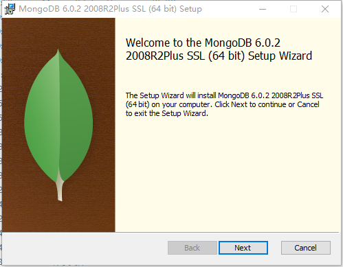
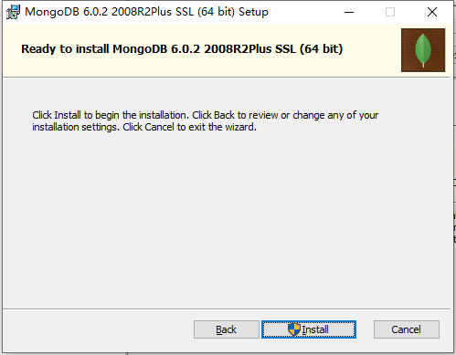

<h1 style="font-size:3.3em;color:skyblue;text-align:center">MongoDB学习笔记</h1>


# MongoDB简介

MongoDB是一个开源、高性能、无模式的文档型数据库，当初的设计就是用于简化开发和方便扩展，是NoSQL数据库产品中的一种。是最 像关系型数据库（MySQL）的非关系型数据库。 

它支持的数据结构非常松散，是一种类似于 JSON 的 格式叫BSON，所以它既可以存储比较复杂的数据类型，又相当的灵活。 MongoDB中的记录是一个文档，它是一个由字段和值对（field:value）组成的数据结构。MongoDB文档类似于JSON对象，即一个文档认 为就是一个对象。字段的数据类型是字符型，它的值除了使用基本的一些类型外，还可以包括其他文档、普通数组和文档数组。


# 业务应用场景

传统的关系型数据库（如MySQL），在数据操作的“三高”需求以及应对Web2.0的网站需求面前，显得力不从心。


“三高”需求：

* High performance - 对数据库高并发读写的需求。 
* Huge Storage - 对海量数据的高效率存储和访问的需求。 
* High Scalability && High Availability- 对数据库的高可扩展性和高可用性的需求。


而MongoDB可应对“三高”需求


具体的应用场景：

* 社交场景，使用 MongoDB 存储存储用户信息，以及用户发表的朋友圈信息，通过地理位置索引实现附近的人、地点等功能
* 游戏场景，使用 MongoDB 存储游戏用户信息，用户的装备、积分等直接以内嵌文档的形式存储，方便查询、高效率存储和访问
* 物流场景，使用 MongoDB 存储订单信息，订单状态在运送过程中会不断更新，以 MongoDB 内嵌数组的形式来存储，一次查询就能将订单所有的变更读取出来
* 物联网场景，使用 MongoDB 存储所有接入的智能设备信息，以及设备汇报的日志信息，并对这些信息进行多维度的分析
* 视频直播，使用 MongoDB 存储用户信息、点赞互动信息等


这些应用场景中，数据操作方面的共同特点是：

* 数据量大
* 写入操作频繁（读写都很频繁）
* 价值较低的数据，对事务性要求不高


对于这样的数据，我们更适合使用MongoDB来实现数据的存储。


什么时候选择MongoDB？

* 应用不需要事务及复杂 join 支持
* 新应用，需求会变，数据模型无法确定，想快速迭代开发
* 应用需要2000-3000以上的读写QPS
* 应用需要TB甚至 PB 级别数据存储
* 应用发展迅速，需要能快速水平扩展
* 应用要求存储的数据不丢失
* 应用需要99.999%高可用
* 应用需要大量的地理位置查询、文本查询


# 体系结构


|SQL术语/概念| MongoDB术语/概念 |解释/说明 |
| :--: | :--: | :--: |
|database| database |数据库|
|table |collection |数据库表/集合|
|row| document |数据记录行/文档|
|column |field| 数据字段/域 |
|index |index |索引|
|table| | joins 表连接,MongoDB不支持 |
| |嵌入文档| MongoDB通过嵌入式文档来替代多表连接|
|primary key| primary key |主键,MongoDB自动将_id字段设置为主键|


# 数据模型

MongoDB的最小存储单位就是文档(document)对象。文档(document)对象对应于关系型数据库的行。数据在MongoDB中以 BSON（Binary-JSON）文档的格式存储在磁盘上

BSON（Binary Serialized Document Format）是一种类json的一种二进制形式的存储格式，简称Binary JSON。BSON和JSON一样，支持 内嵌的文档对象和数组对象，但是BSON有JSON没有的一些数据类型，如Date和BinData类型。

BSON采用了类似于 C 语言结构体的名称、对表示方法，支持内嵌的文档对象和数组对象，具有轻量性、可遍历性、高效性的三个特点，可 以有效描述非结构化数据和结构化数据。这种格式的优点是灵活性高，但它的缺点是空间利用率不是很理想。

Bson中，除了基本的JSON类型：string,integer,boolean,double,null,array和object，mongo还使用了特殊的数据类型。这些类型包括 date,object id,binary data,regular expression 和code。每一个驱动都以特定语言的方式实现了这些类型，查看你的驱动的文档来获取详细信息。


|数据类型 |描述 |举例|
| :--: | :--: | :--: |
|字符串| UTF-8字符串都可表示为字符串类型的数据 |{"x" : "foobar"}|
|对象id| 对象id是文档的12字节的唯一 ID| {"X" :ObjectId() }|
|布尔值| 真或者假：true或者false| {"x":true}+|
|数组| 值的集合或者列表可以表示成数组| {"x" ： ["a", "b", "c"]}|
|32位整数| 类型不可用。JavaScript仅支持64位浮点数，所以32位整数会被自动转换。|shell是不支持该类型的，shell中默认会转换成64位浮点数|
|64位整数| 不支持这个类型。shell会使用一个特殊的内嵌文档来显示64位整数|shell是不支持该类型的，shell中默认会转换成64位浮点数|
|64位浮点数| shell中的数字就是这一种类型| {"x"：3.14159，"y"：3}|
|null |表示空值或者未定义的对象| {"x":null}|
|undefined| 文档中也可以使用未定义类型 |{"x":undefined}|
|符号 |shell不支持，shell会将数据库中的符号类型的数据自动转换成字符串| |
|正则表达式 |文档中可以包含正则表达式，采用JavaScript的正则表达式语法| {"x" ： /foobar/i} |
|代码 |文档中还可以包含JavaScript代码 |{"x" ： function() { /* …… */ }}|
|二进制数据 |二进制数据可以由任意字节的串组成，不过shell中无法使用||
|最大值/最小值|BSON包括一个特殊类型，表示可能的最大值。shell中没有这个类型。||


shell默认使用64位浮点型数值。{“x”：3.14}或{“x”：3}。对于整型值，可以使用NumberInt（4字节符号整数）或NumberLong（8字节符 号整数），{“x”:NumberInt(“3”)}{“x”:NumberLong(“3”)}


# MongoDB的特点

MongoDB主要有如下特点：


## 高性能

MongoDB提供高性能的数据持久性。

特别是, 对嵌入式数据模型的支持减少了数据库系统上的I/O活动。

索引支持更快的查询，并且可以包含来自嵌入式文档和数组的键。（文本索引解决搜索的需求、TTL索引解决历史数据自动过期的需求、地理位置索引可用于构建各种 O2O 应用）

mmapv1、wiredtiger、mongorocks（rocksdb）、in-memory 等多引擎支持满足各种场景需求

Gridfs解决文件存储的需求


## 高可用性

MongoDB的复制工具称为副本集（replica set），它可提供自动故障转移和数据冗余


## 高扩展性

MongoDB提供了水平可扩展性作为其核心功能的一部分。

分片将数据分布在一组集群的机器上。（海量数据存储，服务能力水平扩展）

从3.4开始，MongoDB支持基于片键创建数据区域。在一个平衡的集群中，MongoDB将一个区域所覆盖的读写只定向到该区域内的那些片


## 丰富的查询支持

MongoDB支持丰富的查询语言，支持读和写操作(CRUD)，比如数据聚合、文本搜索和地理空间查询等


# 单机部署

## Windows系统


### 第一步：下载安装包


https://www.mongodb.com/try#community


### 第二步：安装





选择安装位置





### 第三步：启动


手动建立一个目录用于存放数据文件，如 data/db


```sh
PS H:\opensoft\MongoDB> ls


    目录: H:\opensoft\MongoDB


Mode                 LastWriteTime         Length Name
----                 -------------         ------ ----
d-----        2022/11/14     20:18                bin
d-----        2022/11/14     20:19                data
d-----        2022/11/14     20:16                log
-a----         2022/9/29      1:03          30608 LICENSE-Community.txt
-a----         2022/9/29      1:03          16726 MPL-2
-a----         2022/9/29      1:03           1977 README
-a----         2022/9/29      1:03          77913 THIRD-PARTY-NOTICES


PS H:\opensoft\MongoDB> cd data
PS H:\opensoft\MongoDB\data> ls


    目录: H:\opensoft\MongoDB\data


Mode                 LastWriteTime         Length Name
----                 -------------         ------ ----
d-----        2022/11/14     20:20                diagnostic.data
d-----        2022/11/14     20:16                journal
-a----        2022/11/14     20:17          20480 collection-0--8270527627153216986.wt
-a----        2022/11/14     20:17          20480 collection-2--8270527627153216986.wt
-a----        2022/11/14     20:16           4096 collection-4--8270527627153216986.wt
-a----        2022/11/14     20:17          20480 index-1--8270527627153216986.wt
-a----        2022/11/14     20:17          20480 index-3--8270527627153216986.wt
-a----        2022/11/14     20:16           4096 index-5--8270527627153216986.wt
-a----        2022/11/14     20:16           4096 index-6--8270527627153216986.wt
-a----        2022/11/14     20:16              5 mongod.lock
-a----        2022/11/14     20:18          20480 sizeStorer.wt
-a----        2022/11/14     20:16            114 storage.bson
-a----        2022/11/14     20:16             50 WiredTiger
-a----        2022/11/14     20:16             21 WiredTiger.lock
-a----        2022/11/14     20:19           1464 WiredTiger.turtle
-a----        2022/11/14     20:19          69632 WiredTiger.wt
-a----        2022/11/14     20:16           4096 WiredTigerHS.wt
-a----        2022/11/14     20:17          20480 _mdb_catalog.wt


PS H:\opensoft\MongoDB\data> mkdir db


    目录: H:\opensoft\MongoDB\data


Mode                 LastWriteTime         Length Name
----                 -------------         ------ ----
d-----        2022/11/14     20:20                db


PS H:\opensoft\MongoDB\data> ls


    目录: H:\opensoft\MongoDB\data


Mode                 LastWriteTime         Length Name
----                 -------------         ------ ----
d-----        2022/11/14     20:20                db
d-----        2022/11/14     20:20                diagnostic.data
d-----        2022/11/14     20:16                journal
-a----        2022/11/14     20:17          20480 collection-0--8270527627153216986.wt
-a----        2022/11/14     20:17          20480 collection-2--8270527627153216986.wt
-a----        2022/11/14     20:16           4096 collection-4--8270527627153216986.wt
-a----        2022/11/14     20:17          20480 index-1--8270527627153216986.wt
-a----        2022/11/14     20:17          20480 index-3--8270527627153216986.wt
-a----        2022/11/14     20:16           4096 index-5--8270527627153216986.wt
-a----        2022/11/14     20:16           4096 index-6--8270527627153216986.wt
-a----        2022/11/14     20:16              5 mongod.lock
-a----        2022/11/14     20:18          20480 sizeStorer.wt
-a----        2022/11/14     20:16            114 storage.bson
-a----        2022/11/14     20:16             50 WiredTiger
-a----        2022/11/14     20:16             21 WiredTiger.lock
-a----        2022/11/14     20:19           1464 WiredTiger.turtle
-a----        2022/11/14     20:19          69632 WiredTiger.wt
-a----        2022/11/14     20:16           4096 WiredTigerHS.wt
-a----        2022/11/14     20:17          20480 _mdb_catalog.wt


PS H:\opensoft\MongoDB\data>
```


启动有两种方式


#### 第一种：命令行参数方式启动服务


bin目录里输入以下命令：

```sh
mongod --dbpath=..\data\db
```

或者

```sh
.\mongod --dbpath=..\data\db
```


运行结果：

```sh
PS H:\opensoft\MongoDB\data> cd ..
PS H:\opensoft\MongoDB> cd bin
PS H:\opensoft\MongoDB\bin> ls


    目录: H:\opensoft\MongoDB\bin


Mode                 LastWriteTime         Length Name
----                 -------------         ------ ----
-a----         2022/9/29      1:03           1558 InstallCompass.ps1
-a----        2022/11/14     20:16            573 mongod.cfg
-a----         2022/9/29      2:47       56164864 mongod.exe
-a----         2022/9/29      2:47      842002432 mongod.pdb
-a----         2022/9/29      2:01       34776576 mongos.exe
-a----         2022/9/29      2:01      471011328 mongos.pdb


PS H:\opensoft\MongoDB\bin> mongod --dbpath=..\data\db
mongod : 无法将“mongod”项识别为 cmdlet、函数、脚本文件或可运行程序的名称。请检查名称的拼写，如果包括路径，请确保路径正确，然后再试一次。
所在位置 行:1 字符: 1
+ mongod --dbpath=..\data\db
+ ~~~~~~
    + CategoryInfo          : ObjectNotFound: (mongod:String) [], CommandNotFoundException
    + FullyQualifiedErrorId : CommandNotFoundException


Suggestion [3,General]: 找不到命令 mongod，但它确实存在于当前位置。默认情况下，Windows PowerShell 不会从当前位置加载命令。如果信任此命令，请改为键入“.\mongod”。有关详细信息，请参阅 "get-help about_Command_Precedence"。
PS H:\opensoft\MongoDB\bin> .\mongod --dbpath=..\data\db
{"t":{"$date":"2022-11-14T20:23:00.603+08:00"},"s":"I",  "c":"NETWORK",  "id":4915701, "ctx":"thread1","msg":"Initialized wire specification","attr":{"spec":{"incomingExternalClient":{"minWireVersion":0,"maxWireVersion":17},"incomingInternalClient":{"minWireVersion":0,"maxWireVersion":17},"outgoing":{"minWireVersion":6,"maxWireVersion":17},"isInternalClient":true}}}
{"t":{"$date":"2022-11-14T20:23:00.605+08:00"},"s":"I",  "c":"CONTROL",  "id":23285,   "ctx":"thread1","msg":"Automatically disabling TLS 1.0, to force-enable TLS 1.0 specify --sslDisabledProtocols 'none'"}
{"t":{"$date":"2022-11-14T20:23:00.605+08:00"},"s":"I",  "c":"NETWORK",  "id":4648602, "ctx":"thread1","msg":"Implicit TCP FastOpen in use."}
{"t":{"$date":"2022-11-14T20:23:00.607+08:00"},"s":"I",  "c":"REPL",     "id":5123008, "ctx":"thread1","msg":"Successfully registered PrimaryOnlyService","attr":{"service":"TenantMigrationDonorService","namespace":"config.tenantMigrationDonors"}}
{"t":{"$date":"2022-11-14T20:23:00.607+08:00"},"s":"I",  "c":"REPL",     "id":5123008, "ctx":"thread1","msg":"Successfully registered PrimaryOnlyService","attr":{"service":"TenantMigrationRecipientService","namespace":"config.tenantMigrationRecipients"}}
{"t":{"$date":"2022-11-14T20:23:00.608+08:00"},"s":"I",  "c":"REPL",     "id":5123008, "ctx":"thread1","msg":"Successfully registered PrimaryOnlyService","attr":{"service":"ShardSplitDonorService","namespace":"config.tenantSplitDonors"}}
{"t":{"$date":"2022-11-14T20:23:00.608+08:00"},"s":"I",  "c":"CONTROL",  "id":5945603, "ctx":"thread1","msg":"Multi threading initialized"}
{"t":{"$date":"2022-11-14T20:23:00.611+08:00"},"s":"I",  "c":"CONTROL",  "id":4615611, "ctx":"initandlisten","msg":"MongoDB starting","attr":{"pid":2400,"port":27017,"dbPath":"../data/db","architecture":"64-bit","host":"mao"}}
{"t":{"$date":"2022-11-14T20:23:00.611+08:00"},"s":"I",  "c":"CONTROL",  "id":23398,   "ctx":"initandlisten","msg":"Target operating system minimum version","attr":{"targetMinOS":"Windows 7/Windows Server 2008 R2"}}
{"t":{"$date":"2022-11-14T20:23:00.612+08:00"},"s":"I",  "c":"CONTROL",  "id":23403,   "ctx":"initandlisten","msg":"Build Info","attr":{"buildInfo":{"version":"6.0.2","gitVersion":"94fb7dfc8b974f1f5343e7ea394d0d9deedba50e","modules":[],"allocator":"tcmalloc","environment":{"distmod":"windows","distarch":"x86_64","target_arch":"x86_64"}}}}
{"t":{"$date":"2022-11-14T20:23:00.613+08:00"},"s":"I",  "c":"CONTROL",  "id":51765,   "ctx":"initandlisten","msg":"Operating System","attr":{"os":{"name":"Microsoft Windows 10","version":"10.0 (build 19044)"}}}
{"t":{"$date":"2022-11-14T20:23:00.613+08:00"},"s":"I",  "c":"CONTROL",  "id":21951,   "ctx":"initandlisten","msg":"Options set by command line","attr":{"options":{"storage":{"dbPath":"..\\data\\db"}}}}
{"t":{"$date":"2022-11-14T20:23:00.617+08:00"},"s":"I",  "c":"STORAGE",  "id":22315,   "ctx":"initandlisten","msg":"Opening WiredTiger","attr":{"config":"create,cache_size=7636M,session_max=33000,eviction=(threads_min=4,threads_max=4),config_base=false,statistics=(fast),log=(enabled=true,remove=true,path=journal,compressor=snappy),builtin_extension_config=(zstd=(compression_level=6)),file_manager=(close_idle_time=600,close_scan_interval=10,close_handle_minimum=2000),statistics_log=(wait=0),json_output=(error,message),verbose=[recovery_progress:1,checkpoint_progress:1,compact_progress:1,backup:0,checkpoint:0,compact:0,evict:0,history_store:0,recovery:0,rts:0,salvage:0,tiered:0,timestamp:0,transaction:0,verify:0,log:0],"}}
{"t":{"$date":"2022-11-14T20:23:00.949+08:00"},"s":"I",  "c":"STORAGE",  "id":4795906, "ctx":"initandlisten","msg":"WiredTiger opened","attr":{"durationMillis":331}}
{"t":{"$date":"2022-11-14T20:23:00.950+08:00"},"s":"I",  "c":"RECOVERY", "id":23987,   "ctx":"initandlisten","msg":"WiredTiger recoveryTimestamp","attr":{"recoveryTimestamp":{"$timestamp":{"t":0,"i":0}}}}
{"t":{"$date":"2022-11-14T20:23:01.235+08:00"},"s":"W",  "c":"CONTROL",  "id":22120,   "ctx":"initandlisten","msg":"Access control is not enabled for the database. Read and write access to data and configuration is unrestricted","tags":["startupWarnings"]}
{"t":{"$date":"2022-11-14T20:23:01.235+08:00"},"s":"W",  "c":"CONTROL",  "id":22140,   "ctx":"initandlisten","msg":"This server is bound to localhost. Remote systems will be unable to connect to this server. Start the server with --bind_ip <address> to specify which IP addresses it should serve responses from, or with --bind_ip_all to bind to all interfaces. If this behavior is desired, start the server with --bind_ip 127.0.0.1 to disable this warning","tags":["startupWarnings"]}
{"t":{"$date":"2022-11-14T20:23:01.237+08:00"},"s":"I",  "c":"STORAGE",  "id":20320,   "ctx":"initandlisten","msg":"createCollection","attr":{"namespace":"admin.system.version","uuidDisposition":"provided","uuid":{"uuid":{"$uuid":"f9dc9298-7737-4157-942d-69eb2e95c4ca"}},"options":{"uuid":{"$uuid":"f9dc9298-7737-4157-942d-69eb2e95c4ca"}}}}
{"t":{"$date":"2022-11-14T20:23:01.331+08:00"},"s":"I",  "c":"INDEX",    "id":20345,   "ctx":"initandlisten","msg":"Index build: done building","attr":{"buildUUID":null,"collectionUUID":{"uuid":{"$uuid":"f9dc9298-7737-4157-942d-69eb2e95c4ca"}},"namespace":"admin.system.version","index":"_id_","ident":"index-1--8612451295210606605","collectionIdent":"collection-0--8612451295210606605","commitTimestamp":null}}
{"t":{"$date":"2022-11-14T20:23:01.331+08:00"},"s":"I",  "c":"REPL",     "id":20459,   "ctx":"initandlisten","msg":"Setting featureCompatibilityVersion","attr":{"newVersion":"6.0"}}
{"t":{"$date":"2022-11-14T20:23:01.333+08:00"},"s":"I",  "c":"REPL",     "id":5853300, "ctx":"initandlisten","msg":"current featureCompatibilityVersion value","attr":{"featureCompatibilityVersion":"6.0","context":"setFCV"}}
{"t":{"$date":"2022-11-14T20:23:01.333+08:00"},"s":"I",  "c":"NETWORK",  "id":4915702, "ctx":"initandlisten","msg":"Updated wire specification","attr":{"oldSpec":{"incomingExternalClient":{"minWireVersion":0,"maxWireVersion":17},"incomingInternalClient":{"minWireVersion":0,"maxWireVersion":17},"outgoing":{"minWireVersion":6,"maxWireVersion":17},"isInternalClient":true},"newSpec":{"incomingExternalClient":{"minWireVersion":0,"maxWireVersion":17},"incomingInternalClient":{"minWireVersion":17,"maxWireVersion":17},"outgoing":{"minWireVersion":17,"maxWireVersion":17},"isInternalClient":true}}}
{"t":{"$date":"2022-11-14T20:23:01.334+08:00"},"s":"I",  "c":"NETWORK",  "id":4915702, "ctx":"initandlisten","msg":"Updated wire specification","attr":{"oldSpec":{"incomingExternalClient":{"minWireVersion":0,"maxWireVersion":17},"incomingInternalClient":{"minWireVersion":17,"maxWireVersion":17},"outgoing":{"minWireVersion":17,"maxWireVersion":17},"isInternalClient":true},"newSpec":{"incomingExternalClient":{"minWireVersion":0,"maxWireVersion":17},"incomingInternalClient":{"minWireVersion":17,"maxWireVersion":17},"outgoing":{"minWireVersion":17,"maxWireVersion":17},"isInternalClient":true}}}
{"t":{"$date":"2022-11-14T20:23:01.334+08:00"},"s":"I",  "c":"REPL",     "id":5853300, "ctx":"initandlisten","msg":"current featureCompatibilityVersion value","attr":{"featureCompatibilityVersion":"6.0","context":"startup"}}
{"t":{"$date":"2022-11-14T20:23:01.334+08:00"},"s":"I",  "c":"STORAGE",  "id":5071100, "ctx":"initandlisten","msg":"Clearing temp directory"}
{"t":{"$date":"2022-11-14T20:23:01.335+08:00"},"s":"I",  "c":"CONTROL",  "id":20536,   "ctx":"initandlisten","msg":"Flow Control is enabled on this deployment"}
{"t":{"$date":"2022-11-14T20:23:01.812+08:00"},"s":"I",  "c":"FTDC",     "id":20625,   "ctx":"initandlisten","msg":"Initializing full-time diagnostic data capture","attr":{"dataDirectory":"../data/db/diagnostic.data"}}
{"t":{"$date":"2022-11-14T20:23:01.816+08:00"},"s":"I",  "c":"STORAGE",  "id":20320,   "ctx":"initandlisten","msg":"createCollection","attr":{"namespace":"local.startup_log","uuidDisposition":"generated","uuid":{"uuid":{"$uuid":"c6deb412-71a6-4db4-8207-eba2392b5a42"}},"options":{"capped":true,"size":10485760}}}
{"t":{"$date":"2022-11-14T20:23:01.923+08:00"},"s":"I",  "c":"INDEX",    "id":20345,   "ctx":"initandlisten","msg":"Index build: done building","attr":{"buildUUID":null,"collectionUUID":{"uuid":{"$uuid":"c6deb412-71a6-4db4-8207-eba2392b5a42"}},"namespace":"local.startup_log","index":"_id_","ident":"index-3--8612451295210606605","collectionIdent":"collection-2--8612451295210606605","commitTimestamp":null}}
{"t":{"$date":"2022-11-14T20:23:01.923+08:00"},"s":"I",  "c":"REPL",     "id":6015317, "ctx":"initandlisten","msg":"Setting new configuration state","attr":{"newState":"ConfigReplicationDisabled","oldState":"ConfigPreStart"}}
{"t":{"$date":"2022-11-14T20:23:01.925+08:00"},"s":"I",  "c":"STORAGE",  "id":22262,   "ctx":"initandlisten","msg":"Timestamp monitor starting"}
{"t":{"$date":"2022-11-14T20:23:01.929+08:00"},"s":"I",  "c":"CONTROL",  "id":20712,   "ctx":"LogicalSessionCacheReap","msg":"Sessions collection is not set up; waiting until next sessions reap interval","attr":{"error":"NamespaceNotFound: config.system.sessions does not exist"}}
{"t":{"$date":"2022-11-14T20:23:01.929+08:00"},"s":"I",  "c":"NETWORK",  "id":23015,   "ctx":"listener","msg":"Listening on","attr":{"address":"127.0.0.1"}}
{"t":{"$date":"2022-11-14T20:23:01.929+08:00"},"s":"I",  "c":"STORAGE",  "id":20320,   "ctx":"LogicalSessionCacheRefresh","msg":"createCollection","attr":{"namespace":"config.system.sessions","uuidDisposition":"generated","uuid":{"uuid":{"$uuid":"b673fae5-30c1-4303-85d3-d2d8084b9f02"}},"options":{}}}
{"t":{"$date":"2022-11-14T20:23:01.930+08:00"},"s":"I",  "c":"NETWORK",  "id":23016,   "ctx":"listener","msg":"Waiting for connections","attr":{"port":27017,"ssl":"off"}}
{"t":{"$date":"2022-11-14T20:23:02.088+08:00"},"s":"I",  "c":"INDEX",    "id":20345,   "ctx":"LogicalSessionCacheRefresh","msg":"Index build: done building","attr":{"buildUUID":null,"collectionUUID":{"uuid":{"$uuid":"b673fae5-30c1-4303-85d3-d2d8084b9f02"}},"namespace":"config.system.sessions","index":"_id_","ident":"index-5--8612451295210606605","collectionIdent":"collection-4--8612451295210606605","commitTimestamp":null}}
{"t":{"$date":"2022-11-14T20:23:02.089+08:00"},"s":"I",  "c":"INDEX",    "id":20345,   "ctx":"LogicalSessionCacheRefresh","msg":"Index build: done building","attr":{"buildUUID":null,"collectionUUID":{"uuid":{"$uuid":"b673fae5-30c1-4303-85d3-d2d8084b9f02"}},"namespace":"config.system.sessions","index":"lsidTTLIndex","ident":"index-6--8612451295210606605","collectionIdent":"collection-4--8612451295210606605","commitTimestamp":null}}
{"t":{"$date":"2022-11-14T20:23:02.090+08:00"},"s":"I",  "c":"COMMAND",  "id":51803,   "ctx":"LogicalSessionCacheRefresh","msg":"Slow query","attr":{"type":"command","ns":"config.system.sessions","command":{"createIndexes":"system.sessions","v":2,"indexes":[{"key":{"lastUse":1},"name":"lsidTTLIndex","expireAfterSeconds":1800}],"ignoreUnknownIndexOptions":false,"writeConcern":{},"$db":"config"},"numYields":0,"reslen":114,"locks":{"ParallelBatchWriterMode":{"acquireCount":{"r":5}},"FeatureCompatibilityVersion":{"acquireCount":{"r":5,"w":1}},"ReplicationStateTransition":{"acquireCount":{"w":5}},"Global":{"acquireCount":{"r":5,"w":1}},"Database":{"acquireCount":{"r":4,"w":1}},"Collection":{"acquireCount":{"r":5,"w":1}},"Mutex":{"acquireCount":{"r":8}}},"storage":{},"protocol":"op_msg","durationMillis":161}}

```


#### 第二种：配置文件方式启动服务


在解压目录中新建 conf 文件夹，该文件夹中新建配置文件 mongod.conf


配置文件内容：

```
storage:
  dbPath: .\\..\\data\\db
```


```sh
PS H:\opensoft\MongoDB> ls


    目录: H:\opensoft\MongoDB


Mode                 LastWriteTime         Length Name
----                 -------------         ------ ----
d-----        2022/11/14     20:18                bin
d-----        2022/11/14     20:37                conf
d-----        2022/11/14     20:41                data
d-----        2022/11/14     20:16                log
-a----         2022/9/29      1:03          30608 LICENSE-Community.txt
-a----         2022/9/29      1:03          16726 MPL-2
-a----         2022/9/29      1:03           1977 README
-a----         2022/9/29      1:03          77913 THIRD-PARTY-NOTICES


PS H:\opensoft\MongoDB> cd conf
PS H:\opensoft\MongoDB\conf> ls


    目录: H:\opensoft\MongoDB\conf


Mode                 LastWriteTime         Length Name
----                 -------------         ------ ----
-a----        2022/11/14     20:41             33 mongod.conf


PS H:\opensoft\MongoDB\conf> cat .\mongod.conf
storage:
  dbPath: .\\..\\data\\db
PS H:\opensoft\MongoDB\conf>
```


更多参数配置：


启动方式：


```sh
.\mongod -f ../conf/mongod.conf
```

或者

```sh
.\mongod --config ../conf/mongod.conf
```


## Shell连接


第一步：下载


https://www.mongodb.com/try/download/shell


第二步：解压


解压到MongoDB目录下


```sh
PS H:\opensoft\MongoDB> ls


    目录: H:\opensoft\MongoDB


Mode                 LastWriteTime         Length Name
----                 -------------         ------ ----
d-----        2022/11/14     20:18                bin
d-----        2022/11/14     20:37                conf
d-----        2022/11/14     21:02                data
d-----        2022/11/14     20:16                log
d-----         2022/9/20      4:08                mongosh
-a----         2022/9/29      1:03          30608 LICENSE-Community.txt
-a----         2022/9/29      1:03          16726 MPL-2
-a----         2022/9/29      1:03           1977 README
-a----         2022/9/29      1:03          77913 THIRD-PARTY-NOTICES


PS H:\opensoft\MongoDB> cd .\mongosh\
PS H:\opensoft\MongoDB\mongosh> ls


    目录: H:\opensoft\MongoDB\mongosh


Mode                 LastWriteTime         Length Name
----                 -------------         ------ ----
d-----         2022/9/20      4:08                bin
-a----         2022/9/20      4:01          17524 LICENSE-crypt-library
-a----         2022/9/20      4:01          10759 LICENSE-mongosh
-a----         2022/9/20      4:08           5792 mongosh.1.gz
-a----         2022/9/20      4:01            393 README
-a----         2022/9/20      4:01         918987 THIRD_PARTY_NOTICES


PS H:\opensoft\MongoDB\mongosh> cd bin
PS H:\opensoft\MongoDB\mongosh\bin> ls


    目录: H:\opensoft\MongoDB\mongosh\bin


Mode                 LastWriteTime         Length Name
----                 -------------         ------ ----
-a----         2022/9/20      3:53      146979840 mongosh.exe
-a----         2022/8/16     10:50       17886208 mongosh_crypt_v1.dll


PS H:\opensoft\MongoDB\mongosh\bin>
```


第三步：启动


```sh
.\mongosh
```

或者

```sh
.\mongosh --host=127.0.0.1 --port=27017
```


```sh
PS H:\opensoft\MongoDB\mongosh\bin> .\mongosh
Current Mongosh Log ID: 63723d5d79fae2f2ba5e24af
Connecting to:          mongodb://127.0.0.1:27017/?directConnection=true&serverSelectionTimeoutMS=2000&appName=mongosh+1.6.0
Using MongoDB:          6.0.2
Using Mongosh:          1.6.0

For mongosh info see: https://docs.mongodb.com/mongodb-shell/

------
   The server generated these startup warnings when booting
   2022-11-14T20:16:36.251+08:00: Access control is not enabled for the database. Read and write access to data and configuration is unrestricted
------

------
   Enable MongoDB's free cloud-based monitoring service, which will then receive and display
   metrics about your deployment (disk utilization, CPU, operation statistics, etc).

   The monitoring data will be available on a MongoDB website with a unique URL accessible to you
   and anyone you share the URL with. MongoDB may use this information to make product
   improvements and to suggest MongoDB products and deployment options to you.

   To enable free monitoring, run the following command: db.enableFreeMonitoring()
   To permanently disable this reminder, run the following command: db.disableFreeMonitoring()
------

test>
```


```sh
PS H:\opensoft\MongoDB\mongosh\bin> .\mongosh --host=127.0.0.1 --port=27017
Current Mongosh Log ID: 63723d397060718605194f6b
Connecting to:          mongodb://127.0.0.1:27017/?directConnection=true&serverSelectionTimeoutMS=2000&appName=mongosh+1.6.0
Using MongoDB:          6.0.2
Using Mongosh:          1.6.0

For mongosh info see: https://docs.mongodb.com/mongodb-shell/

------
   The server generated these startup warnings when booting
   2022-11-14T20:16:36.251+08:00: Access control is not enabled for the database. Read and write access to data and configuration is unrestricted
------

------
   Enable MongoDB's free cloud-based monitoring service, which will then receive and display
   metrics about your deployment (disk utilization, CPU, operation statistics, etc).

   The monitoring data will be available on a MongoDB website with a unique URL accessible to you
   and anyone you share the URL with. MongoDB may use this information to make product
   improvements and to suggest MongoDB products and deployment options to you.

   To enable free monitoring, run the following command: db.enableFreeMonitoring()
   To permanently disable this reminder, run the following command: db.disableFreeMonitoring()
------

test>
```


查看已经有的数据库

```sh
show databases
```


```sh
test> show databases
admin    40.00 KiB
config  108.00 KiB
local    40.00 KiB
test>
```


退出mongodb

```sh
exit
```


```sh
test> exit
PS H:\opensoft\MongoDB\mongosh\bin>
```


更多参数可以通过帮助查看：

```sh
.\mongosh --help
```


```sh
PS H:\opensoft\MongoDB\mongosh\bin> .\mongosh --help

  $ mongosh [options] [db address] [file names (ending in .js or .mongodb)]

  Options:

    -h, --help                                 Show this usage information
    -f, --file [arg]                           Load the specified mongosh script
        --host [arg]                           Server to connect to
        --port [arg]                           Port to connect to
        --version                              Show version information
        --verbose                              Increase the verbosity of the output of the shell
        --quiet                                Silence output from the shell during the connection process
        --shell                                Run the shell after executing files
        --nodb                                 Don't connect to mongod on startup - no 'db address' [arg] expected
        --norc                                 Will not run the '.mongoshrc.js' file on start up
        --eval [arg]                           Evaluate javascript
        --json[=canonical|relaxed]             Print result of --eval as Extended JSON, including errors
        --retryWrites[=true|false]             Automatically retry write operations upon transient network errors (Default: true)

  Authentication Options:

    -u, --username [arg]                       Username for authentication
    -p, --password [arg]                       Password for authentication
        --authenticationDatabase [arg]         User source (defaults to dbname)
        --authenticationMechanism [arg]        Authentication mechanism
        --awsIamSessionToken [arg]             AWS IAM Temporary Session Token ID
        --gssapiServiceName [arg]              Service name to use when authenticating using GSSAPI/Kerberos
        --sspiHostnameCanonicalization [arg]   Specify the SSPI hostname canonicalization (none or forward, available on Windows)
        --sspiRealmOverride [arg]              Specify the SSPI server realm (available on Windows)

  TLS Options:

        --tls                                  Use TLS for all connections
        --tlsCertificateKeyFile [arg]          PEM certificate/key file for TLS
        --tlsCertificateKeyFilePassword [arg]  Password for key in PEM file for TLS
        --tlsCAFile [arg]                      Certificate Authority file for TLS
        --tlsAllowInvalidHostnames             Allow connections to servers with non-matching hostnames
        --tlsAllowInvalidCertificates          Allow connections to servers with invalid certificates
        --tlsCertificateSelector [arg]         TLS Certificate in system store (Windows and macOS only)
        --tlsCRLFile [arg]                     Specifies the .pem file that contains the Certificate Revocation List
        --tlsDisabledProtocols [arg]           Comma separated list of TLS protocols to disable [TLS1_0,TLS1_1,TLS1_2]
        --tlsUseSystemCA                       Load the operating system trusted certificate list
        --tlsFIPSMode                          Enable the system TLS library's FIPS mode

  API version options:

        --apiVersion [arg]                     Specifies the API version to connect with
        --apiStrict                            Use strict API version mode
        --apiDeprecationErrors                 Fail deprecated commands for the specified API version

  FLE Options:

        --awsAccessKeyId [arg]                 AWS Access Key for FLE Amazon KMS
        --awsSecretAccessKey [arg]             AWS Secret Key for FLE Amazon KMS
        --awsSessionToken [arg]                Optional AWS Session Token ID
        --keyVaultNamespace [arg]              database.collection to store encrypted FLE parameters
        --kmsURL [arg]                         Test parameter to override the URL of the KMS endpoint

  DB Address Examples:

        foo                                    Foo database on local machine
        192.168.0.5/foo                        Foo database on 192.168.0.5 machine
        192.168.0.5:9999/foo                   Foo database on 192.168.0.5 machine on port 9999
        mongodb://192.168.0.5:9999/foo         Connection string URI can also be used

  File Names:

        A list of files to run. Files must end in .js and will exit after unless --shell is specified.

  Examples:

        Start mongosh using 'ships' database on specified connection string:
        $ mongosh mongodb://192.168.0.5:9999/ships

  For more information on usage: https://docs.mongodb.com/mongodb-shell.
PS H:\opensoft\MongoDB\mongosh\bin>
```


第四步：配置环境变量


点击高级系统设置


点击环境变量


编辑path


新建一个，保存


随便在一个路径下启动

```sh
PS C:\Users\mao\Desktop> mongosh.exe
Current Mongosh Log ID: 63723f4fea0a3e8c6d08ee92
Connecting to:          mongodb://127.0.0.1:27017/?directConnection=true&serverSelectionTimeoutMS=2000&appName=mongosh+1.6.0
Using MongoDB:          6.0.2
Using Mongosh:          1.6.0

For mongosh info see: https://docs.mongodb.com/mongodb-shell/

------
   The server generated these startup warnings when booting
   2022-11-14T20:16:36.251+08:00: Access control is not enabled for the database. Read and write access to data and configuration is unrestricted
------

------
   Enable MongoDB's free cloud-based monitoring service, which will then receive and display
   metrics about your deployment (disk utilization, CPU, operation statistics, etc).

   The monitoring data will be available on a MongoDB website with a unique URL accessible to you
   and anyone you share the URL with. MongoDB may use this information to make product
   improvements and to suggest MongoDB products and deployment options to you.

   To enable free monitoring, run the following command: db.enableFreeMonitoring()
   To permanently disable this reminder, run the following command: db.disableFreeMonitoring()
------

test>
```


## Compass-图形化界面客户端


